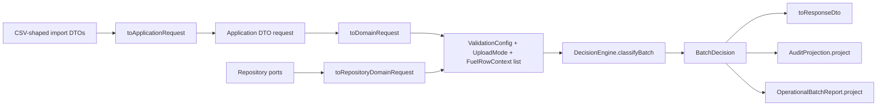
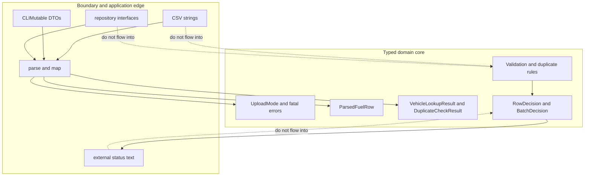
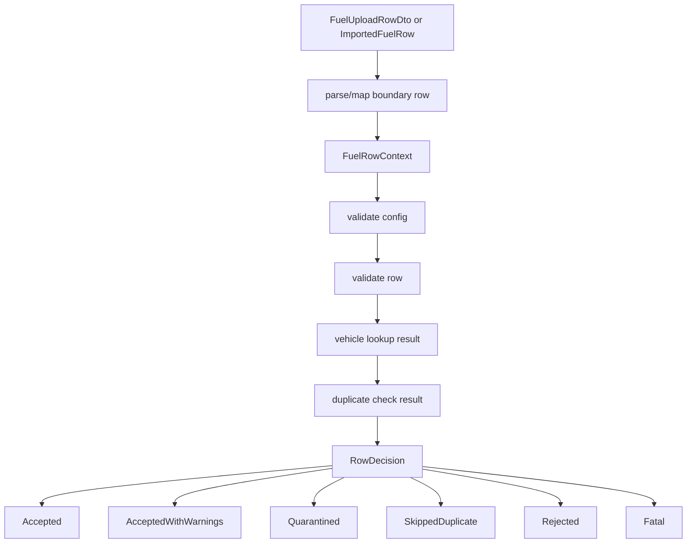
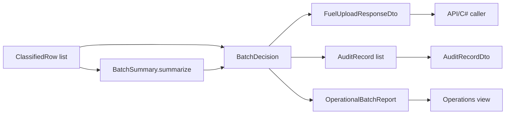

# F# Fuel Upload Learning Guide

This guide turns the v3 F# result into a team-facing learning artifact. It explains how the implementation works, why F# won the v3 core-plus-boundary comparison, and how to extend the model without weakening the domain.

The implementation lives in [`fsharp-fuel-engine`](../fsharp-fuel-engine). The most important habit when reading or changing it is simple: keep raw application, CSV, repository, DTO, and text concerns at the boundary. Let the domain work in typed values and discriminated unions.

## Why F# Won V3

F# was the strongest v3 core-plus-boundary compromise because it combined most of the safety of an algebraic domain model with a practical .NET deployment shape.

- Strong typed domain model: rows, vehicles, duplicate states, validation errors, warnings, quarantine reasons, row decisions, batch decisions, audit events, and operational statuses are explicit types.
- Discriminated unions for outcomes and errors: cases such as `RowDecision.Quarantined`, `DuplicateCheckResult.Fatal`, `FuelImportErrorCode.InvalidNumber`, and `OperationalBatchStatus.Fatal` force callers to name the state they are handling.
- Clean separation between domain and boundary concerns: `DecisionEngine.classifyRow` and `classifyBatch` take typed inputs. They do not parse CSV cells, call repositories, produce DTO strings, or write audit records.
- Practical .NET fit: the project builds with `dotnet`, exposes C#-callable facade classes, and uses normal .NET records, interfaces, arrays, and `Result` values at the boundary.
- Honest weaknesses: C# interop requires `[<CLIMutable>]` records and string-heavy DTOs, and the large `Interop.fs` module mixes import mapping, DTO mapping, repository-backed mapping, facade response projection, and facade classes. Some DTO text currently uses debug-style `%A` rendering. These are boundary weaknesses, not reasons to push strings into the domain.

## Architecture Walkthrough

The F# code is intentionally small, but it has clear layers.



### Domain Decision Engine

[`DecisionEngine.fs`](../fsharp-fuel-engine/FuelUpload.Domain/DecisionEngine.fs) is the core. `classifyRow` applies the rule order:

1. invalid validation config or fatal lookup/check result becomes `RowDecision.Fatal`
2. row validation errors become `RowDecision.Rejected`
3. missing or ambiguous vehicles become typed vehicle rejections
4. matched vehicles plus duplicate state decide accepted vs skipped
5. accepted rows may become warnings or quarantine based on validation policy

`classifyBatch` maps rows through `classifyRow`, derives `BatchSummary`, and returns either `BatchDecision.Ready` or `BatchDecision.Blocked`.

### Application and Interop Boundary

[`Interop.fs`](../fsharp-fuel-engine/FuelUpload.Domain/Interop.fs) is the boundary. It owns:

- `[<CLIMutable>]` DTO records for C# callers
- string normalization and parsing
- typed mapping errors
- imported-row conversion
- repository-backed mapping
- response DTO projection
- `FuelUploadFacade` and `RepositoryFuelUploadFacade`

This file should stay outside the pure decision rules. It can translate strings to types and types back to strings, but it should not decide business outcomes independently.

### CSV-Shaped Import Mapping

`ImportedFuelRow` and `ImportBatchRequest` model already-parsed CSV-like records where every meaningful value arrives as a string. `toApplicationRequest` parses those strings into the existing application DTO shape, returning `Result<FuelUploadRequestDto, FuelImportError list>`.

Good import behavior:

- bad cells become `FuelImportErrorCode` cases
- valid imports reuse the same facade path as normal DTO requests
- import mapping does not classify rows or compute summaries

### Audit Projection

[`Audit.fs`](../fsharp-fuel-engine/FuelUpload.Domain/Audit.fs) projects existing decisions into audit records. `AuditProjection.project` pattern matches on `RowDecision` and builds typed `AuditRecord` values. `AuditProjection.toDto` is the edge where typed audit fields become text for external consumers.

Audit should explain the decision that already happened. It should not re-run validation, duplicate, quarantine, or fatal rules.

### Repository-Backed Service and Ports

The repository pressure is modeled by `IVehicleRepository` and `IDuplicateRepository` in [`Interop.fs`](../fsharp-fuel-engine/FuelUpload.Domain/Interop.fs). The repository-backed facade maps repository results into typed `VehicleLookupResult` and `DuplicateCheckResult` values before calling the same domain engine.

Keep repository IO and failure translation here. Do not inject repositories into `DecisionEngine`.

### Operational Report Projection

[`OperationalBatchReport.fs`](../fsharp-fuel-engine/FuelUpload.Domain/OperationalBatchReport.fs) derives operational status, counts, uploaded transaction IDs, rejected row numbers, quarantined rows, skipped duplicate rows, and fatal errors from `BatchDecision`.

The important rule: uploaded transaction IDs are suppressed when the batch is fatal, even if one row decision looks accepted. The report projects from the final batch decision, not from raw rows.

### Where Concerns Belong



IO, framework, CSV, database, and DTO text belong outside the domain core. Typed lookup results, typed row data, validation config, upload mode, and duplicate state are the only things that should cross inward.

## How A Row Becomes A Decision



`FuelRowContext` is the handoff shape. Once the boundary has created it, the domain no longer cares whether the row came from a DTO, CSV-shaped import, or repository-backed lookup.

## How Decisions Become Outputs



Summary, response DTOs, audit records, and operational reports all derive from decisions. They should not recompute business rules from raw row fields.

## Code-Reading Map

Read the files in this order:

1. [`Primitives.fs`](../fsharp-fuel-engine/FuelUpload.Domain/Primitives.fs): `UploadMode` and fatal processing errors. This is the smallest entry point into the domain vocabulary.
2. [`FuelRow.fs`](../fsharp-fuel-engine/FuelUpload.Domain/FuelRow.fs): the parsed row shape the domain expects after boundary parsing.
3. [`Vehicle.fs`](../fsharp-fuel-engine/FuelUpload.Domain/Vehicle.fs): typed vehicle lookup outcomes, including not found, ambiguous, and fatal.
4. [`Duplicate.fs`](../fsharp-fuel-engine/FuelUpload.Domain/Duplicate.fs): previous attempt states, duplicate check outcomes, and skip reasons.
5. [`Validation.fs`](../fsharp-fuel-engine/FuelUpload.Domain/Validation.fs): validation config, validation errors, warnings, quarantine reasons, and rejection reasons.
6. [`Decision.fs`](../fsharp-fuel-engine/FuelUpload.Domain/Decision.fs): accepted transaction, rejected row, skipped duplicate, quarantined row, `RowDecision`, and `FuelRowContext`.
7. [`DecisionEngine.fs`](../fsharp-fuel-engine/FuelUpload.Domain/DecisionEngine.fs): the rule order and the pure batch classifier.
8. [`BatchSummary.fs`](../fsharp-fuel-engine/FuelUpload.Domain/BatchSummary.fs): derived counts and batch readiness.
9. [`Audit.fs`](../fsharp-fuel-engine/FuelUpload.Domain/Audit.fs): decision-to-audit projection.
10. [`OperationalBatchReport.fs`](../fsharp-fuel-engine/FuelUpload.Domain/OperationalBatchReport.fs): decision-to-operations projection.
11. [`Interop.fs`](../fsharp-fuel-engine/FuelUpload.Domain/Interop.fs): C# DTOs, import mapping, repository ports, facade classes, and response projection.
12. [`Tests.fs`](../fsharp-fuel-engine/FuelUpload.Domain.Tests/Tests.fs): examples for every major rule, boundary path, audit projection, repository path, import path, and report projection.

## How To Extend Safely: Add A New Quarantine Reason

Example requirement: quarantine rows from merchants that match a known watchlist phrase.

### 1. Change The Type First

Start in [`Validation.fs`](../fsharp-fuel-engine/FuelUpload.Domain/Validation.fs). Add a new case to the existing union:

```fsharp
[<RequireQualifiedAccess>]
type QuarantineReason =
    | SuspiciousMerchantName
    | SuspiciousQuantityPattern
    | SuspiciousCostPattern
    | WatchlistedMerchant
```

Do not add a string such as `"watchlisted_merchant"` to the row, DTO, or report first. The domain case is the source of truth.

### 2. Update The Rule That Produces It

Still in `Validation.fs`, update `Validation.quarantineReasonsFor` so the new case is produced from typed row/config inputs:

```fsharp
let quarantineReasonsFor (config: ValidationConfig) (row: ParsedFuelRow) =
    [ let merchantName = row.MerchantName.Trim()

      if merchantName.Contains("blocked fuel", StringComparison.OrdinalIgnoreCase) then
          QuarantineReason.WatchlistedMerchant

      if row.FuelVolumeGallons = config.SuspiciousFuelVolumeGallons then
          QuarantineReason.SuspiciousQuantityPattern ]
```

The exact rule can differ, but it should live in the validation/quarantine policy area and return `QuarantineReason.WatchlistedMerchant`, not a raw status string or boolean flag.

### 3. Let Pattern Matches Tell You What Else Needs Attention

This particular extension may not break every pattern match because most code carries `QuarantineReason list` through unchanged. That is still useful information: the model already has a generic quarantine payload. Review these places anyway:

- `DecisionEngine.accepted`: confirms quarantine still wins over accepted and accepted-with-warnings.
- `AuditProjection.project`: confirms quarantine reasons flow into audit records.
- `AuditProjection.toDto`: confirms external text output is acceptable or needs stable formatting.
- `OperationalBatchReport.project`: confirms operations receives the new reason in quarantined rows.
- `FuelUploadInterop.toDecisionDto`: confirms response DTO quarantine reason text is acceptable or needs a stable renderer.

If the new reason needs a user-facing name, add a small renderer at the boundary. Do not make the domain store the display string.

### 4. Update Projectors Only If Shape Changes

For a new quarantine reason, the report and audit shapes probably do not need new fields. They already carry lists of typed reasons.

Update projectors only when the output contract changes. For example, if operations needs a separate count for watchlisted merchants, add that to `OperationalBatchReport` and derive it from `RowDecision.Quarantined` decisions.

### 5. Add Tests

Add focused tests in [`Tests.fs`](../fsharp-fuel-engine/FuelUpload.Domain.Tests/Tests.fs):

- a row matching the watchlist is `RowDecision.Quarantined`
- the new `QuarantineReason.WatchlistedMerchant` appears in `QuarantineReasons.toList`
- a validation error still rejects instead of quarantining
- the audit projection includes the reason
- the operational report includes the reason or any new derived field

Avoid tests that assert counters by re-reading raw rows. The assertion should use decisions, audit records, or reports.

## Good And Bad Examples

Good: use a discriminated union outcome.

```fsharp
[<RequireQualifiedAccess>]
type RowDecision =
    | Accepted of AcceptedTransaction
    | AcceptedWithWarnings of AcceptedTransaction * Warning list
    | Quarantined of QuarantinedRow
    | SkippedDuplicate of SkippedDuplicate
    | Rejected of RejectedRow
    | Fatal of FatalProcessingError
```

Bad: use a raw status string and nullable payloads.

```fsharp
type RowResult =
    { Status: string
      TransactionId: string
      Error: string }
```

Good: return a typed parsing or mapping result.

```fsharp
let parseImportDecimal field value : Result<decimal, FuelImportError list> =
    match requireCell field value with
    | Error errors -> Error errors
    | Ok value ->
        match Decimal.TryParse(value, NumberStyles.Number, CultureInfo.InvariantCulture) with
        | true, parsed -> Ok parsed
        | false, _ ->
            Error [ importError FuelImportErrorCode.InvalidNumber field "Cell must be a decimal number." ]
```

Bad: drive parsing by exceptions, strings, and nulls.

```fsharp
let parseQuantity value =
    if value = null then
        null
    else
        try string (Decimal.Parse value)
        with _ -> "invalid"
```

Good: derive reports from decisions.

```fsharp
let uploadedTransactionIds =
    rows
    |> List.choose (fun classified ->
        match classified.Decision with
        | RowDecision.Accepted transaction
        | RowDecision.AcceptedWithWarnings(transaction, _) -> Some transaction.TransactionId
        | RowDecision.Quarantined _
        | RowDecision.SkippedDuplicate _
        | RowDecision.Rejected _
        | RowDecision.Fatal _ -> None)
```

Bad: recompute mutable counters from raw rows.

```fsharp
let mutable accepted = 0
let mutable rejected = 0

for row in rawRows do
    if row.VehicleLookupStatus = "matched" && row.DuplicateStatus <> "duplicate" then
        accepted <- accepted + 1
    else
        rejected <- rejected + 1
```

## Team Exercises

1. Add a typed warning for unusually low odometer movement. Start with `Warning`, produce it in `Validation.warningsFor`, then verify `AcceptedWithWarnings`, audit, response DTO, and summary behavior.
2. Add an import error case for unsupported empty batch metadata. Start with `FuelImportErrorCode`, update import parsing, and add tests that assert the typed error code and field path.
3. Add an audit event field for upload mode. Derive it from `AcceptedTransaction.Mode` or `SkippedDuplicate.Mode`; do not parse it back from DTO text.
4. Add a report projection field for warning row numbers. Derive it from `RowDecision.AcceptedWithWarnings` and quarantined warning payloads.
5. Refactor one string-heavy DTO edge by adding a stable boundary renderer for warnings or quarantine reasons. Keep the domain union unchanged and do not add display strings to domain cases.

## Practical Guidance For A C#/.NET Shop

Use F# where the compiler pressure is worth the small language boundary:

- domain cores with important invariants
- rule engines where outcomes must be explicit
- typed application boundaries where parsing and mapping errors matter
- projections that should be derived from decisions, not recomputed

Be cautious with F# where the surface is mostly broad mutable interop:

- large DTO-only layers
- framework-heavy controllers and serializers
- object graphs that C# callers need to mutate freely
- code whose main job is glue rather than rules

A practical shape is a small F# domain project inside the .NET solution, called from C# application/framework edges. C# can own controllers, dependency injection, database adapters, and serialization. F# can own the typed core, boundary mappers where useful, and projections that need exhaustive handling.

The rule of thumb for this fuel-upload domain: use F# to make invalid business states hard to represent; use C# at the outer edges when the job is mostly framework integration.
