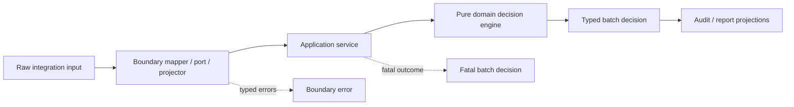
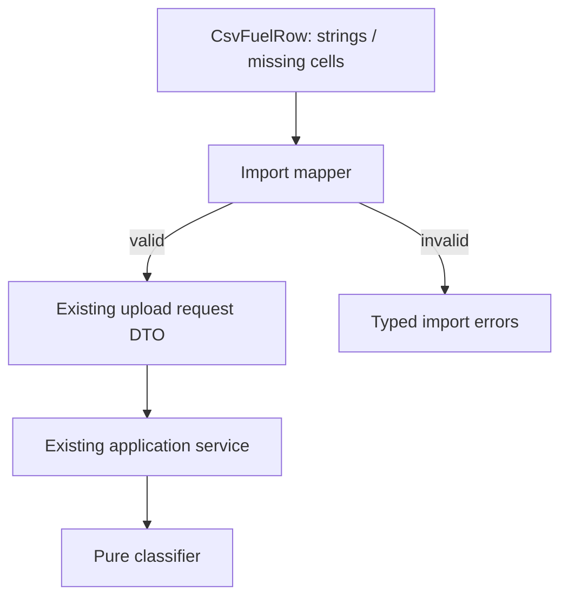
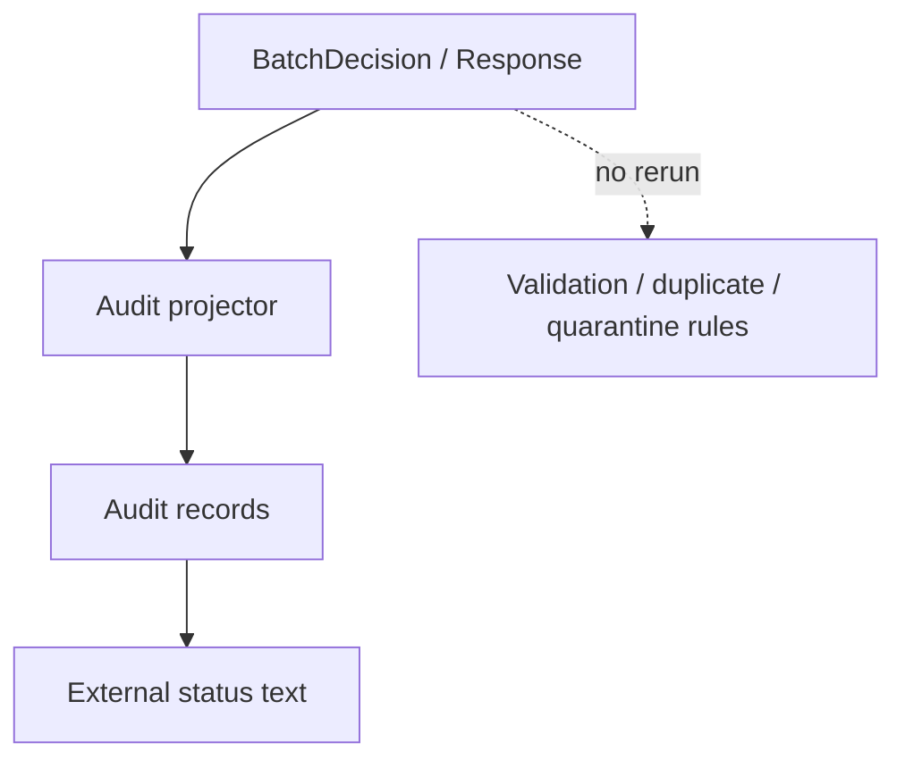
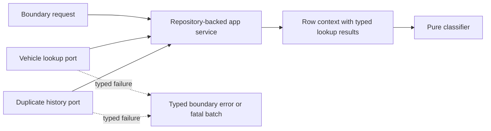
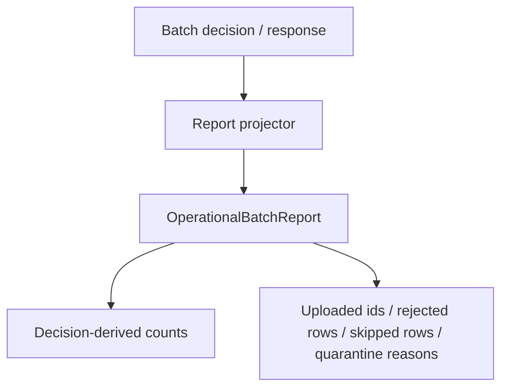
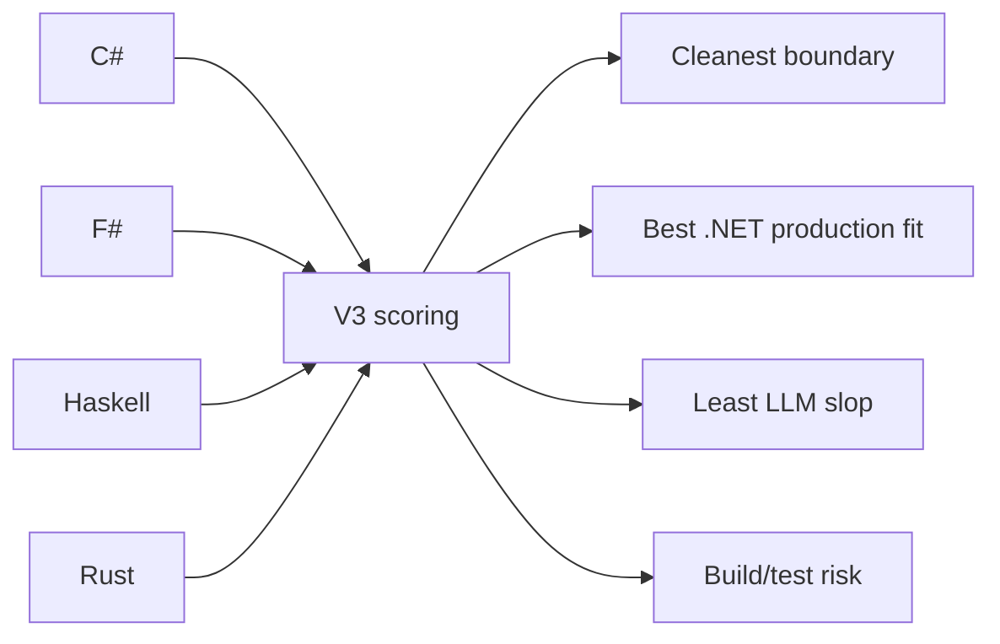

# V3 Integration Pressure Phase Briefing

V3 asks a different question than V2: not just "can the language model a clean domain?", but "does that domain stay clean when realistic application concerns arrive?"

V2 showed that C#, F#, Haskell, and Rust can all express the fuel-upload decision engine with typed outcomes, derived summaries, and minimal raw status strings. V3 keeps those business rules stable and adds integration-shaped pressure around the core: imports, audit records, repository lookups, and operational reporting.

TypeScript and PureScript stay frozen as baselines. V3 scoring focuses on C#, F#, Haskell, and Rust.



The important invariant: integration details point inward only as typed application inputs. They do not become domain concepts.

## Phase 0: Scaffolding

Phase 0 sets the experiment frame. It adds the v3 plan, scoring rubric, agent log, and README links. It also establishes the evaluation categories:

- build/test reliability
- domain boundary integrity
- typed integration errors
- rule correctness preservation
- change safety
- idiomatic integration shape
- practical production fit

This phase should be docs-only. It should not change behavior.

## Phase 1: CSV-Shaped Import Boundary

Phase 1 models what happens when the system receives messy imported rows. The goal is not to parse real CSV files; the goal is to represent already-parsed CSV-shaped records as raw boundary DTOs and convert them into existing application requests.



Good shape:

```csharp
public sealed record CsvFuelRow(
    string RowNumber,
    string VehicleIdentifier,
    string TransactionDate,
    string Quantity,
    string UnitPrice,
    string UploadMode);

public enum ImportErrorCode
{
    MissingRequiredCell,
    InvalidNumber,
    InvalidDate,
    InvalidUploadMode
}

public static ImportResult<FuelUploadRequestDto> ToRequest(ImportBatchRequest input)
{
    var mode = ParseUploadMode(input.UploadMode);
    var rows = input.Rows.Select(ParseRow).ToList();

    if (mode.HasErrors || rows.Any(row => row.HasErrors))
    {
        return ImportResult.Failure(mode.Errors.Concat(rows.SelectMany(row => row.Errors)));
    }

    return ImportResult.Success(new FuelUploadRequestDto(
        UploadMode: mode.Value,
        Rows: rows.Select(row => row.Value).ToList()));
}
```

Why this scores well:

- raw strings are confined to the import boundary
- bad cells become typed import errors
- valid imports flow through the same service as normal DTOs
- the mapper does not decide whether a row is accepted, rejected, skipped, or quarantined

Counterexample:

```csharp
public static BatchSummary ImportAndSummarize(IEnumerable<string[]> csvRows)
{
    var accepted = 0;
    var rejected = 0;

    foreach (var cells in csvRows)
    {
        if (cells[5] == "normal" && decimal.Parse(cells[3]) > 0)
        {
            accepted++;
        }
        else
        {
            rejected++;
        }
    }

    return new BatchSummary(accepted, rejected);
}
```

Why this scores poorly:

- CSV cell positions leak directly into business behavior
- strings drive status decisions
- parsing exceptions are not typed boundary errors
- summary logic is duplicated outside the decision engine

## Phase 2: Audit/Event Projection

Phase 2 adds auditability without embedding audit logic in the classifier. The domain/application decision should already contain enough information to explain what happened; the audit layer simply projects that decision into stable records.



Good shape:

```csharp
public enum AuditEventKind
{
    Accepted,
    AcceptedWithWarnings,
    Rejected,
    SkippedDuplicate,
    Quarantined,
    FatalBatch
}

public sealed record AuditRecord(
    AuditEventKind Kind,
    int? RowNumber,
    string? TransactionId,
    IReadOnlyList<string> Warnings,
    IReadOnlyList<string> QuarantineReasons,
    string ExternalStatus);

public static IReadOnlyList<AuditRecord> From(BatchDecision decision) =>
    decision.Rows.Select(ProjectRow)
        .AppendFatalIfBlocked(decision)
        .ToList();
```

Why this scores well:

- the event kind is typed internally
- external text is produced at the edge
- quarantine reasons and warnings remain separate
- fatal batch audit events are distinct from rejected rows
- projection reads decisions; it does not rerun rules

Counterexample:

```csharp
public static AuditRecord Audit(FuelUploadRowDto row)
{
    if (row.VehicleLookupStatus == "missing")
    {
        return new AuditRecord("rejected", row.RowNumber, "vehicle not found");
    }

    if (row.DuplicateStatus == "duplicate")
    {
        return new AuditRecord("skipped", row.RowNumber, "duplicate");
    }

    return new AuditRecord("accepted", row.RowNumber, "");
}
```

Why this scores poorly:

- audit projection inspects raw input rather than decisions
- raw string statuses drive behavior
- audit logic can drift from domain classification
- fatal lookup failures and row-level rejections are easy to collapse accidentally

## Phase 3: Persistence-Shaped Repository Ports

Phase 3 models repository lookup pressure without adding a real database or IO. Vehicle lookup and duplicate-history lookup should live behind application-layer ports. The domain should receive typed lookup results, not repositories.



Good shape:

```csharp
public interface IVehicleLookupPort
{
    VehicleLookupResult Lookup(VehicleIdentifier identifier);
}

public interface IDuplicateLookupPort
{
    DuplicateCheckResult Lookup(TransactionKey key);
}

public enum RepositoryErrorCode
{
    VehicleLookupUnavailable,
    DuplicateLookupUnavailable
}

public sealed class RepositoryFuelUploadApplicationService
{
    public FuelUploadMapResult<FuelUploadResponseDto> Classify(
        ImportBatchRequest request,
        IVehicleLookupPort vehicles,
        IDuplicateLookupPort duplicates)
    {
        var rowContexts = request.Rows.Select(row =>
            BuildRowContext(row, vehicles.Lookup(row.VehicleIdentifier), duplicates.Lookup(row.Key)));

        return ClassifyExistingDomainRequest(rowContexts);
    }
}
```

Why this scores well:

- repositories are application ports, not domain dependencies
- fake in-memory repositories can test behavior without IO
- lookup failures remain typed
- repository failures are not disguised as validation errors
- domain still sees vehicle lookup and duplicate check results, not database concepts

Counterexample:

```csharp
public sealed class FuelUploadDecisionEngine
{
    private readonly SqlConnection _connection;

    public RowDecision Decide(FuelUploadRow row)
    {
        var vehicleId = QueryVehicleId(_connection, row.VehicleIdentifier);

        if (vehicleId == null)
        {
            return RowDecision.Rejected("not_found");
        }

        var duplicate = QueryDuplicateTable(_connection, row.ExternalReference);
        return duplicate ? RowDecision.Skipped("dup") : RowDecision.Accepted(vehicleId);
    }
}
```

Why this scores poorly:

- the pure engine depends on persistence
- database details leak into domain flow
- repository failures have no typed representation
- raw strings appear in domain decisions
- duplicate lookup behavior is now hard to test independently

## Phase 4: Operational Batch Report

Phase 4 adds a compact business-facing report derived from the batch response or decision. It should answer operational questions: what uploaded, what failed, what was quarantined, what was skipped, and whether the batch was fatal.



Good shape:

```csharp
public enum OperationalReportStatus
{
    Completed,
    CompletedWithExceptions,
    Fatal
}

public sealed record OperationalBatchReport(
    OperationalReportStatus Status,
    BatchSummaryDto Counts,
    IReadOnlyList<string> UploadedTransactionIds,
    IReadOnlyList<int> RejectedRows,
    IReadOnlyList<QuarantinedRowReport> QuarantinedRows,
    IReadOnlyList<int> SkippedDuplicateRows);

public static OperationalBatchReport From(FuelUploadResponseDto response)
{
    var decisions = response.Decisions;

    return new OperationalBatchReport(
        Status: DeriveStatus(response),
        Counts: BatchSummaryDto.From(response),
        UploadedTransactionIds: decisions.AcceptedTransactionIds(),
        RejectedRows: decisions.RejectedRowNumbers(),
        QuarantinedRows: decisions.QuarantinedRowsWithReasons(),
        SkippedDuplicateRows: decisions.SkippedDuplicateRowNumbers());
}
```

Why this scores well:

- report data is derived from decisions/responses
- uploaded transaction IDs come only from accepted decisions
- fatal status cannot pretend rows uploaded
- counts use the existing summary rather than independent counters
- rejected, skipped, quarantined, warned, accepted, and fatal outcomes remain distinguishable

Counterexample:

```csharp
public static OperationalBatchReport BuildReport(IEnumerable<CsvFuelRow> rows)
{
    var accepted = 0;
    var skipped = 0;
    var uploadedIds = new List<string>();

    foreach (var row in rows)
    {
        if (row.DuplicateStatus == "duplicate")
        {
            skipped++;
        }
        else if (decimal.Parse(row.Quantity) > 0)
        {
            accepted++;
            uploadedIds.Add(row.ExternalReference);
        }
    }

    return new OperationalBatchReport(accepted, skipped, uploadedIds);
}
```

Why this scores poorly:

- report projection inspects raw input rows
- mutable counters can drift from decisions
- duplicate and validation logic are recomputed
- external references are confused with uploaded transaction IDs
- fatal outcomes cannot be represented safely

## Phase 5: Scoring Report

Phase 5 compares the four target languages using the v3 rubric. It should not add new implementation features except tiny fixes needed to make the report accurate.

The scoring question is whether v3 changes the v2 conclusion once integration pressure is applied:



Expected outputs:

- `docs/v3-results.md`
- README link to the v3 results
- updated v3 agent log
- phase note for what was verified and what was not

The strongest implementation will not necessarily be the most theoretically pure one. V3 explicitly rewards practical application boundaries, typed integration failures, and production fit.
