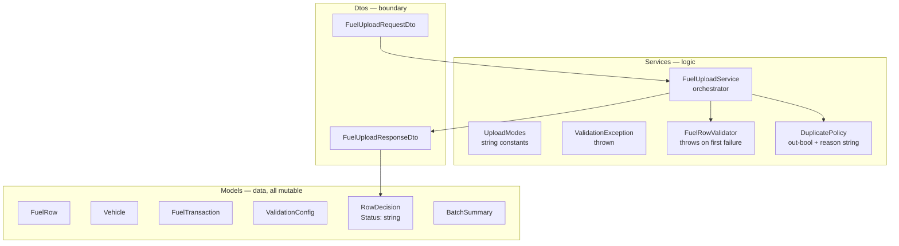

This is the code your team actually ships first. It builds with no
warnings, the happy-path tests are green, and any C# developer hired off
the street can read it on day one. The whole engine is roughly two
hundred lines of code in three folders. We're going to walk through it.

The point of the tour is not to laugh at it. The point is to show
**what is normal** — so that when chapter [seven footguns](03-seven-footguns.qmd)
points at the bugs, you can see they're not stupidity. They are the
default shape of C# when the language's optional features are turned
off.

## The folder layout

Three folders. Models hold data. Services hold logic. Dtos hold the
boundary shapes.



Nothing exotic. No discriminated unions, no `IReadOnlyList<T>`, no
records, no nullable reference types. The csproj has
`<Nullable>disable</Nullable>` — every reference is implicitly nullable
and the compiler stays quiet about it.

## The models

`FuelRow` is a plain class with public getters and setters. Every
property is independently mutable.

```csharp
public class FuelRow
{
    public int RowNumber { get; set; }
    public string VehicleRef { get; set; }
    public string SourceId { get; set; }
    public DateTime OccurredOn { get; set; }
    public decimal QuantityLiters { get; set; }
    public decimal TotalCost { get; set; }
    public string MerchantName { get; set; }
    public int Odometer { get; set; }
}
```

> `src/FuelUploadEngine/Models/FuelRow.cs` lines 5–15

`RowDecision` is the centre of the design. It's **one flat class** that
represents every possible outcome. Which outcome it actually is, is
encoded in a string field called `Status`. Some properties are valid
only for some statuses; the rest are left null.

```csharp
public class RowDecision
{
    public int RowNumber;
    public string Status;                     // "Accepted" | "AcceptedWithWarnings" | "Quarantined" | "Skipped" | "Rejected" | "Fatal"
    public FuelTransaction Transaction;       // null when Status is Rejected / Fatal / Skipped
    public Vehicle Vehicle;                   // null when vehicle lookup failed
    public List<string> Errors = new List<string>();
    public List<string> Warnings = new List<string>();
    public List<string> QuarantineReasons = new List<string>();
    public string SkipReason;                 // populated when Status == "Skipped"
    public string FatalMessage;               // populated when Status == "Fatal"
}
```

> `src/FuelUploadEngine/Models/RowDecision.cs` lines 7–18

`BatchSummary` is a counter bag. One integer per status, plus a total.

```csharp
public class BatchSummary
{
    public int TotalRows { get; set; }
    public int Accepted { get; set; }
    public int AcceptedWithWarnings { get; set; }
    public int Quarantined { get; set; }
    public int Skipped { get; set; }
    public int Rejected { get; set; }
    public int Fatal { get; set; }
}
```

> `src/FuelUploadEngine/Models/BatchSummary.cs` lines 3–12

**Why this is normal.** Public setters are the default. A class with
six counters and a class with nine optional fields is exactly what most
intro tutorials produce. It compiles, it serialises, it tests fine.

## The string constants

The modes and the outcome enums are not enums. They're string constants
grouped in static classes — because the request lands as JSON and
"passing the string through" felt simpler than mapping it.

```csharp
public static class UploadModes
{
    public const string Normal = "Normal";
    public const string Retry = "Retry";
    public const string ConservativeRecovery = "ConservativeRecovery";
    public const string AggressiveRecovery = "AggressiveRecovery";
}
```

> `src/FuelUploadEngine/Services/UploadModes.cs` lines 6–12

There are matching `PreviousOutcomes`, `VehicleLookupStatuses`, and
`DuplicateStatuses` classes in the same file. Every comparison in the
codebase is a string comparison.

**Why this is normal.** Many real C# codebases do exactly this for
"don't want the deserializer to fight me" reasons. It works until
somebody on a JS client sends `"retry"` instead of `"Retry"`.

## The validator

`FuelRowValidator` is a static class with one method that throws on the
first failure. The exception type carries the failure reason in its
`Message`.

```csharp
public static void Validate(FuelRow row, ValidationConfig config)
{
    if (row.QuantityLiters <= config.MinQuantityLiters)
        throw new ValidationException("QuantityNotPositive");

    if (row.QuantityLiters > config.MaxQuantityLiters)
        throw new ValidationException("QuantityExceedsMaximum");

    if (row.TotalCost <= 0m)
        throw new ValidationException("CostNotPositive");

    if (string.IsNullOrEmpty(row.VehicleRef))
        throw new ValidationException("VehicleRefRequired");

    if (string.IsNullOrEmpty(row.MerchantName))
        throw new ValidationException("MerchantRequired");

    if (row.OccurredOn > DateTime.UtcNow)
        throw new ValidationException("TransactionDateInFuture");
}
```

> `src/FuelUploadEngine/Services/FuelRowValidator.cs` lines 13–32

**Why this is normal.** Exceptions for "bad input" feel idiomatic in
C# — there's nothing in the language nudging you toward a `Result<T,
Errors>` shape. The whole pattern of accumulating errors and returning
them as a list is something you have to know to look for.

## The duplicate policy

Four upload modes, six previous outcomes. The policy returns a `bool`
through the return value and a skip reason through an `out` parameter.

```csharp
public static bool ShouldAcceptDuplicate(string mode, string previousOutcome, out string skipReason)
{
    skipReason = "";

    if (mode == UploadModes.Normal) { skipReason = "NormalModeDuplicate"; return false; }

    if (mode == UploadModes.Retry)
    {
        if (previousOutcome == PreviousOutcomes.RetryableFailure) return true;
        skipReason = "RetryModeNotRetryable";
        return false;
    }
    // ... ConservativeRecovery and AggressiveRecovery branches ...

    skipReason = "UnknownMode";
    return false;
}
```

> `src/FuelUploadEngine/Services/DuplicatePolicy.cs` lines 9–55

Look at it. The control flow is a flat list of `if` statements on two
strings. There is nothing telling the compiler that these strings have
a closed set of values. If you forget a `(mode, previousOutcome)`
combination it silently falls through to `UnknownMode`.

**Why this is normal.** This is what `if`/`else` chains on stringly-typed
inputs look like in any language without sum types. The author of this
code is not careless — there's just no compiler check to fail.

## The orchestrator

`FuelUploadService.Process` is the entry point. It loops over each
input row, calls `ProcessOneRow` inside a try/catch, then logs the
decision, then computes the summary.

```csharp
foreach (var input in request.Rows)
{
    var decision = new RowDecision();
    decision.RowNumber = input.RowNumber;

    try
    {
        ProcessOneRow(input, request.Mode, config, decision);
    }
    catch (ValidationException vex)
    {
        decision.Status = "Rejected";
        decision.Errors.Add(vex.Message);
    }
    catch (Exception ex)
    {
        decision.Status = "Fatal";
        decision.FatalMessage = ex.Message;
    }

    response.Decisions.Add(decision);
    LogDecision(decision);
}
```

> `src/FuelUploadEngine/Services/FuelUploadService.cs` lines 20–44

The decision object is **mutated in place** by `ProcessOneRow`. The
catch blocks mutate it again. Then `LogDecision` reads it. Then it's
appended to the response list.

`LogDecision` is the innocent-looking line that lights the fuse:

```csharp
private void LogDecision(RowDecision d)
{
    Console.WriteLine(
        "row " + d.RowNumber +
        " plate=" + d.Vehicle.LicensePlate +
        " status=" + d.Status);
}
```

> `src/FuelUploadEngine/Services/FuelUploadService.cs` lines 154–163

`d.Vehicle` is null whenever the vehicle lookup didn't return Found.
The code dereferences it unconditionally. The first not-found row in
production takes down the whole batch with a `NullReferenceException`.

`ComputeSummary` is the other suspicious piece. It's a `switch`
*statement* with no default arm:

```csharp
switch (d.Status)
{
    case "Accepted": s.Accepted++; break;
    case "AcceptedWithWarnings": s.AcceptedWithWarnings++; break;
    case "Quarantined": s.Quarantined++; break;
    case "Skipped": s.Skipped++; break;
    case "Rejected": s.Rejected++; break;
    case "Fatal": s.Fatal++; break;
    // No default branch -- any "new" status string we forget
    // to handle here will silently fail to be counted.
}
```

> `src/FuelUploadEngine/Services/FuelUploadService.cs` lines 171–183

A new status string introduced anywhere upstream silently fails to be
counted. The total stops matching `TotalRows` but no exception is
raised.

**Why this is normal.** Mutating an output object in a loop and
logging in the same loop is the most direct way to write this code.
The switch statement is C# 1.0 syntax. It's everywhere.

## The pipeline as data flow

Here is the same orchestrator, drawn as a data flow:

```mermaid
flowchart LR
  Req[FuelUploadRequestDto] --> Loop[loop over Rows]
  Loop --> PR[ParsedFuelRow + Vehicle + DuplicateStatus]
  PR --> VLU[Vehicle lookup status]
  VLU --> VAL[FuelRowValidator.Validate]
  VAL --> VCK[Vehicle outcome check]
  VCK --> DUP[DuplicatePolicy.ShouldAcceptDuplicate]
  DUP --> BAD[BuildAcceptedDecision]
  BAD --> RD[RowDecision]
  RD --> LOG[LogDecision]
  LOG --> SUM[ComputeSummary]
  SUM --> Resp[FuelUploadResponseDto]
```



The shape is fine. The exact same shape appears in the F# and Haskell
versions. **What's different is what the type system knows about each
arrow.**

## Where the wheels come off

Now annotate that same diagram with the places where the code does
something the type system can't see:

```mermaid
flowchart LR
  Req[FuelUploadRequestDto] -->|Mode is a string| Loop[loop over Rows]
  Loop --> PR[Input row]
  PR -->|VehicleLookupStatus is a string| VLU[Vehicle lookup status]
  VLU --> VAL[FuelRowValidator.Validate]
  VAL -.->|throws on first failure| CATCH[catch ValidationException]
  VAL --> VCK[Vehicle outcome check]
  VCK -->|sets decision.Vehicle only if Found| DUP[DuplicatePolicy]
  DUP -->|out-bool + reason string| BAD[BuildAcceptedDecision]
  BAD --> RD["RowDecision<br/>Status is a string<br/>Errors is a mutable List"]
  RD --> LOG["LogDecision<br/>reads d.Vehicle.LicensePlate<br/>NRE if Vehicle is null"]
  LOG --> SUM["ComputeSummary<br/>switch statement, no default<br/>new statuses silently drop"]
  SUM --> Resp[FuelUploadResponseDto]
  CATCH -.-> RD
```



Seven distinct places where the language could have warned the author
and didn't. Three of them — the `LogDecision` NRE, the
case-sensitive mode string, and the missing aggressive-recovery branch
— already have failing tests pinning the buggy behaviour in
`FuelUploadServiceTests.cs`. The other four are the kind of bug nobody
notices until production.

That's the next chapter: [seven footguns](03-seven-footguns.qmd) — each
one named, located, demonstrated, and matched to the language feature
that would have made it impossible.
