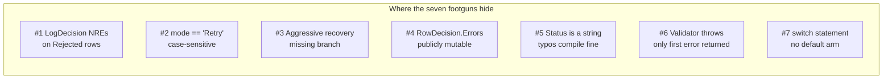
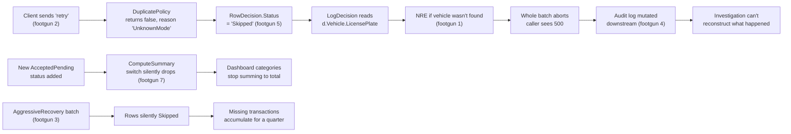

The code from the [previous chapter](02-normal-csharp-tour.qmd) ships
with at least seven specific failure modes the type system could have
refused to compile, if we'd asked it to. They're not subtle judgement
calls. They're real bugs with concrete production consequences.

Four of them have failing tests already checked in — under the
`FuelUploadServiceBugTests` class — pinning the buggy behaviour so
fixing it would fail the test. That's deliberate. Looking at a green
test suite and thinking "all good" is half of the problem.

Here is the map. We're going one by one.



---

## Footgun 1 — NullReferenceException in the logger

`LogDecision` reads `d.Vehicle.LicensePlate` for every row. `d.Vehicle`
is set only on the Found branch of vehicle lookup, so any Rejected or
Fatal row that came in with no vehicle leaves that field null.

```csharp
Console.WriteLine(
    "row " + d.RowNumber +
    " plate=" + d.Vehicle.LicensePlate +
    " status=" + d.Status);
```

> `src/FuelUploadEngine/Services/FuelUploadService.cs` lines 159–162

**What shipping looks like.** A batch with one bad vehicle reference in
the middle takes down the whole upload with an unhandled
`NullReferenceException`. Any rows before it are lost too, because the
response is built in a single loop.

**What a type system could prevent it.** Non-nullable reference types
(NRT, the C# 8 feature this project disables). With NRT on, `Vehicle`
on `RowDecision` would have to be declared `Vehicle?`, and
`d.Vehicle.LicensePlate` would not compile without a null check.

Pinned by `Bug1_NullRefInLoggerWhenVehicleNotFound`.

---

## Footgun 2 — Case-sensitive mode string

The upload mode arrives as JSON and is compared with `==` against the
string constants in `UploadModes`.

```csharp
if (mode == UploadModes.Retry) { ... }
```

> `src/FuelUploadEngine/Services/DuplicatePolicy.cs` line 21

That's an ordinal, case-sensitive comparison. Any client that sends
`"retry"` instead of `"Retry"` — which is what most JS API clients
produce — falls through to the final branch and gets `"UnknownMode"`.

**What shipping looks like.** A retry batch silently does nothing.
Every duplicate is reported as `Skipped` with reason `UnknownMode`. The
batch returns 200 OK, the summary looks healthy, and the actual retry
work isn't done.

**What a type system could prevent it.** A sum type — an enum at
minimum, a discriminated union ideally. The deserializer would either
accept `"retry"` or reject it at the boundary; there is no third option
where it silently bypasses the comparison.

Pinned by `Bug2_RetryModeIsCaseSensitive`.

---

## Footgun 3 — Missing aggressive-recovery branch

This is the one that costs real money. The aggressive recovery contract
says: also accept rows whose previous attempt was
`FailedAfterCanonicalFinalizationWithoutKey` — the canonical write
didn't actually land, so the row should be re-uploaded.

That branch is **not in the code**:

```csharp
if (mode == UploadModes.AggressiveRecovery)
{
    if (previousOutcome == PreviousOutcomes.FailedBeforeCanonicalFinalization)
        return true;
    // NOTE: we should also retry FailedAfterCanonicalFinalizationWithoutKey here
    // -- the aggressive contract says when the canonical key never landed,
    // we should re-upload. But this branch was forgotten.
    skipReason = "AggressiveRecoverySkipped";
    return false;
}
```

> `src/FuelUploadEngine/Services/DuplicatePolicy.cs` lines 41–50

Nothing in the compiler tells you that the `(mode, previousOutcome)`
pair has 24 possible combinations and you've only handled some of them.
Both fields are strings. There is no exhaustiveness check.

**What shipping looks like.** Recovery runs report rows as `Skipped`
when they should be `Accepted`. The skipped rows accumulate as missing
transactions that no one notices for a quarter, because the response
*looks* normal — they're skipped, not failed.

**What a type system could prevent it.** Exhaustive pattern matching
on discriminated unions. F#, Haskell, and Rust will refuse to compile a
match that doesn't cover every constructor of the input. C# `switch`
*expressions* on type patterns will warn. C# `switch` *statements* on
strings won't.

Pinned by `Bug3_AggressiveRecovery_MissesFailedAfterCanonicalWithoutKey`.

---

## Footgun 4 — Mutable response list

`RowDecision.Errors` is a public mutable list field. After the service
returns, any caller can mutate it.

```csharp
public List<string> Errors = new List<string>();
public List<string> Warnings = new List<string>();
public List<string> QuarantineReasons = new List<string>();
```

> `src/FuelUploadEngine/Models/RowDecision.cs` lines 13–15

There is no defensive copy in the service, no `IReadOnlyList<T>`
wrapper, no `ImmutableArray<T>`.

**What shipping looks like.** A reporting layer two steps downstream
mutates the error list during display formatting. The audit log is
rewritten silently. The bug is invisible to the producer of the data
because the producer is long-since returned.

**What a type system could prevent it.** Immutable collection types by
default (`IReadOnlyList<T>`, `ImmutableArray<T>`, F# lists, Haskell
lists, Rust ownership semantics). The compiler refuses to give a caller
a mutating handle.

Pinned by `Bug4_DecisionListIsMutableByCaller`.

---

## Footgun 5 — Status is a string, typos compile fine

`RowDecision.Status` is a string. So is `VehicleLookupStatus`, so is
`DuplicateStatus`, so is `PreviousOutcome`, so is `Mode`. Every domain
decision in this codebase is communicated as a string.

```csharp
public string Status;     // "Accepted" | "AcceptedWithWarnings" | "Quarantined" | "Skipped" | "Rejected" | "Fatal"
```

> `src/FuelUploadEngine/Models/RowDecision.cs` line 10

A downstream consumer writes `if (d.Status == "Quarantied")` (typo).
The build is green. The bug ships. The downstream report quietly
under-counts the quarantine category by 100%.

**What shipping looks like.** Every string comparison anywhere in the
solution — and there are dozens — is a potential instance of this bug.
A renamed status (e.g. you decide `"AcceptedPending"` is a thing) only
fails at the consumers who knew to update. The others compile fine and
return wrong results.

**What a type system could prevent it.** A sum type — discriminated
union, sealed-record hierarchy, enum. A typo in a constructor name
fails to compile. Renaming a case forces every consumer to update.

No pinned test for this one because *every string comparison* is a
potential instance. That's the point.

---

## Footgun 6 — Validator throws on first failure

`FuelRowValidator.Validate` is implemented as a chain of `if/throw`.

```csharp
if (row.QuantityLiters <= config.MinQuantityLiters)
    throw new ValidationException("QuantityNotPositive");

if (row.QuantityLiters > config.MaxQuantityLiters)
    throw new ValidationException("QuantityExceedsMaximum");

if (row.TotalCost <= 0m)
    throw new ValidationException("CostNotPositive");
// ...
```

> `src/FuelUploadEngine/Services/FuelRowValidator.cs` lines 15–22

Two consequences. First, throwing on every invalid row is much slower
than returning a list — bulk uploads with thousands of bad rows feel
sluggish for no good reason. Second, only the first failure is ever
reported. A row that is both negative-quantity and over-cost only ever
shows `QuantityNotPositive`. The user fixes that, re-uploads, gets
`CostNotPositive`, fixes that, re-uploads again — three round trips
where one would have done.

**What shipping looks like.** Customer support tickets that all read
"the upload told me to fix X; I fixed X; now it tells me to fix Y; why
didn't it just say so the first time?" Slow batch performance under
load that profiles back to exception throwing.

**What a type system could prevent it.** A `Result<T, IReadOnlyList<Error>>`
return shape — what F#, Haskell, and Rust make natural. The validator
accumulates instead of bailing. C# can do this too; the language just
doesn't push you toward it the way `Either` and `Result` do.

---

## Footgun 7 — switch statement with no default arm

`ComputeSummary` matches on `d.Status` and increments one counter per
known value:

```csharp
switch (d.Status)
{
    case "Accepted": s.Accepted++; break;
    case "AcceptedWithWarnings": s.AcceptedWithWarnings++; break;
    case "Quarantined": s.Quarantined++; break;
    case "Skipped": s.Skipped++; break;
    case "Rejected": s.Rejected++; break;
    case "Fatal": s.Fatal++; break;
    // No default branch -- any "new" status string we forget
    // to handle here will silently fail to be counted.
}
```

> `src/FuelUploadEngine/Services/FuelUploadService.cs` lines 171–183

Add a new outcome upstream — `"AcceptedPending"`, say — and the count
just vanishes. `s.TotalRows` keeps incrementing in the outer line
above, but no per-status counter catches the new value. The totals
stop adding up. No exception is raised.

**What shipping looks like.** A reporting dashboard whose categories
no longer sum to the total. Some quiet count of rows is being silently
discarded. The bug is found weeks later when someone runs a sanity
SQL.

**What a type system could prevent it.** A switch *expression* on a
discriminated union. The C# compiler does warn on non-exhaustive switch
expressions over sealed-record hierarchies. F#, Haskell, and Rust make
this an error, not a warning. The `BatchSummary` could also be
**derived** from per-row decisions rather than mutated separately,
removing the drift between the row outcomes and the summary entirely.

---

## How the seven chain into failure

The bugs above aren't independent. They reinforce each other. Here's
one specific chain that hits production:



The three planted test cases (`Bug1`, `Bug2`, `Bug3`, `Bug4`) pin four
of these. The rest are the kind of bug nobody writes a test for because
the code looks like ordinary C#.

Look at the map of features that would have prevented each one:

| # | Footgun                              | Language feature that closes it |
| - | ------------------------------------ | --------------------------------- |
| 1 | NRE in logger                        | non-nullable reference types     |
| 2 | case-sensitive mode string           | sum type (enum / DU)             |
| 3 | missing recovery branch              | exhaustive pattern matching      |
| 4 | mutable response                     | immutable collections by default |
| 5 | status typos                         | sum type                         |
| 6 | exception-driven validator           | `Result<T, errors>` return shape |
| 7 | switch without default               | switch *expression* + DU         |

Six of the seven reduce to two ideas: **make illegal states
unrepresentable** (sum types) and **force exhaustiveness** (the
compiler proves you handled every case). The seventh — the mutable
response — is closed by immutability by default.

The next chapter is the first rung up the ladder.
[Idiomatic C#](04-idiomatic-csharp.qmd) keeps the same language and
turns on the features this project disabled. Six of the seven footguns
go away. The one that remains is the one the .NET runtime structurally
cannot prevent — and to close it, we'll have to leave C# entirely.
