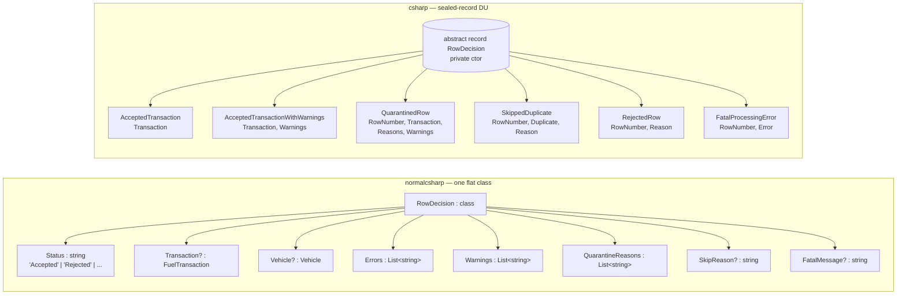
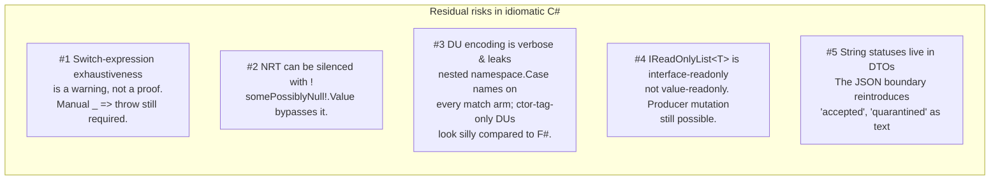

## Same language. All the dials turned on. {.unnumbered}

You don't have to leave C# to make six of the seven footguns from
[chapter 03](03-seven-footguns.qmd) disappear. You just have to **turn on
the features juniors usually skip**.

In one breath: `<Nullable>enable</Nullable>`, sealed-record hierarchies
as a poor-man's discriminated union, `switch` *expressions* with type
patterns, record structs as zero-cost typed primitives, `IReadOnlyList<T>`
at every boundary, real enums instead of string constants, and a
validator that **accumulates errors into a list** instead of throwing
on the first one.

No new language. No new build system. Same `dotnet test`. The compiler
is about to get a lot more useful.

## The shape of the type model, before and after



In the normal branch, **every field exists on every decision** and is
nullable by convention. The compiler thinks an `Accepted` row and a
`Fatal` row have the same shape; only the `Status` string discriminates
them. Forgetting to null-check `Vehicle` on a `Rejected` row is what
caused footgun #1.

In the idiomatic branch, `RowDecision` is an `abstract record` with a
**private constructor** and six nested `sealed record` cases. The private
constructor is the load-bearing trick — it prevents anyone outside the
file declaring a seventh subtype, which is the only thing that makes
exhaustiveness checks meaningful at all.

```csharp
// csharp-fuel-engine/src/FuelUploadEngine/Domain/RowDecision.cs
public abstract record RowDecision
{
    private RowDecision() { }

    public sealed record AcceptedTransaction(FuelTransaction Transaction) : RowDecision;

    public sealed record AcceptedTransactionWithWarnings(
        FuelTransaction Transaction,
        IReadOnlyList<UploadWarning> Warnings) : RowDecision;

    public sealed record QuarantinedRow : RowDecision { /* invariant-checked ctor */ }

    public sealed record SkippedDuplicate(
        RowNumber RowNumber,
        DuplicateState Duplicate,
        DuplicateSkipCode Reason) : RowDecision;

    public sealed record RejectedRow(RowNumber RowNumber, RejectionReason Reason) : RowDecision;

    public sealed record FatalProcessingError(RowNumber RowNumber, FatalError Error) : RowDecision;
}
```

A `RejectedRow` has no `Transaction` field. There is nothing to null.
The illegal state is unrepresentable.

## Footgun by footgun

For each of the seven, we'll look at the normal version, the idiomatic
version, and then say plainly: closed, or still open?

### Footgun #1 — NRE in the logger

Normal C#:

```csharp
// normalcsharp/src/.../Services/FuelUploadService.cs:155
Console.WriteLine(
    "row " + d.RowNumber +
    " plate=" + d.Vehicle.LicensePlate +    // null on Rejected rows
    " status=" + d.Status);
```

Idiomatic C#:

```csharp
// csharp/src/.../Domain/RowDecision.cs
public sealed record RejectedRow(RowNumber RowNumber, RejectionReason Reason) : RowDecision;
```

A `RejectedRow` literally has no `Transaction` and no `Vehicle` member.
You cannot write `decision.Vehicle.LicensePlate` because there is no
`Vehicle` property on a `RejectedRow` to dereference. The only way to
talk about a vehicle is to first pattern-match on a case that has one:

```csharp
var plate = decision switch
{
    RowDecision.AcceptedTransaction a            => a.Transaction.Vehicle.Identifier.Value,
    RowDecision.AcceptedTransactionWithWarnings a => a.Transaction.Vehicle.Identifier.Value,
    RowDecision.QuarantinedRow q                  => q.Transaction.Vehicle.Identifier.Value,
    _ => "(no vehicle)"
};
```

**Closed.** Nominal subtyping over a sealed hierarchy — the field exists
where it's meaningful and nowhere else.

### Footgun #2 — case-sensitive mode string

Normal C#:

```csharp
// normalcsharp/src/.../Services/DuplicatePolicy.cs:21
if (mode == UploadModes.Retry) { ... }   // ordinal compare; "retry" silently misses
```

Idiomatic C#:

```csharp
// csharp/src/.../Domain/Primitives.cs
public enum UploadMode { Normal, Retry, ConservativeRecovery, AggressiveRecovery }

// csharp/src/.../Application/FuelUploadMapper.cs
private static UploadMode? ParseUploadMode(string? value, ...) => Normalize(value) switch
{
    "normal"               => UploadMode.Normal,
    "retry"                => UploadMode.Retry,
    "conservativerecovery" => UploadMode.ConservativeRecovery,
    "aggressiverecovery"   => UploadMode.AggressiveRecovery,
    _ => InvalidUploadMode(field, value, errors)
};
```

The string only lives in `FuelUploadMapper`, where it's lowercased,
trimmed, and stripped of underscores **once**. Inside the engine, `mode`
is one of four enum values. Case-sensitive equality on a string is gone
from the engine entirely.

**Closed.** Enum + boundary normalisation.

### Footgun #3 — the missing aggressive-recovery branch

This is the killer. The normal branch had a four-block `if/else if`
chain on `mode` and a forgotten arm:

```csharp
// normalcsharp/src/.../Services/DuplicatePolicy.cs
if (mode == UploadModes.AggressiveRecovery)
{
    if (previousOutcome == PreviousOutcomes.FailedBeforeCanonicalFinalization)
        return true;
    // NOTE: forgot to also accept FailedAfterCanonicalFinalizationWithoutKey
    skipReason = "AggressiveRecoverySkipped";
    return false;
}
```

Idiomatic C#:

```csharp
// csharp/src/.../Engine/DuplicatePolicy.cs
return mode switch
{
    UploadMode.Normal => new RowDecision.SkippedDuplicate(
        row.RowNumber, duplicate, DuplicateSkipCode.DuplicateInNormalMode),

    UploadMode.Retry when duplicate.PreviousOutcome is PreviousUploadOutcome.RetryableFailure => null,
    UploadMode.Retry => new RowDecision.SkippedDuplicate(
        row.RowNumber, duplicate, DuplicateSkipCode.PreviousAttemptNotRetryable),

    UploadMode.ConservativeRecovery when duplicate.PreviousOutcome is PreviousUploadOutcome.FailedBeforeCanonicalFinalization => null,
    UploadMode.ConservativeRecovery => new RowDecision.SkippedDuplicate(
        row.RowNumber, duplicate, DuplicateSkipCode.PreviousAttemptAlreadyCanonicalized),

    UploadMode.AggressiveRecovery when duplicate.PreviousOutcome is PreviousUploadOutcome.FailedBeforeCanonicalFinalization => null,
    UploadMode.AggressiveRecovery
        when duplicate.PreviousOutcome is PreviousUploadOutcome.FailedAfterCanonicalFinalization
          && duplicate.CanonicalTransactionKey is CanonicalTransactionKeyState.Missing => null,
    UploadMode.AggressiveRecovery => new RowDecision.SkippedDuplicate(
        row.RowNumber, duplicate, DuplicateSkipCode.PreviousAttemptAlreadyCanonicalized),

    _ => throw new InvalidOperationException("Unhandled upload mode.")
};
```

All four modes are visible in a single eight-line scan. The
"canonical-key missing" carve-out is *right there* as its own arm with
a `when` clause on the `CanonicalTransactionKeyState` sealed-record
union. The compiler doesn't strictly *force* coverage over the enum
(see "what can still go wrong"), but the visual signal-to-noise of a
switch expression makes a forgotten case stand out in code review the
way the if-else maze did not.

**Closed in practice, not by compiler proof.** The default `_ => throw`
is your runtime backstop.

### Footgun #4 — publicly-mutable `List<string>` on the response

Normal C#:

```csharp
// normalcsharp/src/.../Models/RowDecision.cs:13
public List<string> Errors = new List<string>();
public List<string> Warnings = new List<string>();
public List<string> QuarantineReasons = new List<string>();
```

A caller can `resp.Decisions[i].Errors.Add(...)` after `Process()`
returns and rewrite the audit trail.

Idiomatic C#:

```csharp
// csharp/src/.../Domain/RowDecision.cs
public sealed record QuarantinedRow : RowDecision
{
    public QuarantinedRow(
        RowNumber rowNumber,
        FuelTransaction transaction,
        IReadOnlyList<QuarantineReason> reasons,
        IReadOnlyList<UploadWarning> warnings)
    {
        if (reasons.Count == 0)
            throw new ArgumentException(
                "Quarantined rows require at least one reason.", nameof(reasons));
        ...
    }

    public IReadOnlyList<QuarantineReason> Reasons { get; }
    public IReadOnlyList<UploadWarning> Warnings { get; }
}
```

`IReadOnlyList<T>` denies the caller `.Add`. The record is immutable.
And the constructor enforces a real invariant — a `QuarantinedRow` with
zero reasons cannot exist.

**Closed**, with a footnote: `IReadOnlyList<T>` is a read-only *interface*,
not a read-only value. If the *producer* keeps a reference to the
underlying `List<T>` and mutates it later, the read-only view changes
underneath the caller. Everything in this codebase builds the list
eagerly and forgets the reference, so the practical risk is zero, but
the language doesn't make it impossible. `ImmutableArray<T>` would, at
the cost of allocation.

### Footgun #5 — status as a string

Normal C#:

```csharp
// normalcsharp/src/.../Models/RowDecision.cs:10
public string Status;   // "Quarantined" or "Quarantied", same to the compiler
```

Idiomatic C#:

```csharp
return decision switch
{
    RowDecision.AcceptedTransaction accepted             => AcceptedDto("accepted", ...),
    RowDecision.AcceptedTransactionWithWarnings accepted => AcceptedDto("accepted_with_warnings", ...),
    RowDecision.QuarantinedRow quarantined               => /* ... */,
    RowDecision.SkippedDuplicate skipped                 => /* ... */,
    RowDecision.RejectedRow rejected                     => RejectedDto(rejected),
    RowDecision.FatalProcessingError fatal               => /* ... */,
    _ => throw new InvalidOperationException("Unhandled row decision.")
};
```

There is no `.Status` property to mistype. The discriminator is the
runtime type. `RowDecision.Quarantied` doesn't exist; the file won't
compile. The string `"quarantined"` is written **once**, in the DTO
mapper, where it's part of the JSON contract and is supposed to be a
string.

**Closed at the engine layer.** The cost is real: string-based
serialisation is now explicit map code, not free.

### Footgun #6 — validator that throws on first error

Normal C#:

```csharp
// normalcsharp/src/.../Services/FuelRowValidator.cs
public static void Validate(FuelRow row, ValidationConfig config)
{
    if (row.QuantityLiters <= 0) throw new ValidationException("QuantityNotPositive");
    if (row.QuantityLiters > config.MaxQuantityLiters) throw new ValidationException("QuantityExceedsMaximum");
    if (row.TotalCost <= 0m) throw new ValidationException("CostNotPositive");
    // ... etc, first one wins
}
```

One bad row → one error → user fixes → one more error → user fixes →
N round-trips.

Idiomatic C#:

```csharp
// csharp/src/.../Engine/FuelRowValidator.cs
public static IReadOnlyList<ValidationError> Validate(FuelRow row, ValidationConfig config)
{
    var errors = new List<ValidationError>();
    if (string.IsNullOrWhiteSpace(row.VehicleIdentifier.Value))
        errors.Add(new ValidationError(ValidationErrorCode.MissingVehicleIdentifier));
    if (row.Quantity <= 0)
        errors.Add(new ValidationError(ValidationErrorCode.NonPositiveQuantity));
    if (row.Quantity > config.MaximumQuantity)
        errors.Add(new ValidationError(ValidationErrorCode.QuantityExceedsMaximum));
    if (row.UnitPrice < 0)
        errors.Add(new ValidationError(ValidationErrorCode.NegativeUnitPrice));
    if (row.UnitPrice > config.MaximumUnitPrice)
        errors.Add(new ValidationError(ValidationErrorCode.UnitPriceExceedsMaximum));
    if (row.TransactionDate > config.Today)
        errors.Add(new ValidationError(ValidationErrorCode.TransactionDateInFuture));
    return errors;
}
```

`ValidationErrorCode` is an enum, not a string. The orchestrator folds
the whole list into a single `RejectedRow` with a
`RejectionReason.ValidationFailed(errors)`. No exceptions for control
flow. Every check runs.

**Closed.** Cost: no short-circuit on the first failure. Each row pays
for every check. The checks are nanoseconds; the saved user round-trips
are hours. Trivial trade.

### Footgun #7 — `switch` statement with no default

Normal C#:

```csharp
// normalcsharp/src/.../Services/FuelUploadService.cs:171
switch (d.Status)
{
    case "Accepted":             s.Accepted++; break;
    case "AcceptedWithWarnings": s.AcceptedWithWarnings++; break;
    case "Quarantined":          s.Quarantined++; break;
    case "Skipped":              s.Skipped++; break;
    case "Rejected":             s.Rejected++; break;
    case "Fatal":                s.Fatal++; break;
    // no default: new statuses silently un-counted
}
```

Idiomatic C# uses `switch` *expressions* over the sealed-record
hierarchy, and the compiler emits **CS8509: The switch expression does
not handle all possible values of its input type** when you forget a
case. Treat warnings as errors and you have a compile-time check:

```csharp
return decision switch
{
    RowDecision.AcceptedTransaction accepted             => ...,
    RowDecision.AcceptedTransactionWithWarnings accepted => ...,
    RowDecision.QuarantinedRow quarantined               => ...,
    RowDecision.SkippedDuplicate skipped                 => ...,
    RowDecision.RejectedRow rejected                     => ...,
    RowDecision.FatalProcessingError fatal               => ...,
    _ => throw new InvalidOperationException("Unhandled row decision.")
};
```

**The most honest answer here is: closed in practice, not closed by
proof.** That `_ => throw` arm is not decoration. The C# compiler
emits CS8509 as a *warning*, on *flow analysis*, with documented holes
(generic constraints, some value-type wrappers, certain composite
patterns) where it stays silent. In a real DU language — F#, Haskell,
Rust — the equivalent `_` arm would be unreachable by construction and
the compiler would *refuse* the program if any case were missing.
Here, the language asks you to write the runtime backstop yourself.

**Six closed at compile time. One closed at code-review time, with a
runtime safety net.**

## What can still go wrong



Four honest residuals, plus a fifth that belongs to Part 1b:

1. **Exhaustiveness is a warning, not a proof.** Every switch in this
   codebase ends with `_ => throw new InvalidOperationException(...)`.
   That `throw` is there because C# does not *require* you to exhaust a
   sealed-record hierarchy. Flow analysis is best-effort.

2. **NRT has an escape hatch.** Any junior who writes `obj!.Member` to
   silence the compiler is back in the normal-branch world. NRT is a
   static analysis pass with a documented opt-out operator.

3. **The DU encoding leaks.** `RowDecision` is `abstract record` +
   nested `sealed record`s, simulating a sum type via closed
   inheritance. The cost: every consumer writes
   `RowDecision.AcceptedTransaction` on every match arm. Payload-less
   tag-only DUs (the five cases of `PreviousUploadOutcome`) look
   particularly silly next to F#'s one-line `RetryableFailure | ...`.

4. **`IReadOnlyList<T>` is interface-readonly, not value-readonly.**
   Same as the footnote above.

5. **The JSON boundary reintroduces string statuses.** Inside the
   engine, status is a type. The DTO mapper still emits
   `"accepted_with_warnings"` and `"quarantined"` as JSON strings. See
   the coda.

## Is it easier to read? Easier to extend?

**Easier to read** if you know pattern matching, harder if you don't.
The `if/else` maze in `DuplicatePolicy` collapses into a single switch
expression you can scan top-to-bottom. The `RowDecision` type is a
one-glance summary of every possible outcome instead of a flat class
with nine nullable fields and a string discriminator. Once you know the
vocabulary, the code is shorter, denser, and tells you what it *can*
and *cannot* do.

For a beginner with no pattern-match experience, this is harder. More
types, more files, more concepts (`abstract record`, type patterns,
`record struct`, `IReadOnlyList<T>`), and the answer to "where is the
status determined?" is "by the runtime type of the value, not by a
string field you can grep for."

**Easier to extend.** Add a seventh case — `RowDecision.HeldForApproval`
for rows that need a human signoff. In the normal branch you add a
string `"HeldForApproval"` somewhere, grep for `case "Accepted":` lines,
and *hope* you find them all. The `ComputeSummary` switch statement
with no default will silently miss the new case.

In the idiomatic branch, the moment you add
`public sealed record HeldForApproval(...) : RowDecision`, every switch
expression on `RowDecision` in the codebase starts emitting **CS8509**.
The compiler hands you a list:

- `FuelUploadMapper.ToDecisionDto` — needs a new arm.
- `BatchSummaryCalculator.Summarize` — uses `.OfType<>().Count()`, won't
  break compile, but a code-review check on this file is now mandatory.
- Anywhere else? CS8509 will tell you. The runtime `_ => throw` arm is
  your second line of defence.

That asymmetry — "compiler tells you where you forgot" vs. "grep and
pray" — is the whole reason to invest in this style. The seven footguns
from chapter 03 are not really seven different bugs. They're seven
instances of the **same** bug: the language let the author forget a
case. Idiomatic C# spends a lot of types to take that ability away.

## Where this still leaks

The domain core is tight now. Six of seven footguns are gone from the
classifier, the validator, and the per-row decision type. If your
program is a pure `ClassifyBatch(BatchClassificationRequest) →
BatchDecision`, you are done.

The catch: real programs aren't pure. They have a boundary — CSV imports
arrive as cell-shaped strings, a repository call returns whatever the
database driver hands you, an audit projection has to emit a `Status`
column that humans search by, an operational report goes out as JSON
with status text. Look at `Application/FuelUploadMapper.cs:333` and
you'll see the boundary right there — `"accepted"`,
`"accepted_with_warnings"`, `"quarantined"` written out as raw string
literals because the JSON contract demands them. Look at
`Application/FuelUploadImportMapper.cs` and you'll see CSV cells
re-parsed. Look at `Application/RepositoryFuelUploadApplicationService.cs`
and you'll see — astonishingly — the repository result being marshalled
**back into a DTO with status strings** before being mapped into the
typed domain, because that lets the implementation reuse the existing
mapper. Look at `Domain/Audit.cs` and you'll see an `AuditRecordDto`
with a `string Status` field next to the typed `AuditRecord` with
`AuditEventKind`.

The V3 honest finding for this branch, in one sentence: *raw string
statuses remain prominent in DTOs and repository adapter glue.* The
domain is type-safe. The edges are not. Part 1b walks through each
boundary in turn and asks the same question the seven footguns did —
which class of bug does the language structurally prevent here? — and
gets a more uncomfortable answer.

Start with [chapter 11 — Boundary returns](../part1b/11-boundary-returns.qmd)
for the full picture, then come back for F#, where the same boundary is
modelled with native DUs and **the leaks change shape**.
