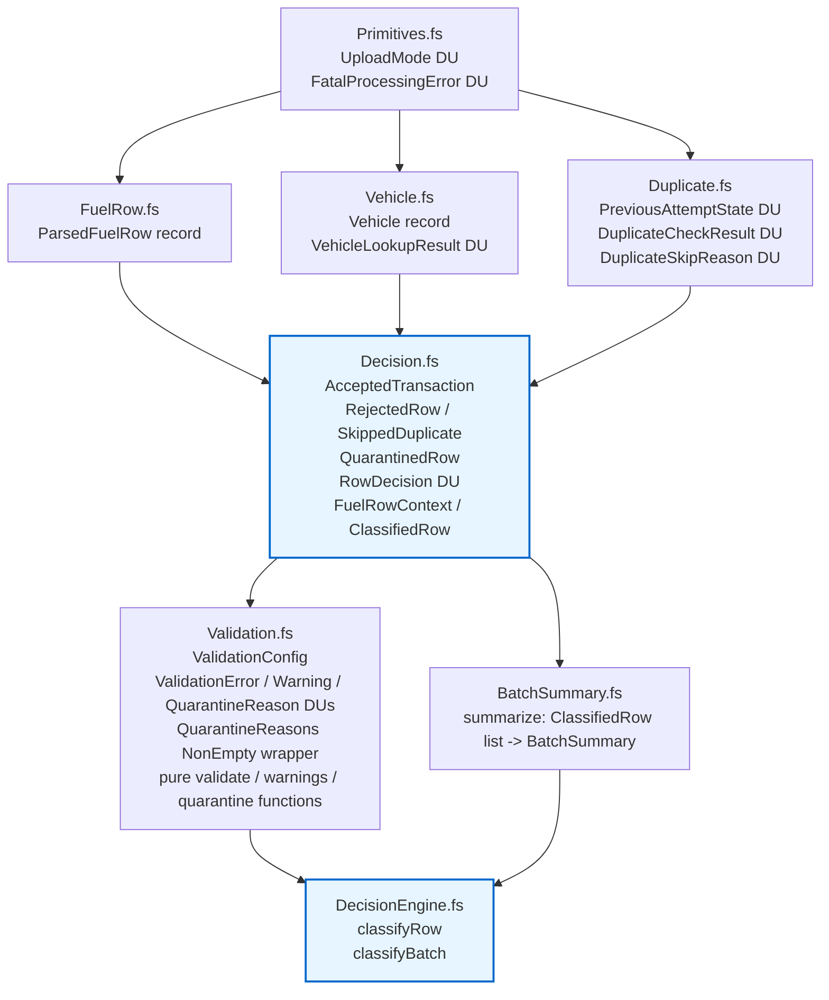

## Same runtime, different language {.unnumbered}

F# is .NET. Same CLR, same `decimal`, same NuGet, same Visual Studio,
same `dotnet test`. You can reference an F# project from a C# project
and call into it like any other library. From the build system's
perspective, nothing exotic is happening.

But the **language** is different. F# is what you get when ML-family
people are allowed to ship on the CLR. Native discriminated unions.
Exhaustive `match` that the compiler will flag for you — and that you
can turn into a hard error with one project setting. Immutability by
default; you opt **in** to mutability, not out. F#'s own types don't
have `null`.

The idiomatic C# from the previous chapter closed six of the seven
footguns. It did so by **simulating** features the language doesn't have:
sealed-record DUs with a private constructor, `IReadOnlyList<T>` instead
of `List<T>`, switch expressions with a `_ => throw` arm so the
compiler stays quiet. Each simulation works. Each one leaves a smell.

From up here, those smells look like what they are: workarounds for
features F# ships natively.

## The same type, two languages

`RowDecision` is the centerpiece of both pipelines. Here it is in
idiomatic C#:

```csharp
// csharp-fuel-engine/src/FuelUploadEngine/Domain/RowDecision.cs
public abstract record RowDecision
{
    private RowDecision() { }

    public sealed record AcceptedTransaction(FuelTransaction Transaction) : RowDecision;

    public sealed record AcceptedTransactionWithWarnings(
        FuelTransaction Transaction,
        IReadOnlyList<UploadWarning> Warnings) : RowDecision;

    public sealed record QuarantinedRow : RowDecision
    {
        public QuarantinedRow(
            RowNumber rowNumber,
            FuelTransaction transaction,
            IReadOnlyList<QuarantineReason> reasons,
            IReadOnlyList<UploadWarning> warnings)
        {
            if (reasons.Count == 0)
                throw new ArgumentException("Quarantined rows require at least one reason.", nameof(reasons));
            // ... assign properties ...
        }
        // ... property declarations ...
    }

    public sealed record SkippedDuplicate(RowNumber RowNumber, DuplicateState Duplicate, DuplicateSkipCode Reason) : RowDecision;
    public sealed record RejectedRow(RowNumber RowNumber, RejectionReason Reason) : RowDecision;
    public sealed record FatalProcessingError(RowNumber RowNumber, FatalError Error) : RowDecision;
}
```

Roughly forty lines once you include the constructor invariant on
`QuarantinedRow`. Now the same type in F#:

```fsharp
// fsharp-fuel-engine/FuelUpload.Domain/Decision.fs
[<RequireQualifiedAccess>]
type RowDecision =
    | Accepted of AcceptedTransaction
    | AcceptedWithWarnings of AcceptedTransaction * Warning list
    | Quarantined of QuarantinedRow
    | SkippedDuplicate of SkippedDuplicate
    | Rejected of RejectedRow
    | Fatal of FatalProcessingError
```

**Seven lines, no ceremony.** No `private RowDecision()` to lock the
hierarchy closed. No `sealed record` per case. No hand-written
constructor invariant — the "quarantine has at least one reason"
invariant is enforced one file over by a private constructor on a
`QuarantineReasons` wrapper type, applied once instead of per-case.

The consumer side is symmetric. Idiomatic C# uses a switch expression
that's *almost* exhaustive but has to close itself with a default arm:

```csharp
return duplicateCheck switch
{
    DuplicateCheckResult.NotDuplicate notDuplicate => CreateAcceptedDecision(...),
    DuplicateCheckResult.Duplicate duplicate      => DuplicatePolicy.Classify(...) ?? CreateAcceptedDecision(...),
    _ => throw new InvalidOperationException("Unhandled duplicate check result.")
};
```

That `_ => throw` is the price of doing DUs in a language that
doesn't have them. The compiler will check the *declared* arms for
type-correctness, but once you write `_ => ...` it stops asking about
new cases. F# has no equivalent need:

```fsharp
match Validation.validateConfig config, vehicleLookup, duplicateCheck with
| fatal :: _, _, _                              -> RowDecision.Fatal fatal
| _, VehicleLookupResult.Fatal fatal, _         -> RowDecision.Fatal fatal
| _, _, DuplicateCheckResult.Fatal fatal        -> RowDecision.Fatal fatal
| [], _, _                                      -> ...
```

That's a pattern match on a **tuple of three sum types simultaneously**,
and the F# compiler will warn if any combination is unreachable or
missing. We'll come back to the "missing" case in a minute.

## The F# domain layout

Six files, compiled in this order. F# has no forward references; the
file order in the `.fsproj` is the dependency graph.



The whole pure domain is around 400 lines. Idiomatic C# is closer to a
thousand for the same problem, because every DU costs roughly thirty
lines of encoding ceremony and every collection needs `IReadOnlyList<T>`
wrappers written explicitly.

## The recovery matrix

This is the climax. The fuel domain has four `UploadMode` cases and six
`PreviousAttemptState` cases, which means twenty-four `(mode, state)`
combinations, plus the "no duplicate" shortcut. The interesting subset —
what each recovery mode is allowed to accept — is a **matrix**.

Idiomatic C# writes it as a sequence of `if` statements on
`PreviousUploadOutcome`-like fields plus a delegate to
`DuplicatePolicy.ClassifyDuplicate`:

```csharp
// csharp-fuel-engine/src/FuelUploadEngine/Engine/FuelUploadDecisionEngine.cs
return duplicateCheck switch
{
    DuplicateCheckResult.NotDuplicate notDuplicate => CreateAcceptedDecision(...),
    DuplicateCheckResult.Duplicate duplicate => DuplicatePolicy.ClassifyDuplicate(
            row, vehicle, duplicate.State, validationConfig, mode)
        ?? CreateAcceptedDecision(row, vehicle, duplicate.State.ExistingTransactionKey, validationConfig),
    _ => throw new InvalidOperationException("Unhandled duplicate check result.")
};
```

The actual matrix is hidden inside `DuplicatePolicy.ClassifyDuplicate` —
a separate file with its own `switch` on `(mode, state)`, returning
`RowDecision?` and using `null` to mean "fall through to accepted."

F# inlines the entire matrix in `DecisionEngine.fs`. Quoted verbatim:

```fsharp
// fsharp-fuel-engine/FuelUpload.Domain/DecisionEngine.fs
match mode, duplicateCheck with
| _, DuplicateCheckResult.NoDuplicate ->
    accepted config mode row vehicle
| UploadMode.Normal, DuplicateCheckResult.Duplicate previous ->
    skipped row mode previous DuplicateSkipReason.NormalModeDuplicate
| UploadMode.Retry, DuplicateCheckResult.Duplicate PreviousAttemptState.RetryableFailure ->
    accepted config mode row vehicle
| UploadMode.Retry, DuplicateCheckResult.Duplicate PreviousAttemptState.Finalized ->
    skipped row mode PreviousAttemptState.Finalized
        DuplicateSkipReason.RetryModeDuplicateAlreadyFinalized
| UploadMode.Retry, DuplicateCheckResult.Duplicate previous ->
    skipped row mode previous (DuplicateSkipReason.RetryModeDuplicateNotRetryable previous)
| UploadMode.ConservativeRecovery,
  DuplicateCheckResult.Duplicate PreviousAttemptState.FailedBeforeCanonicalFinalization ->
    accepted config mode row vehicle
| UploadMode.ConservativeRecovery, DuplicateCheckResult.Duplicate previous ->
    skipped row mode previous
        (DuplicateSkipReason.RecoveryModeDuplicateAlreadyCanonicalized previous)
| UploadMode.AggressiveRecovery,
  DuplicateCheckResult.Duplicate PreviousAttemptState.FailedBeforeCanonicalFinalization ->
    accepted config mode row vehicle
| UploadMode.AggressiveRecovery,
  DuplicateCheckResult.Duplicate
      PreviousAttemptState.FailedAfterCanonicalizationWithoutCanonicalTransactionKey ->
    accepted config mode row vehicle
| UploadMode.AggressiveRecovery, DuplicateCheckResult.Duplicate previous ->
    skipped row mode previous
        (DuplicateSkipReason.RecoveryModeDuplicateAlreadyCanonicalized previous)
| _, DuplicateCheckResult.Fatal fatal ->
    RowDecision.Fatal fatal
```

Every accepted-by-recovery case is a **typed pattern**, not a boolean
check on a flag. There are no `if (previous.WasCanonicalized)` branches,
no `?? CreateAccepted`, no nullable return. The cases that aren't
listed (e.g. `Retry` + `Finalized` is listed, but `Retry` +
`FailedAfterCanonicalizationWithCanonicalTransactionKey` is **not**
listed by name) fall through to the catch-all `Duplicate previous`
pattern earlier in the same arm — which the compiler can see is total
because every `(mode, state)` pair has *some* match.

If you compare to the C# `DuplicatePolicy.ClassifyDuplicate(...) ?? CreateAcceptedDecision(...)`
expression: the `??` is doing the work that pattern fall-through does
in F#, and that single `??` is the only thing standing between a row
that should have been skipped and a silent acceptance, if the policy
table forgets a case.

In F#, forgetting a case is a compiler warning at this exact site.

## Adding a 7th `RowDecision` case

Suppose product comes back next quarter: there's a seventh outcome,
`HeldForReview` — the row passed validation, isn't a duplicate, but
matches a fraud signal that needs human eyes before the canonical write.

**In F#.** Step 1, add the case:

```fsharp
type RowDecision =
    | Accepted of AcceptedTransaction
    | AcceptedWithWarnings of AcceptedTransaction * Warning list
    | Quarantined of QuarantinedRow
    | SkippedDuplicate of SkippedDuplicate
    | Rejected of RejectedRow
    | Fatal of FatalProcessingError
    | HeldForReview of AcceptedTransaction * HeldReason   // <- one new line
```

Step 2, compile. Every `match` expression on `RowDecision` anywhere in
the solution now reports:

> **FS0025: Incomplete pattern matches on this expression.**
> For example, the value `HeldForReview (_, _)` may indicate a case not
> covered by the pattern(s).

The compiler tells you exactly which sites. `BatchSummary.summarize`
will flag. `Interop.toDecisionDto` will flag. Any consumer in the
solution that pattern-matches on `RowDecision` will flag. The warning
resolves only when every site handles the case.

With `<TreatWarningsAsErrors>true</TreatWarningsAsErrors>` (or the
narrower `<WarningsAsErrors>25</WarningsAsErrors>`) in the `.fsproj`,
it's a **hard build break**.

**In idiomatic C#.** Step 1, add the case:

```csharp
public sealed record HeldForReview(FuelTransaction Transaction, HeldReason Reason) : RowDecision;
```

Step 2, compile. **Nothing happens.** The switch expressions in
`FuelUploadDecisionEngine`, `BatchSummaryCalculator`, the response
mapper — all have a `_ => throw new InvalidOperationException(...)`
arm. They all still compile. They all still pass their existing tests.

At runtime, the first `HeldForReview` decision hits the default arm
and throws. You discover this in production, on a row whose payment
team is now waiting on a fraud team that doesn't know it has work.

This is **Footgun 3 ported into idiomatic C#**. The encoding is
cleaner. The underlying gap remains: C# can't enforce exhaustive
matching across an open hierarchy, and the `_ =>` arm makes every
closed hierarchy effectively open.

| Cost to add a case          | F#                          | Idiomatic C#                          |
| --------------------------- | --------------------------- | ------------------------------------- |
| Lines to modify the DU      | 1                           | 1                                     |
| Compiler help finding sites | yes (FS0025 at every site)  | no (`_ =>` arms hide them)            |
| Failure mode if you miss one| warning/error at compile    | `InvalidOperationException` at runtime |

## Easier or harder to read?

Honest answer: **both**. Less code, but the code is denser. The
concepts are unfamiliar.

A junior reading this snippet for the first time sees four ideas
stacked into four lines:

```fsharp
match Validation.validateConfig config, vehicleLookup, duplicateCheck with
| fatal :: _, _, _                       -> RowDecision.Fatal fatal
| _, VehicleLookupResult.Fatal fatal, _  -> RowDecision.Fatal fatal
| _, _, DuplicateCheckResult.Fatal fatal -> RowDecision.Fatal fatal
| [], _, _                               -> ...
```

That's tuple construction, list deconstruction (`fatal :: _` means
"non-empty list, take the head"), wildcard patterns, and DU case
patterns. A first-time reader has to learn all four to parse the
snippet at all.

The equivalent idiomatic C# is more verbose but uses concepts every
C# dev already knows:

```csharp
if (vehicleLookup is VehicleLookupResult.Unavailable vehicleUnavailable)
    return new RowDecision.FatalProcessingError(row.RowNumber, vehicleUnavailable.Error);

if (duplicateCheck is DuplicateCheckResult.Unavailable duplicateUnavailable)
    return new RowDecision.FatalProcessingError(row.RowNumber, duplicateUnavailable.Error);
```

`if`, `is`, `return`. Three keywords. Lower density — you read more
lines to learn less — but you don't need to learn anything new to
read it.

The honest verdict: **once you're past week one of F#, the F# code is
dramatically easier to read** because the structure of the code matches
the structure of the problem. Sum types in, sum types out, exhaustive
match in the middle. The whole recovery matrix fits on one screen and
each row of the matrix is a row of code.

But week one is a real cost. The `|>` pipe, the `::` cons, the `_` for
"don't care," the way `match` returns a value instead of falling out
the bottom, the `[<RequireQualifiedAccess>]` attribute — every one of
those is a new concept. There is no language equivalent of "you
already know this from C#." If your team is new to F#, the learning
curve is non-trivial and lasts roughly a quarter.

## What still leaks

F# isn't a free lunch. The same CLR that gives you `decimal` and
`DateTimeOffset` also gives you `NullReferenceException` at any
interop boundary. `List.head []` still throws `ArgumentException` at
runtime — partial functions exist in the F# standard library; the
convention is `List.tryHead`, but the convention is opt-in. And there
is an entire class of issue called `[<CLIMutable>]` that you can see
in `Decision.fs` already:

```fsharp
[<CLIMutable>]
type AcceptedTransaction =
    { TransactionId: string
      SourceRowNumber: int
      Vehicle: Vehicle
      OccurredAt: DateTimeOffset
      ...
      Mode: UploadMode }
```

That attribute tells the compiler to *also* emit a parameterless
constructor and settable properties for the record, so C# callers and
JSON deserializers can construct it. The F# code itself never mutates
these values — but the type, at the CLR level, exposes a mutable
shape. It is a deliberately carved hole in the safety guarantee, and
it exists for one reason: F# rarely runs alone.

That hole — the boundary between the gorgeous F# core and the C# world
that has to consume it — is the next chapter.

[Next chapter →](06-fsharp-interop.qmd)
