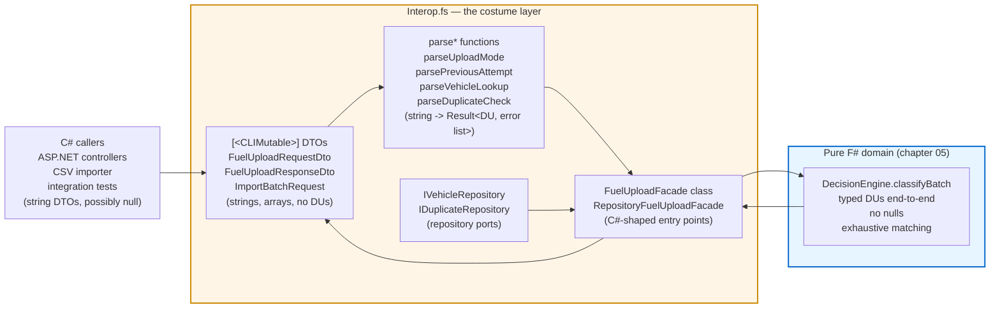

## The clean core has a messy edge {.unnumbered}

The last chapter showed `Decision.fs` as a seven-line discriminated
union and `DecisionEngine.fs` as a single pattern match on a tuple of
three sum types. That's the gorgeous part. That's the part that closes
six of the seven footguns by default behaviour of the language.

But a .NET solution rarely has just one project. There is a C# ASP.NET
controller that needs to deserialize JSON. There is a CSV importer
that needs to take raw strings off a row. There is an audit log writer
that needs flat records to push to BigQuery. There is a C# integration
test calling `new FuelUploadFacade().Classify(...)` because the team
hasn't fully migrated.

`Interop.fs` is where that translation lives. It is one file — 800
lines as of V3 — and it is **mostly `[<CLIMutable>]` records, string
fields, and adapter code**. Every guarantee the domain core earns,
this file re-earns at the boundary.

If the domain is F# being F#, the boundary is F# wearing a C#
costume.

## What the F# project looks like



The blue zone is the part the last chapter celebrated. The orange zone
is what we are about to look at.

Asymmetry: **the domain is five files totaling around 250 lines. The
boundary is one file at 800 lines.** This is a common shape in F#
applications that have to live alongside C#. The domain stays compact;
the boundary absorbs all the costume-wearing.

## `[<CLIMutable>]` — a deliberate hole in the safety guarantee

Here is a real DTO record from `Interop.fs`:

```fsharp
// fsharp-fuel-engine/FuelUpload.Domain/Interop.fs
[<CLIMutable>]
type FuelUploadRequestDto =
    { UploadMode: string                    // string, not UploadMode DU
      RequireExternalReference: bool
      MinFuelVolumeGallons: decimal
      MaxFuelVolumeGallons: decimal
      MinTotalCost: decimal
      MaxTotalCost: decimal
      AllowFutureTransactions: bool
      ProcessingDate: string                // string, not DateTimeOffset
      HighFuelVolumeWarningGallons: decimal
      HighCostPerGallonWarning: decimal
      StaleTransactionWarningDays: int
      SuspiciousFuelVolumeGallons: decimal
      SuspiciousTotalCost: decimal
      Rows: FuelUploadRowDto array }
```

Compare to the typed domain version in `Validation.fs`: `UploadMode` is
a four-case DU. `ProcessingDate` is a `DateTimeOffset`. Here both are
plain `string`. The boundary has been deliberately re-typed to the
shape JSON gives you.

What does `[<CLIMutable>]` actually do? Without the attribute, F#
records are:

- **immutable** — once constructed, fields cannot be reassigned;
- **closed to default construction** — you cannot write `new
  FuelUploadRequestDto()` because the record requires every field to
  be supplied at construction;
- **value-equal** — two records with equal fields compare equal.

`[<CLIMutable>]` keeps the equality behaviour but opens the other two:
the compiler also emits a parameterless constructor and settable
property setters so that C# callers, `System.Text.Json`, and
ASP.NET's model binder can do `new FuelUploadRequestDto { UploadMode =
"Retry", ... }` and have it work. The F# code in `Interop.fs` itself
never *uses* those setters — it always constructs records with the
full literal `{ ... }` syntax. But the type, at the CLR level, exposes
a mutable shape.

That is a **deliberately carved hole** in F#'s safety guarantee. A C#
consumer of the DTO can:

- Default-construct it: `new FuelUploadRequestDto()` — every string is
  `null`, every decimal is `0m`. F# would normally forbid this.
- Mutate it after construction: `dto.UploadMode = null`. F# would
  normally forbid this too.
- Pass `null` for any string field through the property setter.

The boundary is forced to assume any string can be null and any field
can be defaulted. Look at the very first helper in the file:

```fsharp
let private normalize (value: string) =
    if isNull value then
        ""
    else
        value.Replace("_", "").Trim().ToLowerInvariant()
```

`isNull value` is the explicit null guard. F#'s own strings can never
be null. But these strings came from C# through a `[<CLIMutable>]`
record, so they can.

The interop layer pays for `[<CLIMutable>]` with a guard at every
single string field it reads.

## Re-earning the safety: boundary parsers

Inside the domain, `UploadMode` is a four-case DU and you `match` on
it. At the boundary, `UploadMode` came in as `dto.UploadMode : string`.
Bridging the two takes an explicit parser:

```fsharp
let private parseUploadMode field value : Result<UploadMode, FuelUploadMappingError list> =
    match normalize value with
    | "normal"               -> Ok UploadMode.Normal
    | "retry"                -> Ok UploadMode.Retry
    | "conservativerecovery" -> Ok UploadMode.ConservativeRecovery
    | "aggressiverecovery"   -> Ok UploadMode.AggressiveRecovery
    | _ ->
        Error
            [ { Code = FuelUploadMappingErrorCode.InvalidUploadMode
                Field = field
                Detail = $"Unsupported upload mode '{value}'." } ]
```

This is the heart of what the boundary does. **String in, typed
`Result<DU, error list>` out.** Once a string has passed through this
function, the rest of the F# code can treat the value as a proper
`UploadMode` DU and never has to think about case-sensitivity, typos,
or normalisation again. The boundary has *re-earned* the type-system
guarantee that the JSON layer washed away.

There are six of these in the file: `parseUploadMode`,
`parsePreviousAttempt`, `parseVehicleLookup`, `parseDuplicateCheck`,
`parseDate`, plus a parallel set for the CSV importer (`parseImport*`)
that returns the more permissive `FuelImportError` type. Each one
returns `Result<T, error list>` instead of throwing — the boundary
**accumulates** parse errors instead of failing on the first one. A
malformed batch comes back with every field error at once, not just
the first.

The actual mapping function that ties three independent `Result`s
together for one row:

```fsharp
let private mapRow index (row: FuelUploadRowDto) : Result<FuelRowContext, FuelUploadMappingError list> =
    let prefix = $"rows[{index}]"
    let occurredAt    = parseDate $"{prefix}.occurredAt" row.OccurredAt
    let vehicleLookup = parseVehicleLookup prefix row
    let duplicateCheck = parseDuplicateCheck prefix row

    match occurredAt, vehicleLookup, duplicateCheck with
    | Ok occurredAt, Ok vehicleLookup, Ok duplicateCheck ->
        Ok { Row = { /* fields */ }
             VehicleLookup = vehicleLookup
             DuplicateCheck = duplicateCheck }
    | _ ->
        Error (errorsOf occurredAt @ errorsOf vehicleLookup @ errorsOf duplicateCheck)
```

`@` is list concatenation. If all three results are `Ok`, build a
`FuelRowContext`. If any are `Error`, concatenate every error list
into one big error list. Three independent parses, all attempted, all
reported. No first-fail-and-bail.

There is no `Result<T, E>` library to import for this. `Result` and
its operators (`Result.map`, `Result.bind`) ship in `FSharp.Core`.

## Adding a new field at the boundary

Suppose product adds a field to the upload request: `BatchReference`
— an optional caller-supplied string to correlate batches in their
logs. How does the change propagate?

**In the domain:** add `BatchReference: string option` (or a
`BatchReference` typed value) to `ValidationConfig` or a new wrapper
record. One file touched. If any pattern match destructures the record
positionally, the compiler flags it.

**At the boundary:** more work.

1. Add `BatchReference: string` to `FuelUploadRequestDto` in
   `Interop.fs`.
2. Decide null-policy at the boundary. Is it optional (allow `null`
   from C#, parse to `None`)? Required (reject `null`)?
3. Add a `parseBatchReference` function returning
   `Result<_, FuelUploadMappingError list>`.
4. Thread the new parse through `toDomainRequest` — extend the
   thirteen-way tuple match.
5. Add the same field to `ImportBatchRequest` and `mapImportedRow`
   for the CSV path.
6. Add the same field to the response DTO if the response should echo
   it back.
7. Re-run any C# consumer projects to regenerate JSON contracts;
   recompile.

The C# consumers of the F# library see DTO changes the moment they
recompile against the new `FuelUpload.Domain.dll`. Source-level: yes.
Behaviour-level: their old code that ignored `BatchReference` still
compiles, because the field is just *new on the record*. There is no
exhaustiveness check at the boundary the way there is inside the
domain.

This is the asymmetry. **Inside the domain, the type system is your
backstop.** Outside, the type system is something you re-impose, by
hand, in `Interop.fs`. The further you walk out the boundary, the
less help you get.

## Where this still leaks (V3 coda)

In V2, `Interop.fs` was already the largest file in the project. V3
made it considerably larger. The current file holds, in one module:

- The original JSON request/response DTOs (`FuelUploadRequestDto`,
  `FuelUploadResponseDto`).
- A second, stricter set of CSV import DTOs (`ImportedFuelRow`,
  `ImportBatchRequest`, `FuelImportError`) that mirrors the first set
  but with all-string fields and parsing happening one layer earlier.
- Repository port interfaces (`IVehicleRepository`,
  `IDuplicateRepository`) with their own error type families
  (`VehicleRepositoryError`, `DuplicateRepositoryError`).
- A second classify path (`toRepositoryDomainRequest`,
  `classifyWithRepositories`) that uses the ports instead of inline
  DTO fields.
- Response serialisation (`toDecisionDto`, `toResponseDto`,
  `warningText`/`rejectionText`/`quarantineText` formatters built on
  `sprintf "%A"`).
- Two facade classes (`FuelUploadFacade`, `RepositoryFuelUploadFacade`)
  exposing all of the above to C# callers.

The V3 scoring report names this directly:

> *"The interop module is large and mixes several adapter concerns;
> `[<CLIMutable>]` records and string DTO fields weaken the otherwise
> strong model for C# callers."* — `docs/v3-results.md`

What is "several adapter concerns" hiding? Three jobs in one file:

1. **JSON wire format** — `FuelUploadRequestDto` / `FuelUploadResponseDto`.
2. **CSV import format** — `ImportBatchRequest` / `ImportedFuelRow`.
3. **Repository ports** — `IVehicleRepository` / `IDuplicateRepository`
   plus their error families.

In a larger codebase these would be three separate modules with
narrower public surfaces. Bundled into one file, they share helper
functions (`normalize`, `require`, `errorsOf`) — which is convenient
— but they also share blast radius: a change to the JSON DTO shape
touches the same file as a change to the CSV import shape.

The `%A` formatters are another leak. Quoting `toDecisionDto`:

```fsharp
| RowDecision.SkippedDuplicate skipped ->
    decisionDto
        skipped.Row.RowNumber
        "skipped_duplicate"
        ""
        ""
        [||]
        [||]
        [||]
        ($"%A{skipped.Reason}")          // <- prototype-grade output
        ""
```

`%A{skipped.Reason}` formats the `DuplicateSkipReason` DU using F#'s
generic debug printer. The output is something like
`"RetryModeDuplicateNotRetryable Finalized"` — which is fine for a
prototype, but it ties the response wire format to the internal DU's
*name and shape*. If you rename a DU case for clarity, you've broken
your JSON contract. The fix is a hand-written `match` per DU that
emits stable lowercase strings, the same way `parseUploadMode` does
the reverse mapping. The boundary should be **symmetric** —
hand-mapped both ways — but the V3 implementation took the shortcut
on the response side.

Then there are the empty strings: when a `RowDecision.Accepted` row
becomes a `FuelUploadDecisionDto`, fields like
`DuplicateSkipReason` and `FatalError` are populated with `""`
instead of `null`. That's because `[<CLIMutable>]` strings default to
empty rather than null in the F# `{ ... }` literal — which is *safer*
than `null`, but still requires the consumer to know that `""` means
"absent" rather than "empty string." A more careful boundary would use
`string option` and an opt-in JSON converter, but that's more code
than the prototype needed.

## How this connects to the other engines

Every engine in this book hits the same wall at the boundary. The
shape of the wall differs:

- **Idiomatic C#** has no boundary problem because its domain is
  *already* in C# — but its domain pays for that with the
  thirty-line-per-DU encoding from chapter 04.
- **F# (this chapter)** keeps the domain pristine and pays in one
  large `Interop.fs` file.
- **Haskell** keeps the domain even more pristine and pays at the FFI
  level — you'll see in chapter 08 that the boundary is JSON via
  `aeson`, but everything outside the Haskell runtime is opaque to
  the Haskell type system.
- **Rust** has the boundary as `serde` derive macros and an explicit
  Vec-to-NonEmpty conversion, which we cover in chapter 09.

Part Ib gathers all four engine boundaries onto one page for direct
comparison. If you want to see how the same `BatchReference`-style
extension lands in each of the four, that's the chapter to skip to:

[Compare all four boundaries side-by-side →](../part1b/11-boundary-returns.qmd)

Otherwise, the next rung up the ladder is the type-driven extreme. F#
made the safe choice the default. Haskell removes the unsafe choice
entirely — no `[<CLIMutable>]` escape hatch, no nullable strings at
the boundary, side effects tracked in the type signature, and
exhaustive matching as a hard error rather than a warning.

[Next chapter →](07-haskell-primer.qmd)
