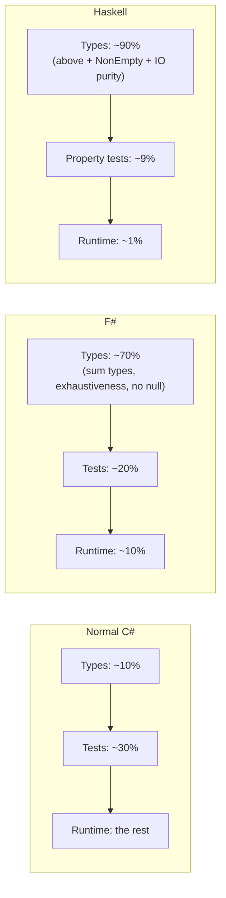
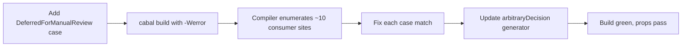

## The climax of the climb {.unnumbered}

Every rung up to now has been about *catching* bugs. Idiomatic C# made
the compiler emit `CS8509` on a non-exhaustive switch expression. F#
made `match` warn on a missing DU case and let you flip it to a build
error. Each rung shrank the set of bugs you could ship without the
compiler shouting.

Haskell asks a different question. Not "does the compiler warn me"
but **is there a value of this type that could even represent the
bug?**

If the type system can't express the bug, you cannot ship it. You
cannot write a test that hits it. You can't even write a unit test
that *demonstrates* it without the test itself failing to compile.
The footgun isn't avoided. It's structurally absent.

Let's walk the seven-footgun catalogue one more time, on the cliff
face.

## The seven footguns, Haskell column

Recall the catalogue from chapter 3:

1. NRE in the logger — `d.Vehicle.LicensePlate` when `Vehicle` is null
2. Case-sensitive mode string — `"retry"` vs `"Retry"`
3. Missing recovery branch — `AggressiveRecovery` falls through silently
4. Mutable response — caller appends to `Errors` after the engine returns
5. Status typos compile — `"Accepetd"` ships
6. Validator throws on first failure — only one error per row reported
7. `switch` without a default — new case silently dropped

### Footgun 1 — Rogue logger touches a nullable field

**Representable in Haskell?** No.

The classifier's type is `ValidationConfig -> UploadMode -> RowContext
-> RowDecision`. No `IO` anywhere. You cannot call `putStrLn`
(Haskell's `Console.WriteLine`) inside a function with that signature
— the compiler refuses with a type mismatch. To add a logger, you'd
have to change the signature to `… -> IO RowDecision`, which forces
every caller all the way up to `main` into `IO`. Logging cannot hide.

And even if it were allowed, there is no nullable field to crash on.
Each `RowDecision` constructor carries exactly its case's payload.
There's no shared shape with a "sometimes null `Vehicle`" hanging off
it. The crash site doesn't exist as a value.

### Footgun 2 — Case-sensitive mode string

**Representable in Haskell?** Inside the domain — no. At the
boundary — yes, but caught.

`UploadMode` is a closed sum type:

```haskell
data UploadMode
  = Normal
  | Retry
  | ConservativeRecovery
  | AggressiveRecovery
  deriving stock (Eq, Show)
```

Once you're holding an `UploadMode`, you cannot have an unknown
variant. The string `"retry"` cannot be implicitly compared. It's
just not a value of that type.

The string only exists at the boundary, in `Api.hs`:

```haskell
parseMode :: String -> String -> Either [FuelUploadMappingError] UploadMode
parseMode field value =
  case normalize value of
    "normal" -> Right Normal
    "retry" -> Right Retry
    "conservativerecovery" -> Right ConservativeRecovery
    "aggressiverecovery" -> Right AggressiveRecovery
    _ -> Left [FuelUploadMappingError InvalidUploadMode field ...]
```

The return type is `Either [FuelUploadMappingError] UploadMode`. The
caller cannot pretend an unparsed string is a valid mode. They have
to handle the `Left` branch — that's the type system speaking.

### Footgun 3 — Missing recovery branch

**Representable in Haskell?** No.

The recovery matrix in `DuplicatePolicy.hs` is a series of equations
over `(UploadMode, DuplicateState)`. Add a fifth `UploadMode` case
called `ManualOverride` to `Domain/Primitive.hs` and run `cabal
build`. You get:

```
src/FuelUpload/DuplicatePolicy.hs: warning: [-Wincomplete-patterns]
    Pattern match(es) are non-exhaustive
    In an equation for 'duplicateDecision':
        Patterns of type 'UploadMode', 'DuplicateState' not matched:
            ManualOverride (DuplicateOf _)
```

This project's `.cabal` enables `-Wincomplete-uni-patterns`, and the
conventional production setting flips warnings to errors via
`-Werror`. The build fails until you've handled every combination.
You cannot ship the unhandled case.

C#'s `switch` *expression* has a similar property (CS8509), but its
`switch` *statement* does not — and the normal-C# version uses
statements. Haskell has only one `case` form, and it's always
checked.

### Footgun 4 — Mutable response

**Representable in Haskell?** No.

There is no `mutable` keyword in Haskell. There is no `var`. Records
cannot be mutated; the closest you get is record-update syntax, which
*creates a new value* that differs from the old one by the named
fields. The old value is untouched.

```haskell
bumpTotal summary =
  summary {summaryTotalRows = summaryTotalRows summary + 1}
```

That doesn't change `summary`. It returns a new `BatchSummary`. If a
caller holds the old `summary` after this call, they still hold the
old value. Aliasing-based mutation isn't possible because nothing
mutates.

To get true in-place mutability you need `IORef` or `STRef` — and
those types themselves appear in your function signature (`IORef`
lives in `IO`, `STRef` in `ST`). Hidden mutation is impossible.
Footgun 4 cannot be written in Haskell at all.

### Footgun 5 — Status typos compile

**Representable in Haskell?** No.

There are no status strings. The "status" of a row decision is the
constructor name:

```haskell
data RowDecision
  = Accepted FuelTransaction
  | AcceptedWithWarnings FuelTransaction (NonEmpty ValidationWarning)
  | Quarantined FuelTransaction (NonEmpty QuarantineReason)
  | SkippedDuplicate SkippedDuplicate
  | Rejected RejectedRow
  | Fatal FatalError
  deriving stock (Eq, Show)
```

Typing `Accepetd transaction` produces a compile error: "Data
constructor not in scope: `Accepetd`." There's no string layer for
the typo to survive into. The serialization to JSON happens at the
boundary, in `Api.hs`, where the constructor *maps* to a string —
but that mapping is itself one function, written once, and any new
constructor that lacks a string mapping is an exhaustiveness warning.

### Footgun 6 — Validator throws on first failure

**Representable in Haskell?** Yes, but the codebase doesn't.

You *could* throw via `error "bad row"`. The community treats that as
a code smell; the natural shape is to return a list:

```haskell
validationErrors :: ValidationConfig -> ParsedFuelRow -> [ValidationError]
validationErrors config row =
  quantityErrors <> amountErrors <> odometerErrors
```

`[ValidationError]` — a list of typed errors, accumulated. Each check
returns either `[]` or a single-element list; they concatenate. The
caller gets every error the row produced, not just the first.

Not enforced by the type system — you *could* throw — but the language
steers you the other way. Exceptions are clumsy; `Either e a` and
lists are easy.

### Footgun 7 — `switch` without a default

**Representable in Haskell?** No.

There is no "default-less switch" because there's only `case`, and
`case` is always checked by `-Wincomplete-uni-patterns`. Every
constructor must be handled or the build warns. With `-Werror`, the
build fails.

The `Summary.hs` `summarizeRows` function is the proof:

```haskell
addDecision decision summary =
  case decision of
    Accepted _ -> countAccepted summary
    AcceptedWithWarnings _ _ -> countAcceptedWithWarnings summary
    Quarantined _ _ -> countQuarantined summary
    SkippedDuplicate _ -> countSkipped summary
    Rejected _ -> countRejected summary
    Fatal _ -> countFatal summary
```

No default. No fallthrough. No `_ -> error "unknown"`. If a seventh
constructor were added, every `case` like this in the codebase would
warn, the build would fail, and the missing branches would be
enumerated by the compiler.

### Scorecard

| # | Footgun | Normal C# | Idiomatic C# | F# | Haskell |
|---|---|---|---|---|---|
| 1 | NRE in logger | possible | partial (NRT opt-in) | partial | **impossible** (IO not in signature) |
| 2 | Case-sensitive mode | possible | enum | DU | **closed sum type** |
| 3 | Missing recovery branch | possible | expression warn | match warn | `case` warn + Werror |
| 4 | Mutable response | possible | IReadOnlyList view | immutable default | **no mutability without IORef/IO** |
| 5 | Status typo | possible | sealed record per case | DU case | **constructor name** |
| 6 | Validator throws first | possible | accumulate | accumulate | accumulate (Either/list idiom) |
| 7 | Switch no default | possible | expression warn | match warn | `case` warn + Werror |

Seven for seven. Either the type cannot represent the bug at all, or
the compiler refuses the build when it can.

## The multiplier: property tests

Algebraic types and property tests are made for each other. The
constructors *are* the cases your test needs to cover; generating a
random `RowDecision` means picking a constructor uniformly and
filling its payload with random data. **QuickCheck** is the library
that does this.

A property test, briefly: instead of writing one example case
(`testThatTotalIsThreeWhenWeHaveThreeRows`), you state a property
that should hold for *any* input, and let QuickCheck generate ~100
random inputs and check the property on each. If any input
violates the property, QuickCheck shrinks it down to a minimal
counterexample and reports it.

Here's the property test for batch summary totals
(`test/FuelUpload/Properties.hs`):

```haskell
prop "summary total is the number of row decisions" \(Decisions decisions) ->
  summaryTotalRows (summarizeRows decisions) == length decisions

prop "summary count partitions always add up to total" \(Decisions decisions) ->
  let summary = summarizeRows decisions
   in summaryAccepted summary
        + summaryQuarantined summary
        + summarySkippedDuplicates summary
        + summaryRejected summary
        + summaryFatal summary
        == summaryTotalRows summary
```

Two statements, each backed by 100 random batches of decisions:

1. The summary total equals the number of decisions. Always.
2. The per-outcome counts partition the total. Always.

The `Arbitrary` instance generates random `RowDecision`s by picking a
constructor:

```haskell
arbitraryDecision :: Gen RowDecision
arbitraryDecision =
  oneof
    [ Accepted <$> arbitraryTransaction
    , AcceptedWithWarnings <$> arbitraryTransaction <*> arbitraryWarnings
    , Quarantined <$> arbitraryTransaction <*> arbitraryQuarantineReasons
    , SkippedDuplicate <$> arbitrarySkippedDuplicate
    , Rejected <$> arbitraryRejectedRow
    , Fatal <$> arbitraryFatalError
    ]
```

The shape of this generator *mirrors* the shape of the type. Six
constructors in the type, six branches in the generator. When you
add a seventh constructor (chapter 7's hypothetical
`DeferredForManualReview`), this generator becomes incomplete — and
the existing properties keep passing only on the cases they cover,
no longer exercising the new one. You don't get false confidence;
you get pressure to add the seventh branch to the generator too.

Here's a third property that demonstrates the "laws as constructor
properties" point:

```haskell
prop "fatal row decisions block the batch" \(NonEmptyFatalContexts contexts) ->
  case batchOutcome (classifyBatch defaultConfig Normal contexts) of
    BatchBlockedByFatal _ -> property True
    BatchUploadable -> counterexample "expected fatal to block batch" False
```

Read: for any batch of contexts that contains at least one fatal
row, the batch outcome must be `BatchBlockedByFatal`. The
`NonEmptyFatalContexts` generator always inserts a fatal context
somewhere in the batch, then asserts the outcome.

This isn't testing one example. It's testing the rule. Domain rule 7
from CLAUDE.md ("fatal errors block the entire batch") *is* this
property. The test is the rule's executable statement.

## What the type system covers vs. what the tests cover



Percentages are rough. The point is the *shift in burden*. In normal
C# the runtime is the last-line defender. In Haskell the runtime
barely catches anything because the type system caught it and (where
types can't reach) properties caught it.

## Is it easier or harder to read?

Honest answer: harder up front, easier once you can.

Steeper learning curve than F# (already steeper than C#). The primer
in chapter 7 is enough to read the domain code, but Haskell in the
wild uses applicative combinators (`<$>`, `<*>`, `>>=`), monad
transformers, type-class machinery, GADT syntax — none of which
appear in this codebase, all of which a real-world Haskell project
might. The vocabulary is large.

Once you can read it, the domain is more legible than at any of the
lower rungs. The normal-C# `RowDecision` from chapter 2 is nine
fields, four nullable, three mutable lists, six valid status strings
encoded in a comment — the shape doesn't tell you which combinations
are legal. The Haskell `RowDecision` is eight lines and every
constructor carries exactly what it needs, no more, no less. The
shape *is* the documentation.

## How easy is it to extend?

Adding a seventh `RowDecision` case, say `DeferredForManualReview`:

```haskell
data RowDecision
  = Accepted FuelTransaction
  | AcceptedWithWarnings FuelTransaction (NonEmpty ValidationWarning)
  | Quarantined FuelTransaction (NonEmpty QuarantineReason)
  | SkippedDuplicate SkippedDuplicate
  | Rejected RejectedRow
  | Fatal FatalError
  | DeferredForManualReview FuelTransaction String   -- NEW
  deriving stock (Eq, Show)
```

One line. Now run `cabal build`. Every `case` in the codebase that
matches on `RowDecision` emits a `-Wincomplete-uni-patterns`
warning. The compiler enumerates them:

- `Summary.hs`'s `addDecision` and `collectFatal`
- `Api.hs`'s `toDecisionDto`
- `Audit.hs`'s `projectRow` and `acceptedTransactionIds`
- `Report.hs`'s `acceptedTransactionIds`, `rejectedRowNumbers`,
  `quarantinedRows`, `skippedDuplicateRowNumbers`
- `DecisionEngine.hs` (only if a `case` reads `RowDecision` —
  here it produces them, so it's fine)

With `-Werror` the build fails until each is handled. You **cannot
ship a half-extended codebase**. The compiler has located every
consumer; you fix them; you ship.

Property tests are the second layer. The `arbitraryDecision`
generator covers six branches today. After the change, it still
covers six branches and silently ignores the seventh — the
properties still pass, but on a narrower domain. The generator
itself isn't compile-checked against the constructors (there's no
"exhaustive generator" feature), so this is a soft signal rather
than a build break. Catching it is part of the "extend the generator
when you extend the type" discipline.



Compare to normal C# where the same change is "add the string
'DeferredForManualReview' and hope nothing downstream needs to know."
Five hops above the cliff base.

## Where this still leaks

Haskell stayed the strongest reference model in the V3 scoring
(`docs/v3-results.md`). The domain is tight, the property tests are
real, the boundary errors are typed. The score it lost was on a
single dimension: **practical fit for a .NET shop**.

From the V3 results:

> The API boundary is an in-process typed facade rather than a
> realistic service adapter; repository errors lose details when
> converted to fatal decisions; vehicle lookup lacks the
> ambiguous-vehicle case present in the other v3 implementations.
> No real serialization or .NET-friendly adapter shape emerged.

The Haskell `Api.hs` is impeccable as a type-driven mapping
exercise. It parses CSV-shaped strings, accumulates typed mapping
errors, and emits typed DTOs. What it isn't, is a service that fits
naturally into a C#/.NET application's runtime — there's no
ASP.NET hosting model, no `System.Text.Json` serialisation, no
DI-shaped repository client.

That's the boundary tradeoff the next part picks up. The
type system on the cliff face is everything we said it was. The
adapter shape that brings it into a real .NET application is — for
this organisation — a separate problem, and one we revisit in [Part Ib
chapter 11](../part1b/11-boundary-returns.qmd).

For Part I's narrative, though, the Haskell column is the answer to
the central question: **what kind of bug can the type system
make unrepresentable?** Seven out of seven. The cliff is real, and
once you're standing on it, the floor is a long way down.

[next →](09-rust-lands.qmd)
