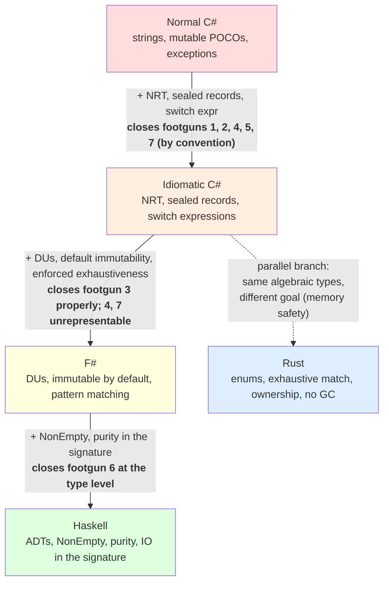

## Restating the climb {.unnumbered}

The blub paradox said you cannot see what your language is missing
while you are inside it. The point of building the same fuel
engine five times was to *show* the missing pieces — to put the
junior C# version next to the idiomatic, F#, Haskell, and Rust
versions and ask: for each footgun, what would the compiler have
done?

You have now seen all five rungs. Each one made a class of error
**structurally impossible** that the rung below treated as a
footgun. Not less likely. Impossible. The compiler refuses to
produce a binary in which that bug exists.

This is the synthesis chapter. It does not introduce new code. It
puts the climb in one table, one diagram, and one answer to each
of the four questions we promised to ask at every rung.

## The big table

Seven footguns, five languages. *Open* means the language lets the
bug compile and ship. *Convention* means the language allows it but
the idiomatic style does not. *Closed* means the compiler catches
it. *Unrepresentable* means the bug cannot be expressed in the
type system at all.

| # | Footgun | Normal C# | Idiomatic C# | F# | Haskell | Rust |
|---|---|---|---|---|---|---|
| 1 | NRE in logger (null deref) | Open | Closed (NRT) | Unrepresentable | Unrepresentable | Unrepresentable |
| 2 | Case-sensitive mode string | Open | Closed (enum) | Unrepresentable (DU) | Unrepresentable (ADT) | Unrepresentable (enum) |
| 3 | Missing recovery branch | Open | Convention (default throws at runtime) | Closed (warning, error in CI) | Closed (warning, error with `-Werror`) | Unrepresentable (compile error) |
| 4 | Mutable response list | Open | Convention (`IReadOnlyList`) | Closed (immutable by default) | Unrepresentable (purity + immutable data) | Closed (immutable by default) |
| 5 | Status typos as strings | Open | Closed (sealed records) | Unrepresentable (DU) | Unrepresentable (ADT) | Unrepresentable (enum) |
| 6 | Validator throws on first failure | Open | Convention (returns list) | Convention (returns list) | Convention (returns `NonEmpty`) | Convention (returns `Vec`) |
| 7 | `switch` with no default | Open | Convention (compiler doesn't enforce) | Closed (warning, error in CI) | Closed (warning, error with `-Werror`) | Unrepresentable (compile error) |

Three things to notice.

First, the gap between *normal C#* and *idiomatic C#* is enormous.
Six of seven move from open to closed without changing language.
The rung you can take fastest, with the least training cost, is
the one inside your existing toolchain. If you read no further
than [chapter 4](04-idiomatic-csharp.qmd), most of the work is
already done.

Second, the difference between *idiomatic C#* and *F#/Haskell/Rust*
is not "more bugs caught" — most of the bugs are already caught.
The difference is **how**. Idiomatic C# closes six footguns through
a combination of compiler features and convention: turn on NRT,
use sealed records, prefer `IReadOnlyList<T>`, write switch
expressions, remember the default arm. F#/Haskell/Rust close the
same six **without remembering**. The cases are unrepresentable.
There is no default arm to forget, because there is no string
status to forget about.

Third, footgun 6 (the throwing validator) is *convention* in all
four upper rungs. No mainstream type system forces you to write a
non-throwing validator. The cultural default is "return a list of
errors," and the linter / clippy / FS warning will lean on you to
follow it — but if you write `panic!("bad row")` in Rust or
`failwith` in F#, the compiler will let you.

## The ladder, visualised

Rust is shown as a parallel branch off the algebraic-types step
rather than strictly above F# on the ladder. The reason: Rust's
type discipline is comparable to F#/Haskell, but Rust got there
chasing memory safety, not domain modelling. On this domain that
distinction does not matter — Rust closes the same footguns. On a
domain with concurrency or zero-copy parsing, Rust would pull
ahead. On a domain with a `NonEmpty` invariant, Haskell would pull
ahead. There is no single ordering; there is a set of tradeoffs.

## The four questions, answered

We promised at every rung to ask the same four questions. Here are
all the answers in one place.

### What did each rung protect against?

| Rung | Closed |
|---|---|
| Idiomatic C# | Nulls (NRT), string typos (sealed records), unknown enum values, mutable response surface |
| F# | Forgotten DU cases (warning, error in CI), default immutability, non-empty wrappers possible |
| Haskell | Non-empty *enforced* at the type level (`NonEmpty`); side effects visible in the signature (`IO`) |
| Rust | Exhaustive match as a hard compile error (no flag), ownership rules, memory safety, no GC |

### What can still go wrong?

| Rung | Still possible |
|---|---|
| Idiomatic C# | A `switch` with a default arm that throws at runtime when a new case ships; runtime-only quarantine-reasons check; nullable third-party types; warnings ignored |
| F# | `[<CLIMutable>]` for C# interop weakens the type model; DTO strings at the boundary; warnings can be disabled |
| Haskell | DTO strings still leak in (`show`-formatted); cross-field combinations inside a record can still be inconsistent; pure model, impure adapter |
| Rust | `f64` for money; empty `Vec` where `NonEmpty` would be tighter; `Debug`-formatted DTO strings; `.unwrap()` panics in poorly-reviewed code |

Notice the pattern: as you climb, the "still possible" list does
not get shorter so much as it **moves outward**. The core is
clean. The bugs migrate to the boundary, where strings come in
and go out. That is the entire subject of Part Ib.

### Easier or harder to read?

| Rung | Reading experience |
|---|---|
| Idiomatic C# | Verbose but immediately readable to any C# developer; switch expressions take a week to internalise |
| F# | Compact, terse; reads like pseudocode for the domain; takes a week of "what does that operator mean" before it clicks |
| Haskell | Highest signal-to-noise ratio of any version; `data RowDecision = ...` is the domain model verbatim; takes a month for `do`-notation, typeclasses, and `Monad` to feel natural |
| Rust | Verbose like idiomatic C#, but the verbosity is in the right places — named field variants, explicit `.clone()`, explicit lifetimes when they matter; reads like ML once you get past the punctuation |

### Easy to extend?

Add a 7th `RowDecision` case — `ManualReview`. What does the
compiler do?

| Rung | Outcome |
|---|---|
| Normal C# | Silent runtime corruption. `switch (d.Status)` has no default arm and the new status is never counted. The build is green. Bugs found at month-end reconciliation. |
| Idiomatic C# | Runtime throw. The switch expression's discard arm hits `_ => throw new InvalidOperationException(...)`. Loud — you find out on the same deploy — but still runtime, still after CI passed. |
| F# | Compiler warning `FS0025` (incomplete pattern match). With `<TreatWarningsAsErrors>true>` (idiomatic in F# production projects) the build refuses. |
| Haskell | Compiler warning `-Wincomplete-patterns`. With `-Werror` (idiomatic in Haskell production projects) the build refuses. |
| Rust | Compile error `E0004`. No flag to set. The build cannot produce a binary. |

The C# crowd will note that the gap between *warning* and *error*
is configuration. True. The gap between *silent* and *warning* is
not configuration — it is the type system.

## There is no winner

This is not a polemic. Read the
[V2 scoring report](../../../docs/v2-results.md) and you will see
that all four serious implementations score within three points of
each other (87–90 out of 100). The differences are real but not
huge, and they are differences *of kind*, not of quantity:

- **Idiomatic C#** closes six of seven footguns cheaply for a .NET
  shop. It is the most practical production fit in this
  organisation. It is what we would actually ship.

- **F#** is the best compromise inside .NET. Discriminated unions,
  immutable by default, exhaustive pattern matching — all without
  leaving the CLR. Hires are harder, debugging is the same
  Visual Studio, deployment is identical to C#. The
  [V3 scoring](../../../docs/v3-results.md) put F# at the top once
  the boundary work was added.

- **Haskell** is the reference oracle. The cleanest algebraic
  model, the only property tests, the strongest `NonEmpty`
  discipline. We would not ship it in a .NET shop, but we would
  read it before designing the C# version. It is the answer to
  "what does the type system look like with all the safety nets
  turned on?"

- **Rust** gets the same algebraic safety with curly braces and a
  performance budget. On this domain, that performance budget is
  irrelevant. On a different domain (a parser, a service that
  fans out to a million concurrent connections, an embedded
  agent), Rust would pull ahead.

The blub paradox warned you that you cannot see what your
language is missing from inside it. You have now seen it. You
have a vocabulary — *exhaustive match*, *non-null by default*,
*discriminated unions*, *non-empty at the type level*, *immutable
by default* — and you have a calibrated eye. The next time
someone says "F# would have caught that," you know what they
mean. The next time someone says "the compiler error told me
exactly which file to fix," you know which compiler.

That is the whole purpose of climbing the ladder. Not to rank the
languages. To **see** the categories.

## Teaser: the cores are clean, the edges are not

Every version above has a clean core. The classifier is pure. The
decision is a sum type. The summary is derived. The
recovery matrix is exhaustively matched.

And yet every version above still has bugs.

The bugs do not live in the core. They live at the edges. CSV
imports parse dates with three different libraries and accept
three slightly different sets of strings. Repository adapters
look up a transaction, get a typed result back, and then
**stringify it** before mapping it back into the domain — the
same string-typed pattern the junior version shipped with, only
moved to a different file. Audit logs project domain decisions
into freeform `show`-style text that breaks when an enum is
reordered. Operational reports double-count rows when the fatal
batch logic forgets to suppress the upload list.

Every real app has those edges. The next part of this book is
about them. The clean core was the easy half. The boundary is
where the bugs come back.

[Read on: Chapter 11 — The boundary returns](../part1b/11-boundary-returns.qmd).
