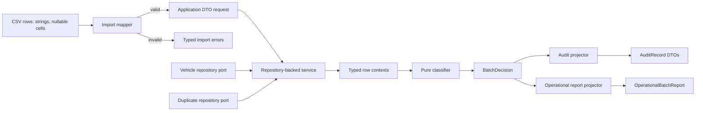
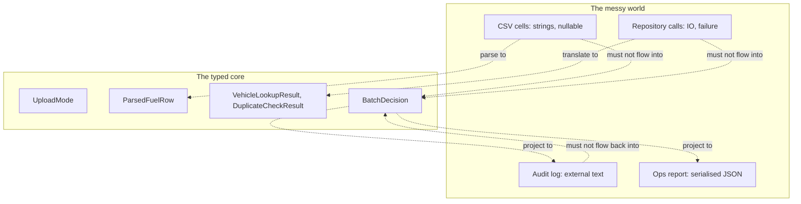

## A clean core is not a clean system {.unnumbered}

In [Part I](../part1/01-blub-paradox.qmd) you watched five rungs of the
language ladder close the seven footguns in the *domain core*. By the time
we landed on Rust, the decision engine was pure, the types made impossible
states unrepresentable, exhaustive `match` caught missing cases at compile
time, and the batch summary was derived from per-row decisions instead of
mutated alongside them. The blub-paradox demo had landed: there was a
class of bug each rung made structurally impossible.

So why is there a Part Ib?

Because real systems do not take pre-validated `ParsedFuelRow` values.
Real systems take CSV strings. They call a vehicle-lookup service that
sometimes times out. They write audit events to a log the ops team
actually reads. They emit an operational report that drives a "what
uploaded today" dashboard. Every one of those is an *edge*, a place
where the typed domain has to meet messy reality — and every one is a
*new* surface where bad types can sneak back in.

V2 of this experiment asked: *can the language model the domain
cleanly?* V3 asked a harder question: *can the language keep that
domain clean when integration arrives?*

That is what Part Ib is about.

## What V3 added

The V3 pass kept the V2 domain rules frozen and added four boundary
concerns around the pure core:

1. **CSV-shaped import.** Already-parsed CSV cells (every field a
   nullable string) flow in. The mapper turns them into typed application
   DTOs or typed import errors. Nothing about being a CSV cell ever
   crosses into the decision engine.
2. **Repository ports.** Vehicle lookup and duplicate history live
   behind application-layer interfaces. The pure engine sees typed
   `VehicleLookupResult` and `DuplicateCheckResult` values, never a
   `SqlConnection` or an HTTP client.
3. **Audit projection.** A separate projector reads `BatchDecision` and
   emits typed audit records, with a clearly-marked string conversion at
   the very edge where they leave the process.
4. **Operational batch report.** A second projector reads the same
   `BatchDecision` and emits the ops-facing report: counts, uploaded
   transaction IDs, rejected row numbers, quarantined rows with reasons,
   and a fatal/ready status.

The full V3 pipeline looks like this:

The V2 work lives entirely inside the `Engine` box. Everything outside
that box is new in V3, and everything outside that box is where the
seven footguns try to make a comeback.

## Why this is the real test

The V2 lesson — *types make domain bugs structurally impossible* — is
true but incomplete. Anyone can write a clean pure function. The
question is whether you can wire it to a CSV parser, three repositories,
an audit log, and an ops dashboard without the CSV parser's strings, the
repository's nulls, the log's free-text status field, and the dashboard's
mutable counters creeping back into your decision types.

That is a different skill from "model the domain." It is the skill of
*holding a boundary*.

V3 is the test of that skill. The same four languages from V2 — C#, F#,
Haskell, Rust — get the same four boundary concerns added. The V2
scoring put Haskell first; the V3 scoring does not. The boundary
changes the answer.

The reason is intuitive once you look at it:

The arrows that *should* be there are typed translations at the edge.
The arrows that *should not* be there are the bugs. A junior writing
this code for the first time has to actively resist drawing them. A
mid-level engineer writes them by accident in the third file of a six-file
PR. The question V3 asks is: **which language makes the missing arrows
hard to draw?**

## The five risks at every boundary

When you sit a junior down in front of the V3 pipeline, here are the
five concrete things they tend to ship. They are not exotic. Each one
is a single line of code at the edge that quietly undoes the V2 lesson.

1. **Raw string statuses sneaking back into domain code.** The audit
   layer needs an external status text like `"accepted_with_warnings"`.
   Once that string is in scope, it is one paste away from being the
   *input* to the next layer's switch statement. Strong tip: produce
   the string at the *very last* boundary, never before.

2. **Nullable/default DTO construction violating non-empty invariants.**
   In V2 we worked hard to make `AcceptedTransaction` carry a real
   `Vehicle` and a real `TransactionKey`. The DTO layer hands you back
   nullable strings, and `with { TransactionKey = null }` compiles.
   F#'s `[<CLIMutable>]` records, C#'s record `with` updates, Rust's
   `Option<String>` — every one of these can hand you an "accepted"
   row whose key is empty if you are not paying attention.

3. **Loose numeric types for money and quantity.** The pure engine
   uses `decimal`/`Rational`/`Decimal` because rounding matters. The
   DTO layer takes a string and parses it. If you parse to `f64` /
   `Double` because that is what `parse::<f64>()` returns, you have
   reintroduced floating point into a financial calculation at the
   boundary. The V3 audit caught this in Rust: monetary values
   round-tripped through `f64`.

4. **Repository failures losing detail.** When the vehicle-lookup
   service times out, the typed-error part of you wants to say
   `RepositoryError::TimedOut { duration: 7s, endpoint: "..." }`. The
   tired part of you collapses that into "this row is fatal" and
   forgets the detail. The V3 audit caught this in both C# and Rust:
   the repository result was translated *first* into a DTO status
   string, *then* re-parsed back into a domain `Fatal` variant. The
   round-trip discarded everything in between.

5. **Summary/report logic duplicating per-row decision logic.** The
   ops report needs to count "accepted with warnings." The naive
   implementation iterates the raw input rows and re-decides what
   counts as accepted. Now you have two classifiers, and they will
   drift. The V2 lesson — *derive the summary from decisions* — has to
   hold at the report boundary too. The V3 phase briefing called this
   out specifically: the counterexample is the report projector that
   inspects `csvRows` and tracks `accepted` and `skipped` in mutable
   counters; the good shape is the projector that reads `BatchDecision`
   and never looks at the raw input again.

All four V3 implementations close some of these risks; none closes all
five. The honest cross-language picture is the next chapter.

## What V2 was and was not

It is worth being explicit about what the V2 audit *did* test, so the
V3 lesson lands without sounding like a contradiction.

V2 took the pure decision engine and pushed five rounds of change
through it: split a monolith into modules, add a new `Quarantined`
outcome with typed reasons, split `Recovery` mode into conservative and
aggressive variants, add a thin DTO mapping layer, score the result.
At every step the V2 audit checked the same V1 footguns — raw status
strings, nullable accepted transactions, boolean soup in duplicate
state, mutated summaries — and confirmed that each idiomatic
implementation either prevented the bug or made it harder to write.

What V2 did *not* push hard on:

- a CSV-shaped import that has to handle bad cells, not just
  well-typed DTOs;
- repository lookups that can fail mid-batch and have to be translated
  into typed outcomes;
- a separate audit projection that emits records to a log other systems
  consume;
- an ops report that consumers will read once and assume is honest.

Each of those is a new boundary. Each one re-opens the same V1
footguns. V3 made that explicit by adding all four at once.

The four V3 implementations did not regress on V2 rules. The decision
engine in each language is still pure, still produces typed outcomes,
still derives the summary from decisions. What V3 surfaced is the
*surface area* the integration adds. That surface area is where the
ranking flipped.

## What's next

[Chapter 12](12-boundary-side-by-side.qmd) walks all four engines
through all four boundary concerns side-by-side, with real code from
each implementation. It is the longest chapter in the book because the
boundary is where most of the engineering effort lives in production.

[Chapter 13](13-final-takeaway.qmd) is the final takeaway: what to
recommend a junior developer do in a real .NET shop, given everything
the two halves of this book have shown.

If you want the scoring rationale up front, the [V3 results
document](https://github.com/tedk99/experiment-normalcsharp/blob/main/docs/v3-results.md)
has every score and verdict. The short version: the V2 winner is not the
V3 winner, and the reason is the boundary.
