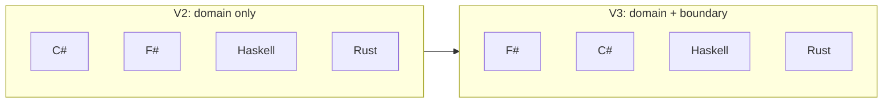
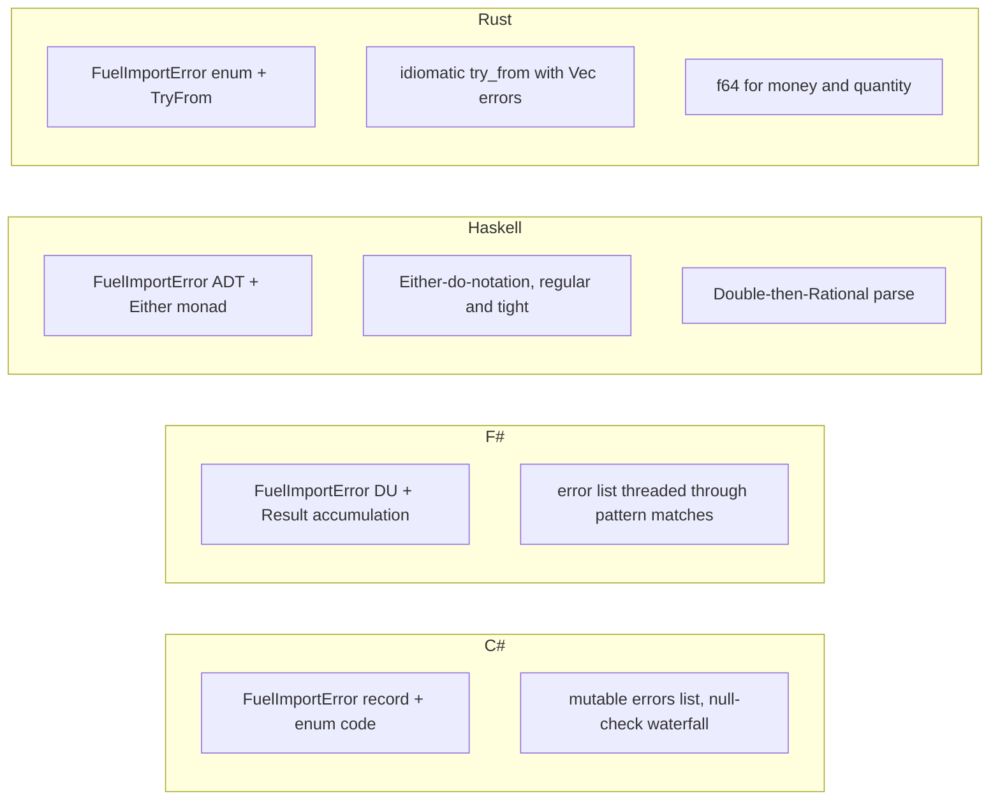
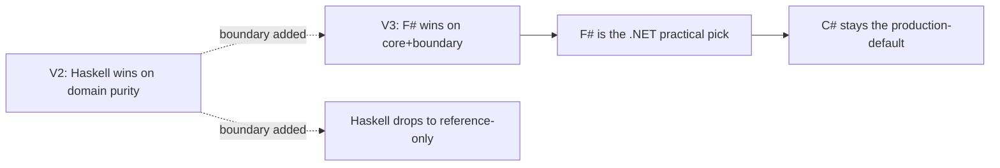

## The same four problems, four times {.unnumbered}

[Chapter 11](11-boundary-returns.qmd) named the four V3 boundary
concerns: CSV-shaped import, repository ports, audit projection,
operational batch report. This chapter walks all four of them through
all four V3 engines — C#, F#, Haskell, Rust — with real code from each
implementation and an honest verdict on each cell of the grid.

We are no longer asking *can the language model the domain?* All four
can. We are asking *can the language hold the boundary?*

That question lands differently in each language. F# wins on the
combined picture. C# wins on practical fit. Haskell still has the most
algebraic shape but feels academic. Rust is disciplined but adds
friction. The V2 ranking does not survive the boundary; the rest of
this chapter shows you why.



The reorder is not noise. It is the lesson.

## CSV-shaped import

The first boundary is parsing. Already-tokenised CSV cells arrive as
string-shaped DTOs with every cell optional. The mapper has to produce
either a typed application request or a list of typed import errors.

### C#: typed errors, repeated parsing branches

C# models the inputs as record types with nullable strings, and the
import errors as a sealed sum:

```csharp
public sealed record ImportedFuelRow(
    string? RowNumber,
    string? VehicleIdentifier,
    string? TransactionDate,
    string? Quantity,
    string? UnitPrice,
    /* ... eleven more nullable strings ... */);

public enum FuelImportErrorCode
{
    MissingRows,
    MissingRequiredCell,
    InvalidNumber,
    InvalidDate,
    InvalidUploadMode,
    InvalidBoolean
}

public sealed record FuelImportError(
    FuelImportErrorCode Code,
    string Field,
    string Detail);
```

The mapping function accumulates a list of errors and returns either a
`Success` or a `Failure`:

```csharp
public static FuelImportMapResult<FuelUploadRequestDto> ToApplicationRequest(
    ImportBatchRequest request)
{
    var errors = new List<FuelImportError>();
    var uploadMode = ParseUploadMode(request.UploadMode, "uploadMode", errors);
    var maximumQuantity = ParseDecimal(request.MaximumQuantity, "maximumQuantity", errors);
    /* ... eight more parses, each appending to errors ... */

    if (errors.Count > 0 || uploadMode is null || /* eight null checks */)
    {
        return new FuelImportMapResult<FuelUploadRequestDto>.Failure(errors);
    }
    return new FuelImportMapResult<FuelUploadRequestDto>.Success(/* ... */);
}
```

This works. The errors are typed. The strings stay outside the domain.
But the code shape is *repeated parsing branches* — each parser writes
the same `if value is null { add error; return null; }` skeleton. The
V3 audit called this out: "import and mapping code repeat parsing
branches." It is C#-idiomatic and the most common production shape, but
it does not pressure the compiler to help.

### F#: typed errors accumulated through `Result`

F# uses the same pattern but with `Result` and lists, and the missing
piece is a typed `FuelImportErrorCode` discriminated union:

```fsharp
[<RequireQualifiedAccess>]
type FuelImportErrorCode =
    | MissingRows
    | MissingRequiredCell
    | InvalidNumber
    | InvalidDate
    | InvalidUploadMode
    | InvalidBoolean

let private parseImportDate field value =
    match requireCell field value with
    | Error errors -> Error errors
    | Ok value ->
        match DateTimeOffset.TryParse(value) with
        | true, parsed -> Ok parsed
        | false, _ ->
            Error [ importError FuelImportErrorCode.InvalidDate field "..." ]
```

The shape is similar to C# — error list, pattern match for the
collapse — but the F# version threads the typed result through
`Result<_, _>` everywhere, so the *combine* step (collecting per-field
errors into a per-batch list) is just list concatenation, not a
manually-maintained `errors.Add(...)` list. The V3 audit's note: "the
mapper accumulates typed `FuelImportError` values and hands valid rows
to the existing DTO boundary."

### Haskell: `Either`-based and the most regular

Haskell's import code is the most regular of the four. Each parser
returns `Either [FuelImportError] a`, and the combine step is straight
applicative-style pattern matching:

```haskell
data FuelImportErrorCode
  = ImportMissingRows
  | ImportMissingRequiredCell
  | ImportInvalidNumber
  | ImportInvalidDate
  | ImportInvalidUploadMode
  deriving stock (Eq, Show)

parseImportDate :: String -> String -> Either [FuelImportError] String
parseImportDate field value = do
  required <- requireImportCell field value
  if isIsoDate required
    then Right required
    else Left [ importError ImportInvalidDate field "Date must use yyyy-MM-dd format." ]
```

Two costs. First, `parseImportRational` round-trips through `Double`
before converting to `Rational`, which is the same `f64`-leak risk
Rust has. Second, the date check is shape-only (`isIsoDate` checks
digits and ranges 1–12, 1–31 but does not validate calendar dates).
Both are fixable; neither is fixed.

### Rust: `TryFrom` impls with typed errors

Rust uses the same shape, but expressed through `TryFrom`:

```rust
impl TryFrom<&ImportBatchRequest> for FuelUploadRequestDto {
    type Error = Vec<FuelImportError>;

    fn try_from(value: &ImportBatchRequest) -> Result<Self, Self::Error> {
        let upload_mode = parse_import_upload_mode(value.upload_mode.as_deref(), "upload_mode");
        let suspicious_quantity = parse_required_f64(
            value.validation.suspicious_quantity.as_deref(),
            "validation.suspicious_quantity",
        );
        /* ... */
        if !errors.is_empty() { return Err(errors); }
        Ok(Self { /* ... */ })
    }
}
```

`TryFrom` is the idiomatic Rust spelling for "boundary translation that
can fail." The errors are a `Vec<FuelImportError>`. The concrete catch
the V3 audit flagged: `parse_required_f64` returns `f64`, so monetary
values cross the boundary as floats and stay that way through the
domain. Rust's enum discipline is excellent for outcomes; it does not
help if the numeric primitive is wrong.

### Side-by-side



All four implement the boundary the right way at the *type* level:
errors are typed, status is not a magic string. The differences live in
the seams. C# and Rust hand-roll the accumulation. F# and Haskell get
it from the language's monadic combinators. Haskell and Rust both
silently parse money to a float.

## Repository ports

The second boundary is persistence. Vehicle lookup and duplicate
history are application ports the domain consumes typed results from.
The domain must not depend on a database or an HTTP client.

### C#: ports clean, results re-stringified

C# defines the ports cleanly:

```csharp
public interface IVehicleRepository
{
    VehicleRepositoryResult Lookup(VehicleIdentifier identifier);
}

public interface IDuplicateRepository
{
    DuplicateRepositoryResult Lookup(DuplicateLookup lookup);
}

public abstract record VehicleRepositoryResult
{
    private VehicleRepositoryResult() { }
    public sealed record Success(VehicleLookupResult Lookup) : VehicleRepositoryResult;
    public sealed record Failure(VehicleRepositoryError Error) : VehicleRepositoryResult;
}
```

So far so good. The implementation, though, takes a shortcut that the
V3 audit called out specifically:

```csharp
public FuelUploadMapResult<FuelUploadResponseDto> Classify(FuelUploadRequestDto request)
{
    var rows = request.Rows?.Select(ResolveRow).ToArray();
    var resolvedRequest = request with { Rows = rows };
    return new FuelUploadApplicationService().Classify(resolvedRequest);
}

private FuelUploadRowDto ResolveRow(FuelUploadRowDto row)
{
    /* ... */
    return row with
    {
        VehicleLookupStatus = VehicleLookupStatus(vehicleLookup),  // -> "found" / "not_found" / "ambiguous"
        VehicleId = VehicleId(vehicleLookup),
        /* ... eight more string-typed fields ... */
    };
}

private static string VehicleLookupStatus(VehicleRepositoryResult result)
{
    return result switch
    {
        VehicleRepositoryResult.Success { Lookup: VehicleLookupResult.Found } => "found",
        VehicleRepositoryResult.Success { Lookup: VehicleLookupResult.NotFound } => "not_found",
        VehicleRepositoryResult.Success { Lookup: VehicleLookupResult.Ambiguous } => "ambiguous",
        VehicleRepositoryResult.Success { Lookup: VehicleLookupResult.Unavailable } => "unavailable",
        VehicleRepositoryResult.Failure => "unavailable",
        _ => throw new InvalidOperationException("Unhandled vehicle repository result.")
    };
}
```

Read that switch carefully. The repository handed us a typed
`VehicleLookupResult.Found` value. We are turning it into the string
`"found"`, putting it back on the DTO, and then *re-parsing* the
string into `VehicleLookupResult.Found` in the next mapper layer. The
V3 audit:

> repository-backed classification mutates a DTO-shaped row with status
> strings, then reuses the normal mapper. That is practical but less
> clean than mapping repository results directly to row context.

Practical because it re-uses the existing DTO mapper. Lossy because
detail discards in the round-trip. `VehicleRepositoryResult.Failure`
collapses to the same string as `Success { Lookup: Unavailable }`. The
two are different in the type but indistinguishable on the DTO.

### F#: repositories map directly to domain types

F# does not take that shortcut. The repository result goes straight to
the typed `FuelRowContext`:

```fsharp
type IVehicleRepository =
    abstract Lookup: vehicleKey: string -> Result<VehicleLookupResult, VehicleRepositoryError>

type IDuplicateRepository =
    abstract Lookup: lookup: DuplicateRepositoryLookup -> Result<DuplicateCheckResult, DuplicateRepositoryError>

let private mapRepositoryRow vehicleRepository duplicateRepository index row =
    /* ... parse occurredAt, vehicleKey, externalReference ... */
    let vehicleLookup =
        match vehicleRepository.Lookup vehicleKey with
        | Ok lookup -> lookup
        | Error error -> VehicleLookupResult.Fatal(FatalProcessingError.VehicleLookupUnavailable error.Detail)

    let duplicateCheck =
        match vehicleLookup with
        | VehicleLookupResult.Fatal _ -> DuplicateCheckResult.NoDuplicate
        | _ ->
            match duplicateRepository.Lookup { RowNumber = row.RowNumber; VehicleKey = vehicleKey; ExternalReference = externalReference } with
            | Ok lookup -> lookup
            | Error error -> DuplicateCheckResult.Fatal(FatalProcessingError.DuplicateCheckUnavailable error.Detail)

    Ok { Row = ...; VehicleLookup = vehicleLookup; DuplicateCheck = duplicateCheck }
```

The repository's typed `Result<VehicleLookupResult, _>` reaches the
domain's typed `VehicleLookupResult` without ever passing through a
status string. The V3 audit's note: "repository calls map directly to
typed `FuelRowContext` values rather than going through status
strings."

### Haskell: typed and pure, but academic

Haskell models repositories as `newtype`-wrapped function types:

```haskell
newtype VehicleRepository = VehicleRepository
  { repositoryLookupVehicle :: Registration -> Either VehicleRepositoryError VehicleLookupResult
  }

newtype DuplicateRepository = DuplicateRepository
  { repositoryLookupDuplicate :: RepositoryDuplicateLookup -> Either DuplicateRepositoryError DuplicateCheckResult
  }

mapRepositoryRow vehicleRepository duplicateRepository index dto = /* ... */
  vehicleLookup =
    either
      (const (VehicleLookupFatal (VehicleLookupUnavailable number)))
      id
      (lookupVehicle registrationValue)
```

This is the cleanest *shape* of the four. There is no DTO round-trip,
no string detour, and no IO type leakage because it is a pure
function-as-record. It is also, the V3 audit honestly notes, "an
in-process typed facade rather than a realistic service adapter."
There is no notion of async, no `IO` involvement, no dependency
injection container — this is what a Haskell mathematician would write
to convince another Haskell mathematician the design is right. A C#
shop wiring this up to a real database would need a much bigger glue
layer than the other three engines.

Also: repository failures discard detail. `Left
(VehicleRepositoryUnavailable msg)` becomes `VehicleLookupFatal
(VehicleLookupUnavailable rowNumber)` — the message is dropped.

### Rust: traits, idiomatic, same DTO shortcut as C#

Rust's repository ports are well-shaped traits:

```rust
pub trait VehicleRepository {
    fn lookup(&self, reference: &VehicleRef)
        -> Result<VehicleLookupResult, VehicleRepositoryError>;
}

pub trait DuplicateRepository {
    fn lookup(&self, lookup: &DuplicateLookup)
        -> Result<DuplicateCheckResult, DuplicateRepositoryError>;
}
```

But the application service takes the same shortcut C# took:

```rust
fn resolve_row(&self, row: &FuelUploadRowDto) -> FuelUploadRowDto {
    let vehicle_ref = VehicleRef(row.vehicle_ref.trim().to_string());
    let vehicle_lookup = self.vehicle_repository.lookup(&vehicle_ref);
    let duplicate_lookup = /* ... */;
    let mut resolved = row.clone();
    apply_vehicle_lookup(&mut resolved, vehicle_lookup);
    apply_duplicate_lookup(&mut resolved, duplicate_lookup);
    resolved
}

fn apply_vehicle_lookup(row: &mut FuelUploadRowDto, result: Result<VehicleLookupResult, _>) {
    match result {
        Ok(VehicleLookupResult::Found(vehicle)) => {
            row.vehicle_lookup_status = "found".to_string();
            row.vehicle_id = Some(vehicle.id.0);
            /* ... */
        }
        Ok(VehicleLookupResult::NotFound { .. }) => {
            row.vehicle_lookup_status = "not_found".to_string();
            /* ... */
        }
        /* ... five more match arms, all writing to string fields ... */
    }
}
```

Same round-trip as C#. Typed result → string DTO field → re-parsed
back into typed result. The V3 audit: "the repository adapter
converts typed repository results into string DTO fields, then parses
them back into domain inputs. That mirrors C#'s shortcut and weakens
the boundary."

### Side-by-side


F# and Haskell connect typed result to typed domain input in one
step. C# and Rust take a detour through strings. The detour is
practical — it re-uses the existing DTO mapper — but it is also the
point at which the typed repository result becomes indistinguishable
from a CSV cell. *That* is where slop enters.

## Audit projection

The third boundary is audit. The projector reads `BatchDecision` and
emits typed audit records, with external text produced only at the
last step.

This is the boundary where all four implementations look most alike.
Each has a typed `AuditEventKind` enum/DU/ADT, a typed `AuditRecord`,
and a separate `AuditRecordDto` with strings. Each projects from
`RowDecision` with exhaustive pattern matching.

### C#: enum + record + switch-with-default

```csharp
public enum AuditEventKind
{
    Accepted, AcceptedWithWarnings, Rejected,
    SkippedDuplicate, Quarantined, FatalBatch
}

private static AuditRecord Project(RowDecision decision)
{
    return decision switch
    {
        RowDecision.AcceptedTransaction accepted => /* ... */,
        RowDecision.AcceptedTransactionWithWarnings accepted => /* ... */,
        RowDecision.QuarantinedRow quarantined => /* ... */,
        RowDecision.SkippedDuplicate skipped => /* ... */,
        RowDecision.RejectedRow rejected => /* ... */,
        RowDecision.FatalProcessingError fatal => /* ... */,
        _ => throw new ArgumentOutOfRangeException(nameof(decision), decision, "Unsupported row decision.")
    };
}
```

The `_ => throw` arm is the C# tax. Sealed records cannot tell the
compiler "these are the only cases," so you get a runtime exception if
a new case is added and this switch is missed. The V3 audit:

> adding a new decision or repository result can miss a switch until
> tests hit it; sealed record switches still need default throw
> branches instead of compiler-enforced exhaustiveness.

It is closed by tests, not by the compiler.

### F#: discriminated union with compiler-enforced exhaustiveness

```fsharp
let private projectClassified classified =
    match classified.Decision with
    | RowDecision.Accepted transaction ->
        transactionRecord AuditEventKind.Accepted [] transaction
    | RowDecision.AcceptedWithWarnings(transaction, warnings) ->
        transactionRecord AuditEventKind.AcceptedWithWarnings warnings transaction
    | RowDecision.Quarantined quarantined -> /* ... */
    | RowDecision.SkippedDuplicate skipped -> /* ... */
    | RowDecision.Rejected rejected -> /* ... */
    | RowDecision.Fatal fatal -> /* ... */
```

No default arm. F# will refuse to compile if a new case is added and
this pattern match is not updated. The V3 audit's note: "Pattern
matching over `RowDecision` keeps warning, quarantine, rejection,
duplicate, and fatal cases explicit."

### Haskell: same property, even tighter

```haskell
projectRow :: RowDecision -> AuditRecord
projectRow decision =
  case decision of
    Accepted transaction ->
      transactionRecord AuditAccepted [] [] transaction
    AcceptedWithWarnings transaction warnings ->
      transactionRecord AuditAcceptedWithWarnings (nonEmptyToList warnings) [] transaction
    Quarantined transaction reasons ->
      transactionRecord AuditQuarantined [] (nonEmptyToList reasons) transaction
    SkippedDuplicate skipped -> /* ... */
    Rejected rejected -> /* ... */
    Fatal fatalError -> /* ... */
```

Same compiler-enforced exhaustiveness as F#, plus the warnings and
reasons are `NonEmpty` — a missing case in the projector is a compile
error, an empty warnings list on `AcceptedWithWarnings` is a type
error. The V3 audit: "Every event is a constructor-derived projection
from `RowDecision`."

### Rust: same property, expressed in `match`

```rust
fn project_row(decision: &RowDecision) -> AuditRecord {
    match decision {
        RowDecision::Accepted(transaction) => transaction_record(
            AuditEventKind::Accepted, transaction, Vec::new(), Vec::new(),
        ),
        RowDecision::Warning { transaction, warnings } => transaction_record(
            AuditEventKind::AcceptedWithWarnings,
            transaction, warnings.clone(), Vec::new(),
        ),
        RowDecision::Quarantined { transaction, reasons, warnings } => /* ... */,
        RowDecision::SkippedDuplicate(skipped) => /* ... */,
        RowDecision::Rejected(rejected) => /* ... */,
        RowDecision::Fatal(fatal) => /* ... */,
    }
}
```

Same compiler-enforced exhaustiveness as F# and Haskell. The DTO
output uses `format!("{warning:?}")` debug formatting, which the V3
audit flagged — debug output is not a stable contract — but the
projection itself is honest.

### The audit cell

The audit boundary is where the four engines are most alike. All four
get the *typed-internal/string-external* split right. The single
distinguishing concern is **does the compiler force you to update the
projection when a new `RowDecision` case is added?** F#, Haskell, and
Rust say yes. C# requires a runtime `_ => throw` and a test that hits
the new case.

## Operational batch report

The fourth boundary is the ops report. All four engines derive the
report from `BatchDecision`, not from a separate counter. That is the
V2 lesson holding. The interesting question is **how each handles the
"fatal batch → suppress uploaded transaction IDs" case**.

### C#: imperative `if` on status

```csharp
public static OperationalBatchReport Project(BatchDecision decision)
{
    var status = decision.HasFatalErrors ? OperationalBatchStatus.Fatal : OperationalBatchStatus.Ready;
    var uploadedTransactionIds = status == OperationalBatchStatus.Fatal
        ? Array.Empty<TransactionKey>()
        : decision.RowDecisions
            .Select(UploadedTransactionId)
            .OfType<TransactionKey>()
            .ToArray();
    /* ... */
}
```

Correct: when the batch is fatal, uploaded IDs are empty. The check is
imperative — `if status == Fatal` — and depends on the boolean
`HasFatalErrors` derived from the decision. It works, but the compiler
does not enforce the suppression rule.

### F#: pattern match on `BatchDecision`

```fsharp
let project decision =
    let rows = rowsOf decision
    let status = statusOf decision

    let uploadedTransactionIds =
        if status = OperationalBatchStatus.Fatal then
            []
        else
            rows
            |> List.choose (fun classified ->
                match classified.Decision with
                | RowDecision.Accepted transaction
                | RowDecision.AcceptedWithWarnings(transaction, _) -> Some transaction.TransactionId
                | RowDecision.Quarantined _
                | RowDecision.SkippedDuplicate _
                | RowDecision.Rejected _
                | RowDecision.Fatal _ -> None)
```

Same imperative shape as C#, but the inner `match` is
compiler-enforced exhaustive. The status itself comes from a DU
pattern match on `BatchDecision.Ready` vs `BatchDecision.Blocked`.

### Haskell: status and fatal-errors come from one `case`

```haskell
projectOperationalReport decision =
  OperationalBatchReport
    { operationalStatus = status
    , operationalCounts = batchSummary decision
    , operationalUploadedTransactionIds =
        case status of
          OperationalReady -> acceptedTransactionIds (batchRows decision)
          OperationalFatal -> []
    , /* ... */
    }
  where
    (status, fatalErrors) =
      case batchOutcome decision of
        BatchUploadable -> (OperationalReady, [])
        BatchBlockedByFatal errors -> (OperationalFatal, nonEmptyToList errors)
```

Status and fatal-error list are derived in one pattern match from
`batchOutcome`. Hard to drift. The V3 audit: "It derives from
`BatchDecision`, uses existing summary data, and models fatal status
explicitly."

### Rust: pattern match on `BatchDecision`

```rust
pub fn project_operational_report(decision: &BatchDecision) -> OperationalBatchReport {
    let status = match decision {
        BatchDecision::Ready { .. } => OperationalBatchStatus::Ready,
        BatchDecision::Blocked { .. } => OperationalBatchStatus::Fatal,
    };

    let uploaded_transaction_ids = if status == OperationalBatchStatus::Fatal {
        Vec::new()
    } else {
        decision.rows().iter()
            .filter_map(|row| match row {
                RowDecision::Accepted(transaction) | RowDecision::Warning { transaction, .. } =>
                    Some(transaction.transaction_id.clone()),
                RowDecision::Quarantined { .. }
                | RowDecision::SkippedDuplicate(_)
                | RowDecision::Rejected(_)
                | RowDecision::Fatal(_) => None,
            })
            .collect()
    };
    /* ... */
}
```

The outer status is exhaustive `match`. The inner suppression is `if
status == Fatal`. Same pattern as F#, same compiler-enforced
exhaustiveness on the inner match.

### The report cell

This boundary is where derivation-from-decisions discipline matters
most — and where all four engines passed the audit. The differences
are stylistic:

- **C#** uses `decision.HasFatalErrors` and `if` checks.
- **F#** uses exhaustive `match` on inner row decision, `if` on status.
- **Haskell** uses one `case` on `batchOutcome` to derive status and
  fatal list together.
- **Rust** uses `match` on `BatchDecision`, then `if` on status.

The V3 audit:

> uploaded transaction IDs are suppressed when the batch is fatal,
> even if one row decision looks accepted. The report projects from
> the final batch decision, not from raw rows.

All four hold that line. No engine duplicated decision logic at the
report.

## The big comparison

Pulling the four boundary cells together against the four engines:

| Concern | C# | F# | Haskell | Rust |
|---|---|---|---|---|
| **CSV import** | typed errors, repeated parsing branches | typed errors, monadic accumulation | regular `Either`-do, `Double`-then-`Rational` leak | `TryFrom` typed errors, `f64` money leak |
| **Repository ports** | clean ports, string-detour rehydration | direct typed mapping | pure facade, academic | clean traits, string-detour rehydration |
| **Audit projection** | clean, requires `_ => throw` default | clean, compiler-enforced exhaustive | tightest, `NonEmpty`-enforced | clean, debug-format DTOs |
| **Operational report** | derived, `if`-based fatal check | derived, exhaustive inner match | derived, one-`case` status+fatal | derived, exhaustive variants |

Read down each engine column:

- **C#** is the most practical and the most familiar, with two real
  gaps: string detour at the repository edge, and runtime exhaustiveness
  closed by tests rather than the compiler.
- **F#** is the cleanest *practical* shape: typed at every edge, no
  string detour, compiler-enforced exhaustive matches. The weakest part
  is the interop module is large and mixes adapter concerns.
- **Haskell** is the cleanest *type* shape and the least production-shaped
  boundary. Pure functions everywhere, but the repository port is a
  function-as-record without any IO story, and the import code parses
  money through `Double`.
- **Rust** is disciplined and well-tooled, with the same string-detour
  shortcut as C# and an `f64` numeric leak.

## The honest verdict

The V3 results document scored the four engines at 91, 90, 89, 88 —
within four points of each other. The ranking is real, but it is
narrow, and the reason it changed from V2 is the boundary.

From the V3 results:

> F# kept the cleanest practical boundary. Haskell's pure domain
> stayed cleanest in isolation, but F# handled repository, import,
> audit, and report pressure while staying realistic for .NET.

> [C#'s] application services, DTOs, repositories, and xUnit tests
> match the expected shop shape.

> V2 favored Haskell as the best reference and C# as the practical app
> choice. V3 makes F# the strongest core-plus-boundary compromise
> because integration pressure rewards typed domain modeling and .NET
> proximity at the same time.

That last sentence is the headline. The V2 winner (Haskell) is not the
V3 winner. The V3 winner (F#) was second in V2. The reason for the
reorder is exactly the boundary pressure this chapter walked through.

The narrative payoff:



If you can put an F# project inside your .NET solution, that is the
strongest combined shape this experiment found. If you cannot — and in
most .NET shops you cannot — then idiomatic C# (the V2 second-place
chapter, [Idiomatic C#](../part1/04-idiomatic-csharp.qmd)) is the
default that does not throw away most of the V2 gains.

Haskell is the reference. Rust is the parallel option if you are
already building a service in it. Neither is the .NET production
recommendation.

[Chapter 13](13-final-takeaway.qmd) is the closer: what to actually
recommend a Fieldale junior do, given everything the two halves of
this book have shown.
