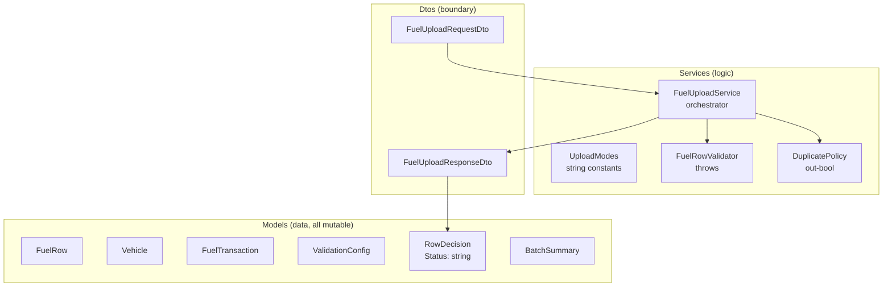
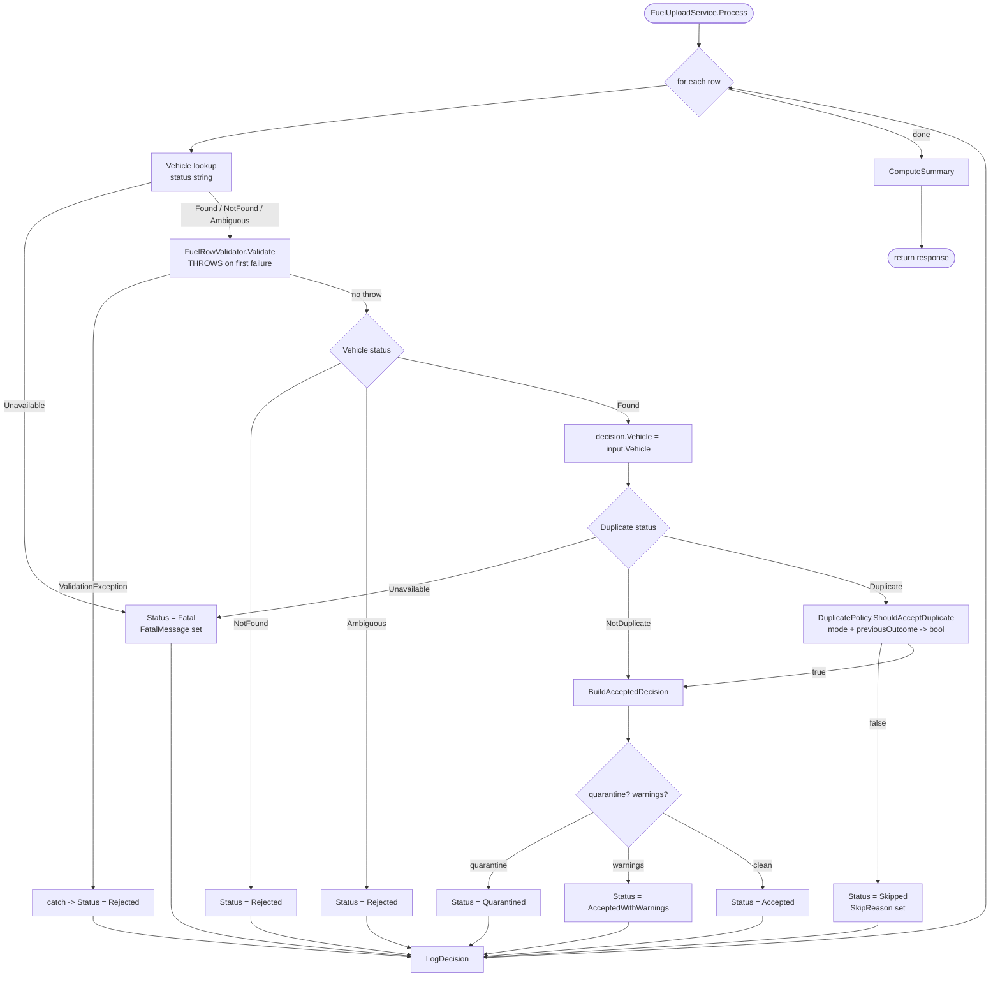
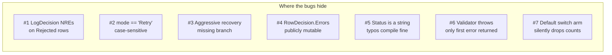
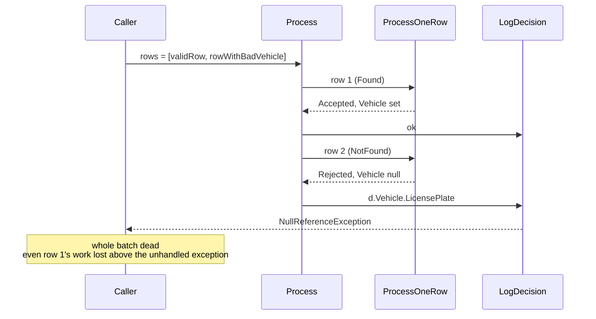

# Part 1 — The "Normal C#" Walkthrough

This is the kind of C# most teams ship. It builds, it runs, the happy path
test cases pass, and a junior could maintain it without learning anything
new. It also has **at least seven failure modes the language could have
prevented**, which you only notice once you've used something else.

This document is the tour.

---

## 1. Structure

```
src/FuelUploadEngine/
├── Models/
│   ├── FuelRow.cs                 mutable POCO
│   ├── Vehicle.cs                 mutable POCO
│   ├── FuelTransaction.cs         mutable POCO
│   ├── ValidationConfig.cs        thresholds
│   ├── RowDecision.cs             ONE class for every outcome (status = string)
│   └── BatchSummary.cs            counts
├── Services/
│   ├── UploadModes.cs             string constants for modes & statuses
│   ├── ValidationException.cs     thrown to signal a bad row
│   ├── FuelRowValidator.cs        throws on first failure
│   ├── DuplicatePolicy.cs         out-bool + skip-reason string
│   └── FuelUploadService.cs       big orchestrator
└── Dtos/
    ├── FuelUploadRequestDto.cs    inbound
    └── FuelUploadResponseDto.cs   outbound
```

Nothing surprising here. Models and Services folders, a DTOs folder for the
boundary. No special types — just classes with public setters.



---

## 2. The Flow

The pipeline mirrors the idiomatic versions: parse → validate vehicle
lookup → validate row → duplicate gate → build transaction → summarise.



Reading the diagram you can already see two suspicious shapes:

- `LogDecision` runs **after** the try/catch, on **every** decision —
  including the rejected ones where `decision.Vehicle` may still be null.
- The duplicate gate is a `bool` with an `out string` for the reason. Any
  case the writer forgot just becomes "skipped, unknown mode."

We'll come back to both.

---

## 3. What can go wrong

Seven concrete footguns this code makes easy. Each one is a real failure
mode the type system could have refused to compile, if we'd asked it to.



### Footgun 1 — NullReferenceException waiting to happen

`LogDecision` looks like helpful dev logging:

```csharp
Console.WriteLine(
    "row " + d.RowNumber +
    " plate=" + d.Vehicle.LicensePlate +
    " status=" + d.Status);
```

`d.Vehicle` is set inside `ProcessOneRow` only when vehicle lookup succeeded.
For a `Rejected` (validation or vehicle-not-found) or early `Fatal` row it
stays null. The first such row in production crashes the entire batch.



Pinned by `Bug1_NullRefInLoggerWhenVehicleNotFound`. The compiler couldn't
help because Nullable Reference Types is disabled — the project ships with
`<Nullable>disable</Nullable>` and the type `Vehicle` is just as nullable
as everything else.

### Footgun 2 — Case-sensitive mode string

`if (mode == UploadModes.Retry)` is an ordinal, case-sensitive compare. The
JSON shape that lands on most teams' boundary is lowercase or camelCase
("retry"). The mapper here passes the string through unchanged. Result:
a "retry" run silently does nothing — every duplicate is reported as
`UnknownMode` and skipped.

Pinned by `Bug2_RetryModeIsCaseSensitive`. The compiler couldn't help
because `Mode` is `string`. **No enum, no help.**

### Footgun 3 — Missing recovery branch (the killer)

`DuplicatePolicy.cs` handles four modes and six previous outcomes. The
aggressive-recovery contract is: also accept rows whose previous attempt
was `FailedAfterCanonicalFinalizationWithoutKey` — the canonical write
didn't actually land, so we should retry.

That branch is **not in the code**. It falls through to `skipReason =
"AggressiveRecoverySkipped"` and the row is dropped. Nothing in the
compiler will tell you. `previousOutcome` is a string. There is no
exhaustiveness check.

Pinned by `Bug3_AggressiveRecovery_MissesFailedAfterCanonicalWithoutKey`.

This is the one that will eat a quarter's worth of money in lost transactions
before someone notices.

### Footgun 4 — Mutable response

`RowDecision.Errors` is `public List<string> Errors = new List<string>();`
— a public mutable field. After `Process()` returns, any downstream code
can `resp.Decisions[i].Errors.Add(...)` and silently rewrite the audit
trail. There's no defensive copy, no read-only wrapper.

Pinned by `Bug4_DecisionListIsMutableByCaller`. The compiler couldn't help
because *every collection in C# defaults to mutable* and the convention
for closing this off (`IReadOnlyList<T>`, immutable collections, records
with `IReadOnlyCollection` properties) is opt-in and not present here.

### Footgun 5 — Status as string (typos compile fine)

`RowDecision.Status` is a string. The producer writes `"Quarantined"`. A
consumer somewhere else writes `if (d.Status == "Quarantied")` (typo). The
build is green; the bug ships. The summary then quietly under-counts the
category. It's the same shape of bug as #2, but it costs once at every
consumer site.

The walkthrough doesn't pin a test for this one because *every* string
comparison in the codebase is a potential instance — that's the point.

### Footgun 6 — Validator throws on first failure

`FuelRowValidator.Validate` uses `throw` for control flow. Two consequences:

1. **Performance.** Throwing on every invalid row is much slower than
   returning a list. Bulk uploads with a few thousand bad rows feel sluggish.
2. **Diagnostics.** Only the first failure is reported. A row that is both
   negative-quantity and over-cost only ever shows `QuantityNotPositive`.
   The user fixes that, re-uploads, gets `CostNotPositive`, fixes that,
   re-uploads — three round trips for what could've been one.

The idiomatic implementations return `IReadOnlyList<ValidationError>`. This
one throws, so accumulating is unnatural.

### Footgun 7 — `switch` without a default arm

`ComputeSummary` has a `switch (d.Status)` with one case per known status
and **no default branch**. Add a new status string somewhere upstream
(e.g. you decide `"AcceptedPending"` is a thing) and the count just
vanishes — the totals stop adding up to `TotalRows`, but nothing throws.

C# *can* warn on non-exhaustive switch *expressions*. This is a switch
*statement*, which doesn't warn. The pattern is invisible to lint.

---

## 4. Why each of these is hard to see

Look at the seven, and notice the common shape:

| # | Footgun                              | What the language *could* enforce |
| - | ------------------------------------ | --------------------------------- |
| 1 | NRE in logger                        | non-null reference types          |
| 2 | case-sensitive mode string           | sum type (enum / DU)              |
| 3 | missing recovery branch              | exhaustive pattern match          |
| 4 | mutable response                     | immutable types by default        |
| 5 | status typos                         | sum type                          |
| 6 | exception-driven validator           | `Result<T, errors>` style return  |
| 7 | switch statement with no default     | switch *expression* + DU          |

Six of the seven boil down to two ideas:

- **Make illegal states unrepresentable** — a string can hold any value;
  a sum type can only hold the ones you defined.
- **Force exhaustiveness** — if the compiler can prove you've handled every
  case, you can't silently forget one.

This is what the next four documents are about. The idiomatic C# branch
shows what you can do **inside this language**. F#, Haskell, and Rust each
show a different point on the curve.
