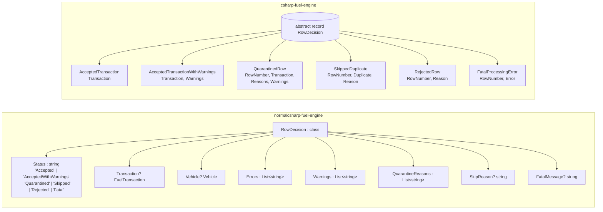
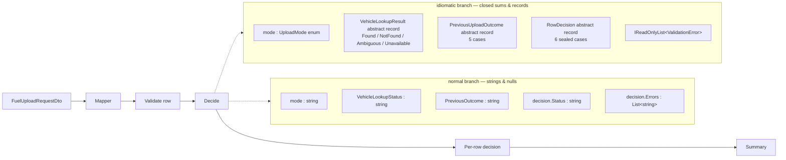

# Part 2 — Idiomatic C# Closes Most of the Footguns

In [Part 1](./01-walkthrough.md) we walked the seven failure modes of a
"normal junior C#" fuel-upload engine. This document compares that branch
against the **idiomatic** C# implementation living next door at
`csharp-fuel-engine/`. Same problem, same pipeline shape, written by
someone who has internalised the modern C# toolbox.

What modern C# brings to this fight, in one breath: **nullable reference
types** (`<Nullable>enable</Nullable>`), **`abstract record` + `sealed
record` hierarchies** as a poor-man's discriminated union, **switch
expressions** with type patterns, **record structs** as zero-cost typed
primitives, **`IReadOnlyList<T>`** at every boundary, **enums** with
exhaustively-handled values, and **`Result`-style mapping** instead of
exception-driven validation. No new language; just the features juniors
usually skip past.

---

## 1. The shape of `RowDecision` — flat class vs. closed hierarchy

The single biggest visible change is the decision type. Two views of the
same idea:



In the normal branch, **every** field exists on **every** decision and is
nullable by convention. The "shape" of an `Accepted` row and a `Fatal` row
is identical to the compiler; only a string discriminator tells them
apart. Forgetting to null-check `Vehicle` on a `Rejected` row is what
caused **Footgun 1**.

In the idiomatic branch, `RowDecision` is `abstract record` with a
**private constructor** and six `sealed record` nested cases. That
private constructor is the crucial bit — it prevents anyone outside the
file from declaring a seventh subtype, which is what lets exhaustiveness
checks be meaningful at all:

```csharp
public abstract record RowDecision
{
    private RowDecision() { }

    public sealed record AcceptedTransaction(FuelTransaction Transaction) : RowDecision;

    public sealed record AcceptedTransactionWithWarnings(
        FuelTransaction Transaction,
        IReadOnlyList<UploadWarning> Warnings) : RowDecision;

    public sealed record QuarantinedRow : RowDecision { /* ... */ }

    public sealed record SkippedDuplicate(
        RowNumber RowNumber,
        DuplicateState Duplicate,
        DuplicateSkipCode Reason) : RowDecision;

    public sealed record RejectedRow(RowNumber RowNumber, RejectionReason Reason) : RowDecision;

    public sealed record FatalProcessingError(RowNumber RowNumber, FatalError Error) : RowDecision;
}
```

A `RejectedRow` has no `Transaction` field. There is nothing to null. The
illegal state is unrepresentable.

---

## 2. Same pipeline, different types in the pipes

The control flow is identical — both branches parse a DTO, validate the
row, look up the vehicle, run a duplicate check, and emit a decision.
Only the *types flowing through the pipeline* differ.



The pipeline reads almost the same in plain English. But every string in
the normal branch is a place a typo or an unhandled case can hide;
every record/enum in the idiomatic branch is a place the compiler will
make you exhaust the possibilities.

---

## 3. The seven footguns, line by line

Each row of this table maps a Part-1 footgun to the exact mechanism in
the idiomatic branch that prevents it, and names the cost.

| # | Footgun (Part 1) | How idiomatic C# closes it | Cost |
| - | ---------------- | -------------------------- | ---- |
| 1 | `LogDecision` NREs on Rejected rows | NRT on, plus `Transaction`/`Vehicle` only exist on cases where they're meaningful | A compiler upgrade and the discipline to keep `<Nullable>enable</Nullable>` |
| 2 | `mode == "Retry"` is case-sensitive | `UploadMode` is an `enum`; mapper does case-insensitive parse once at the boundary | One mapping table; one place to add a new mode |
| 3 | Aggressive-recovery branch silently missing | `switch` expression over an enum + sealed-record `PreviousUploadOutcome` cases | Verbose DU encoding; still needs a `_ => throw` default |
| 4 | `Errors` is publicly mutable | `IReadOnlyList<T>` on every decision field; `record` value semantics | Callers must build the list before constructing the decision |
| 5 | `Status` is a string; typos compile | Decision is a sealed record hierarchy; matched by *type*, not string | More files, more types; no string-based serialisation for free |
| 6 | Validator throws on first failure | `IReadOnlyList<ValidationError>` return; accumulate all errors | No early exit; you must walk every check |
| 7 | Summary `switch` has no default | `switch` *expression* over closed hierarchy, with a `_ => throw` safety net | The `_ => throw` is still a runtime check, not a compile error |

### Footgun 1 — NRT + variant-specific fields

The normal version blew up because `decision.Vehicle.LicensePlate` was
called on a row whose vehicle lookup never succeeded. In the idiomatic
branch a `RowDecision.RejectedRow` simply has no `Transaction` and no
`Vehicle` field:

```csharp
public sealed record RejectedRow(
    RowNumber RowNumber,
    RejectionReason Reason) : RowDecision;
```

There is nothing to dereference. The closest thing to logging the
license plate would have to pattern-match on which case you have first:

```csharp
var plate = decision switch
{
    RowDecision.AcceptedTransaction a => a.Transaction.Vehicle.Identifier.Value,
    RowDecision.AcceptedTransactionWithWarnings a => a.Transaction.Vehicle.Identifier.Value,
    RowDecision.QuarantinedRow q => q.Transaction.Vehicle.Identifier.Value,
    _ => "(no vehicle)"
};
```

This closes **Footgun 1** at compile time. The language feature doing
the work is *nominal subtyping over a sealed hierarchy* — a vehicle
exists in the cases where it is meaningful, and nowhere else.

### Footgun 2 — enum + boundary normalisation

The normal branch compared mode strings directly. The idiomatic branch
makes mode an `enum`:

```csharp
public enum UploadMode
{
    Normal,
    Retry,
    ConservativeRecovery,
    AggressiveRecovery
}
```

…and parses it once, case-insensitively, at the application boundary:

```csharp
private static UploadMode? ParseUploadMode(
    string? value,
    string field,
    List<FuelUploadMappingError> errors)
{
    return Normalize(value) switch
    {
        "normal" => UploadMode.Normal,
        "retry" => UploadMode.Retry,
        "conservativerecovery" => UploadMode.ConservativeRecovery,
        "aggressiverecovery" => UploadMode.AggressiveRecovery,
        _ => InvalidUploadMode(field, value, errors)
    };
}

private static string Normalize(string? value)
{
    return value?.Replace("_", string.Empty, StringComparison.Ordinal)
                 .Trim()
                 .ToLowerInvariant()
        ?? string.Empty;
}
```

Inside the engine, `mode` is always one of four values. The
case-sensitive comparison **cannot happen** because comparisons are by
enum identity, not by string. This closes **Footgun 2**.

### Footgun 3 — exhaustive switch expression on a closed union

This is the killer footgun from Part 1. The normal branch's
`DuplicatePolicy` was a wall of `if (mode == ...)` blocks; the
aggressive-recovery branch for `FailedAfterCanonicalFinalizationWithoutKey`
was simply absent and fell through to a "skip" with no warning.

The idiomatic branch encodes the same policy as a single switch
expression on `UploadMode × PreviousUploadOutcome`, where both
operands are closed types:

```csharp
return mode switch
{
    UploadMode.Normal => new RowDecision.SkippedDuplicate(
        row.RowNumber, duplicate, DuplicateSkipCode.DuplicateInNormalMode),
    UploadMode.Retry when duplicate.PreviousOutcome is PreviousUploadOutcome.RetryableFailure => null,
    UploadMode.Retry => new RowDecision.SkippedDuplicate(
        row.RowNumber, duplicate, DuplicateSkipCode.PreviousAttemptNotRetryable),
    UploadMode.ConservativeRecovery when duplicate.PreviousOutcome is PreviousUploadOutcome.FailedBeforeCanonicalFinalization => null,
    UploadMode.ConservativeRecovery => new RowDecision.SkippedDuplicate(
        row.RowNumber, duplicate, DuplicateSkipCode.PreviousAttemptAlreadyCanonicalized),
    UploadMode.AggressiveRecovery when duplicate.PreviousOutcome is PreviousUploadOutcome.FailedBeforeCanonicalFinalization => null,
    UploadMode.AggressiveRecovery
        when duplicate.PreviousOutcome is PreviousUploadOutcome.FailedAfterCanonicalFinalization
            && duplicate.CanonicalTransactionKey is CanonicalTransactionKeyState.Missing => null,
    UploadMode.AggressiveRecovery => new RowDecision.SkippedDuplicate(
        row.RowNumber, duplicate, DuplicateSkipCode.PreviousAttemptAlreadyCanonicalized),
    _ => throw new InvalidOperationException("Unhandled upload mode.")
};
```

The missing aggressive-recovery branch is **right there** as its own
arm, with a `when` clause that checks the canonical-key state via type
pattern on the `CanonicalTransactionKeyState` sealed-record union. The
compiler doesn't strictly *force* exhaustiveness over the enum, but the
`switch` expression form makes "did I cover all modes?" a four-line
visual scan instead of a four-block `if/else` flow chart. This is the
biggest win in the file, and it closes **Footgun 3**.

### Footgun 4 — `IReadOnlyList<T>` and `record` immutability

The normal branch shipped a publicly-mutable `List<string> Errors`. The
idiomatic branch types every collection on a decision as
`IReadOnlyList<T>`, and decisions are immutable `record`s:

```csharp
public sealed record QuarantinedRow : RowDecision
{
    public QuarantinedRow(
        RowNumber rowNumber,
        FuelTransaction transaction,
        IReadOnlyList<QuarantineReason> reasons,
        IReadOnlyList<UploadWarning> warnings)
    {
        if (reasons.Count == 0)
        {
            throw new ArgumentException("Quarantined rows require at least one reason.", nameof(reasons));
        }
        // ...
    }

    public IReadOnlyList<QuarantineReason> Reasons { get; }
    public IReadOnlyList<UploadWarning> Warnings { get; }
}
```

Two things to notice. First, `IReadOnlyList<T>` is the read-only view —
a caller cannot `Add` to it. (It's not a guarantee against the
*producer* mutating the underlying list, but everything in this branch
constructs the list eagerly and never touches it again.) Second, the
constructor enforces the invariant that a `QuarantinedRow` has at least
one reason — an illegal state ruled out at the constructor boundary.
This closes **Footgun 4**.

### Footgun 5 — status as a type, not a string

There is no `Status` property in the idiomatic decision. Consumers
discover the status by pattern matching on the runtime type:

```csharp
return decision switch
{
    RowDecision.AcceptedTransaction accepted => AcceptedDto("accepted", accepted.Transaction, []),
    RowDecision.AcceptedTransactionWithWarnings accepted => AcceptedDto(
        "accepted_with_warnings", accepted.Transaction,
        accepted.Warnings.Select(w => w.Code.ToString()).ToArray()),
    RowDecision.QuarantinedRow quarantined => /* ... */,
    RowDecision.SkippedDuplicate skipped => /* ... */,
    RowDecision.RejectedRow rejected => RejectedDto(rejected),
    RowDecision.FatalProcessingError fatal => /* ... */,
    _ => throw new InvalidOperationException("Unhandled row decision.")
};
```

Typos like `RowDecision.Quarantied` simply do not compile — there is
no such type. This closes **Footgun 5**. The cost is real: string-based
serialisation now needs an explicit map (you can see it: `"accepted"`,
`"accepted_with_warnings"`, etc., are written out in the DTO mapper).

### Footgun 6 — accumulate, don't throw

The normal validator threw on the first failure. The idiomatic
validator returns the full list:

```csharp
public static IReadOnlyList<ValidationError> Validate(FuelRow row, ValidationConfig config)
{
    var errors = new List<ValidationError>();

    if (string.IsNullOrWhiteSpace(row.VehicleIdentifier.Value))
        errors.Add(new ValidationError(ValidationErrorCode.MissingVehicleIdentifier));

    if (row.Quantity <= 0)
        errors.Add(new ValidationError(ValidationErrorCode.NonPositiveQuantity));

    if (row.Quantity > config.MaximumQuantity)
        errors.Add(new ValidationError(ValidationErrorCode.QuantityExceedsMaximum));

    if (row.UnitPrice < 0)
        errors.Add(new ValidationError(ValidationErrorCode.NegativeUnitPrice));

    if (row.UnitPrice > config.MaximumUnitPrice)
        errors.Add(new ValidationError(ValidationErrorCode.UnitPriceExceedsMaximum));

    if (row.TransactionDate > config.Today)
        errors.Add(new ValidationError(ValidationErrorCode.TransactionDateInFuture));

    return errors;
}
```

The errors carry `ValidationErrorCode` enum values, not strings. The
orchestrator then folds the whole list into a single `RejectedRow`:

```csharp
var validationErrors = FuelRowValidator.Validate(row, validationConfig);
if (validationErrors.Count > 0)
{
    return new RowDecision.RejectedRow(row.RowNumber, new RejectionReason.ValidationFailed(validationErrors));
}
```

Cost: there's no early exit, so every row pays for every check. In
practice the checks are nanoseconds and the saved round-trips are
hours of human time, so it's an easy trade. This closes **Footgun 6**.

### Footgun 7 — switch *expression* over a closed hierarchy

The normal branch's summary used a `switch` *statement* without a
default arm. New statuses silently dropped on the floor. The idiomatic
branch uses `switch` *expressions* — and they cover every case of
`RowDecision` *by type*:

```csharp
return decision switch
{
    RowDecision.AcceptedTransaction accepted => /* ... */,
    RowDecision.AcceptedTransactionWithWarnings accepted => /* ... */,
    RowDecision.QuarantinedRow quarantined => /* ... */,
    RowDecision.SkippedDuplicate skipped => /* ... */,
    RowDecision.RejectedRow rejected => /* ... */,
    RowDecision.FatalProcessingError fatal => /* ... */,
    _ => throw new InvalidOperationException("Unhandled row decision.")
};
```

The C# compiler emits **CS8509: The switch expression does not handle
all possible values of its input type (it is not exhaustive)** as a
warning if a case is missing. This is treated as an error if the project
uses `<TreatWarningsAsErrors>true</TreatWarningsAsErrors>` (or
`<WarningsAsErrors>nullable;CS8509</WarningsAsErrors>`). This closes
**Footgun 7** — modulo the next section.

---

## 4. What can still go wrong in idiomatic C#

Don't oversell it. C# is not F#, and the discriminated-union shape is
emulated, not native. Four honest residual risks:

**1. Exhaustiveness isn't actually enforced — only warned.** Notice
that every switch expression in the codebase ends with this kind of
arm:

```csharp
var vehicle = vehicleLookup is VehicleLookupResult.Found found
    ? found.Vehicle
    : throw new InvalidOperationException("Unhandled vehicle lookup result.");
```

That `throw` is there because C# does not *require* you to exhaust a
sealed-record hierarchy the way F# requires you to exhaust a DU or Rust
requires you to exhaust an `enum`. The compiler can warn (CS8509), but
the warning fires on *flow analysis*, and there are well-known holes
(generic constraints, value-type wrappers, certain composite patterns)
where it stays silent. The `throw` is a runtime backstop the
language *forces* you to write. In a true DU language it would be
unreachable by construction.

**2. NRT warnings can be silenced with `!`.** Anywhere a junior writes
`somePossiblyNull!.Value` to "shut the compiler up", you are back in
the normal branch's world. NRT is a static analysis pass with an
opt-out operator. It's better than nothing by a wide margin, but it is
not a soundness guarantee.

**3. Discriminated-union encoding is verbose and leaks.** The fact that
`RowDecision` lives as nested `sealed record`s inside an `abstract
record` with a private constructor is a *trick* — it abuses the closed
inheritance model to simulate a sum type. You can see the cost in
`PreviousUploadOutcome` (five payload-less sealed records where an enum
would do), in the type tax of writing `new PreviousUploadOutcome.RetryableFailure()`
just to test a tag, and in the fact that every consumer has to write
the namespace-qualified case name on every match arm. Compare to F#:
`PreviousOutcome.RetryableFailure` and you're done.

**4. `IReadOnlyList<T>` is read-only by *interface*, not by value.**
The interface forbids the caller from mutating, but if the producer
hands you the same underlying `List<T>` and *then* mutates it, your
"read-only" view changes underneath you. The idiomatic branch is
careful about this, but the language doesn't make it impossible.
Immutable collections (`ImmutableArray<T>`, `ImmutableList<T>`) would,
at the cost of allocation.

---

## 5. Does the idiomatic branch actually catch errors the normal one doesn't?

**Yes, on six of the seven footguns, with hard evidence.**

- **#1 (NRE in logger):** structurally impossible. Fields don't exist on
  the wrong case.
- **#2 (case-sensitive mode):** impossible at the engine layer. `mode`
  is an enum; the string only lives in the mapper, where it is
  `ToLowerInvariant`'d.
- **#3 (missing recovery branch):** the four `UploadMode.AggressiveRecovery`
  arms in `DuplicatePolicy.cs` are right next to each other; a reviewer
  spots a missing arm in seconds, and the `_ => throw` will detonate in
  test rather than silently dropping rows.
- **#4 (mutable response):** `IReadOnlyList<T>` on every collection
  field; records are immutable.
- **#5 (status typo):** impossible — no string status exists.
- **#7 (silent switch):** CS8509 warns on missing cases in switch
  expressions; the `_ => throw` arm catches the residue at runtime.

**Where it stops:** the residue is **#3** and **#7**. Both still rely
on a *runtime* `throw new InvalidOperationException("Unhandled ...")`.
If you forget a case *and* your tests don't exercise it, production
will see the exception, not the compiler. In F# / Rust / Haskell, the
compiler refuses to build code that's not exhaustive — that's Part 3
and Part 5.

---

## 6. Is it easier or harder to read?

Honest both-sides take. **Harder for a true beginner**, because there
are more types, more files, more concepts (`abstract record`,
`record struct`, type patterns, `IReadOnlyList<T>`, generic result
wrappers), and because the "where is the status determined?" answer is
"by the type of the value, not by a string field you can grep for."
A junior who has never seen pattern matching has to learn pattern
matching to read this code.

**Easier for anyone who has read pattern-match code before**, because
the if-else maze in `DuplicatePolicy` collapses into a single switch
expression you can read top-to-bottom, and because the `RowDecision`
type is a one-glance summary of every possible outcome instead of a
constellation of nullable fields where you have to mentally reconstruct
"which fields are valid when `Status == \"Skipped\"`?". Once the
vocabulary lands, the code is shorter, denser, and tells you what it
*can* and *cannot* do. That's the whole point.

---

## 7. How easy is it to extend?

Suppose product adds a seventh outcome — `RowDecision.HeldForApproval` —
for rows that pass validation but exceed a per-vehicle spend limit and
need a human to ok them.

**In the normal branch:** Add the string `"HeldForApproval"` somewhere.
The `RowDecision` class doesn't change — it already has nullable
everything. Now `grep` for `case "Accepted":` and similar lines to find
every consumer, and *hope* you find them all. The
`ComputeSummary` switch statement won't error if you miss it; it'll
just quietly stop counting `HeldForApproval` rows. The DTO mapper
won't error if you miss it; the new outcome will be serialised as
whatever default the code picks. Test coverage is your only safety net,
and the bug is invisible to the compiler.

**In the idiomatic branch:** Add a new `sealed record HeldForApproval(...)
: RowDecision` to the closed hierarchy. The moment you do, **every
switch expression on `RowDecision` in the codebase starts emitting
CS8509**. The compiler hands you a list:

- `FuelUploadMapper.ToDecisionDto` — needs a new arm.
- `BatchSummaryCalculator.Summarize` — needs a new arm.
- Anywhere else? CS8509 will tell you.

The default `_ => throw` arm at the bottom of each switch *also*
catches it at runtime if you ignore the warning. You're locally fine
even before you've finished — the system fails loud, not silent.

That asymmetry — "the compiler tells you where you forgot" vs.
"search-and-pray and hope tests catch it" — is the single most
important reason to invest in this style. The footguns from Part 1 are
not really seven different bugs; they're seven instances of *the same
bug*: the language let the author forget a case. The idiomatic branch
spends a lot of types to take that ability away.

---

Part 3 looks at what happens when you stop trying to fake discriminated
unions and use a language that has them natively — F#.
