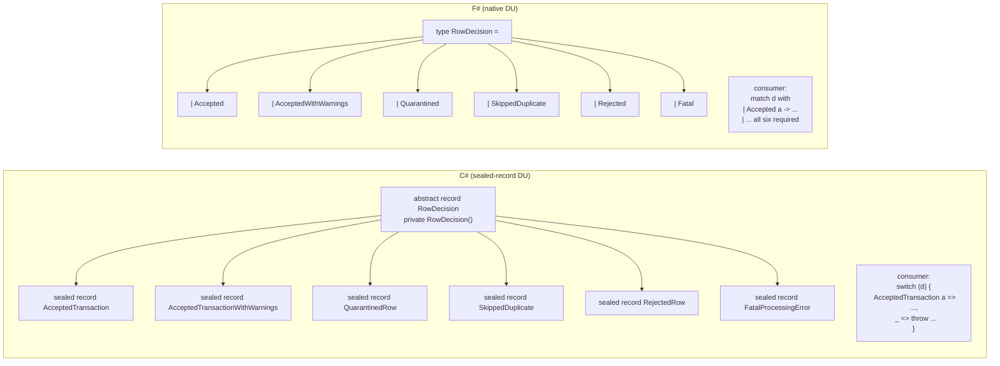
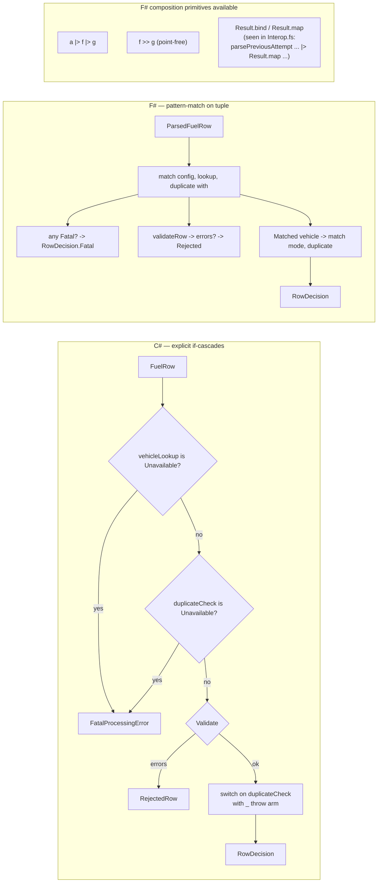
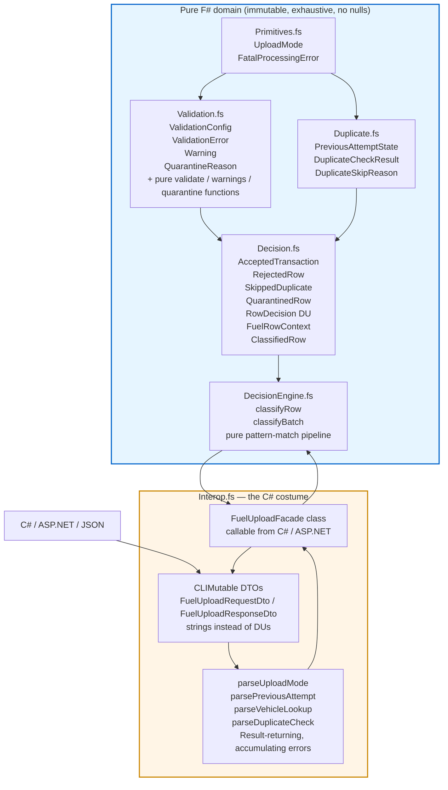

# Part 3 — Idiomatic C# vs F#

Part 1 catalogued seven footguns the "normal" C# implementation can't see
because the language never asks it to. Part 2 (if you've read it) walked
through the idiomatic C# rewrite — sealed-record discriminated unions,
switch expressions, nullable reference types, primitive wrappers — and
showed how far you can push the C# type system to *make illegal states
unrepresentable* without leaving the language.

Part 3 is where we step out.

F# is the same .NET runtime, the same `decimal`, the same `List<T>` if you
ask for it. But it ships with **native sum types**, **native exhaustive
pattern matching**, **immutability by default**, a **Result type that
isn't a NuGet package**, type inference that infers across function
boundaries, pipe operators (`|>`, `>>`), and computation expressions for
monadic flow. It is what you get when ML-family people are allowed to ship
on the CLR. Six of the seven footguns from Part 1 disappear by default
instead of by discipline.

That's the Blub paradox in action. The idiomatic C# in Part 2 simulates
DUs with abstract sealed records and private constructors. It can do it,
but every encoding leaves a smell — the `_ => throw new
InvalidOperationException(...)` arm, the `is X x =>` ceremony, the
`IReadOnlyList<T>` you have to remember to write. From up here those
smells look like what they are: workarounds for a missing feature.

---

## 1. The same type, in two languages

`RowDecision` is the central sum type for both pipelines. Here it is in
both encodings, side by side.



Here are the two encodings as they actually live in the repos.

```csharp
// csharp-fuel-engine/src/FuelUploadEngine/Domain/RowDecision.cs
public abstract record RowDecision
{
    private RowDecision() { }

    public sealed record AcceptedTransaction(FuelTransaction Transaction) : RowDecision;

    public sealed record AcceptedTransactionWithWarnings(
        FuelTransaction Transaction,
        IReadOnlyList<UploadWarning> Warnings) : RowDecision;

    public sealed record QuarantinedRow : RowDecision
    {
        public QuarantinedRow(
            RowNumber rowNumber,
            FuelTransaction transaction,
            IReadOnlyList<QuarantineReason> reasons,
            IReadOnlyList<UploadWarning> warnings) { /* invariant check */ }

        public RowNumber RowNumber { get; }
        public FuelTransaction Transaction { get; }
        public IReadOnlyList<QuarantineReason> Reasons { get; }
        public IReadOnlyList<UploadWarning> Warnings { get; }
    }

    public sealed record SkippedDuplicate(RowNumber RowNumber, DuplicateState Duplicate, DuplicateSkipCode Reason) : RowDecision;
    public sealed record RejectedRow(RowNumber RowNumber, RejectionReason Reason) : RowDecision;
    public sealed record FatalProcessingError(RowNumber RowNumber, FatalError Error) : RowDecision;
}
```

```fsharp
// fsharp-fuel-engine/FuelUpload.Domain/Decision.fs
[<RequireQualifiedAccess>]
type RowDecision =
    | Accepted of AcceptedTransaction
    | AcceptedWithWarnings of AcceptedTransaction * Warning list
    | Quarantined of QuarantinedRow
    | SkippedDuplicate of SkippedDuplicate
    | Rejected of RejectedRow
    | Fatal of FatalProcessingError
```

That's the entire DU declaration in F#: **seven lines, zero ceremony**.
The C# encoding is about thirty lines to express the same shape. No
`private RowDecision()` to lock down the discriminant set, no `sealed
record` per case, no constructor invariants written by hand — and the
consumer side is symmetric: F#'s `match` requires every case, while C#'s
switch expression accepts a `_ =>` arm that silently absorbs anything you
forgot.

Look at the consumer mechanics:

```csharp
return duplicateCheck switch
{
    DuplicateCheckResult.NotDuplicate notDuplicate => CreateAcceptedDecision(...),
    DuplicateCheckResult.Duplicate duplicate => DuplicatePolicy.ClassifyDuplicate(...) ?? CreateAcceptedDecision(...),
    _ => throw new InvalidOperationException("Unhandled duplicate check result.")
};
```

```fsharp
match Validation.validateConfig config, vehicleLookup, duplicateCheck with
| fatal :: _, _, _ -> RowDecision.Fatal fatal
| _, VehicleLookupResult.Fatal fatal, _ -> RowDecision.Fatal fatal
| _, _, DuplicateCheckResult.Fatal fatal -> RowDecision.Fatal fatal
| [], _, _ ->
    match Validation.validateRow config row with
    | [] -> ...
    | errors -> RowDecision.Rejected { Row = row; Reasons = [ RejectionReason.ValidationFailed errors ] }
```

The C# version has a `_ => throw` because the compiler doesn't know the
hierarchy is closed (the `private` constructor closes it socially, not
formally). The F# version pattern-matches on a **tuple of three sum
types** at once — and the compiler will warn if any combination is
unreachable or missing.

---

## 2. Pipeline composition

Both pipelines do the same five stages: validate config → check vehicle
lookup fatal → check duplicate fatal → validate row → classify. The
difference is how you write *and read* the glue between stages.



C# composes by **statement** — `if (...)` followed by `var ... =` followed
by `return ... switch`. Each early return is a separate guard. F# composes
by **expression**: the whole `classifyRow` body is one big `match`, with
the tuple `Validation.validateConfig config, vehicleLookup, duplicateCheck`
threading three sum types through one decision table.

`Interop.fs` shows the available shape clearly:

```fsharp
let private parseDuplicateCheck prefix row =
    match normalize row.DuplicateStatus with
    | "noduplicate" -> Ok DuplicateCheckResult.NoDuplicate
    | "duplicate" ->
        parsePreviousAttempt $"{prefix}.previousAttempt" row.PreviousAttempt
        |> Result.map DuplicateCheckResult.Duplicate
    | "fatal" -> ...
    | _ -> Error [ ... ]
```

`parsePreviousAttempt ... |> Result.map DuplicateCheckResult.Duplicate` is
the F# version of "if the inner parse succeeded, wrap it; otherwise pass
the error through." In C# you'd write either a nested `if (result.IsSuccess)
...` or a custom `Result<T,E>` library (which there isn't one of in the
idiomatic C# repo — it returns `RowDecision` directly and accumulates
errors via `RejectionReason.ValidationFailed`).

The available composition primitives in F#:

| Operator | What it does | Where it appears here |
| --- | --- | --- |
| `\|>` | forward pipe: `x \|> f` = `f x` | `rows \|> Seq.map ... \|> Seq.toList` in `DecisionEngine.fs` |
| `>>` | function compose: `(f >> g) x` = `g (f x)` | not used heavily here, but available |
| `Result.map` | apply a function to the `Ok` branch | `Interop.fs` `parseDuplicateCheck` |
| `Result.bind` | chain a function returning `Result` | available; not heavily used here |
| `List.choose` | map + filter for `option` | `DecisionEngine.fs` `fatalErrors` extraction |

None of these are libraries you import. They're in the standard `FSharp.Core`.

---

## 3. What F# protects that C# does not

This is the heart of the comparison. Four protections matter, mapped
directly to the seven footguns from Part 1.

### 3.1 Exhaustiveness of `match` (Footguns 3 and 7 — the killers)

Footgun 3 was the missing aggressive-recovery branch in normal C#. Footgun
7 was the switch statement with no default arm. Both reduce to the same
question: **if I add a case to a sum type, does the compiler force me to
update every consumer?**

In F#: yes.

```fsharp
match mode, duplicateCheck with
| _, DuplicateCheckResult.NoDuplicate -> accepted config mode row vehicle
| UploadMode.Normal, DuplicateCheckResult.Duplicate previous ->
    skipped row mode previous DuplicateSkipReason.NormalModeDuplicate
| UploadMode.Retry, DuplicateCheckResult.Duplicate PreviousAttemptState.RetryableFailure ->
    accepted config mode row vehicle
| UploadMode.Retry, DuplicateCheckResult.Duplicate PreviousAttemptState.Finalized -> ...
// ... and so on for every UploadMode × PreviousAttemptState combination
```

If you add `UploadMode.GhostMode` to `Primitives.fs` and don't update
`classifyRow`, the F# compiler emits **FS0025: Incomplete pattern matches
on this expression**. The build still completes (it's a warning, not an
error, by default), but it's flagged on every consumer that touches the
DU. With `--warnaserror` or the equivalent project setting, it's a hard
break. Either way, you cannot ship without seeing it.

In idiomatic C# the equivalent switch expression has this arm:

```csharp
_ => throw new InvalidOperationException("Unhandled duplicate check result.")
```

The C# compiler **does** check exhaustiveness for switch expressions on
sealed hierarchies — but only over the *declared* arms. The moment you
write `_ => ...`, the compiler shuts up. You've told it the rest is
handled. The new case slips through at runtime, as a thrown exception,
discovered by your customer.

That's Footgun 3 in two words: **escape hatches**. C# has them by design.
F# has them too (you can write `| _ -> ...` if you really want), but the
default — the path of least resistance — is exhaustive.

### 3.2 Immutability by default (Footgun 4)

Footgun 4 was `public List<string> Errors = ...` — a publicly mutable
field a caller could rewrite. Idiomatic C# fixes this with
`IReadOnlyList<T>` properties on records:

```csharp
public IReadOnlyList<QuarantineReason> Reasons { get; }
```

You have to remember to write `IReadOnlyList<T>` and not `List<T>`. The
compiler doesn't push you. If you typo `List<T>` the build is green.

F# records and lists are immutable unless you say otherwise:

```fsharp
[<CLIMutable>]
type RejectedRow =
    { Row: ParsedFuelRow
      Reasons: RejectionReason list }
```

`RejectionReason list` is `FSharp.Core`'s `FSharpList<T>` — an immutable
singly-linked list. There is no `Reasons.Add(x)`. The only way to "add"
a reason is to construct a new list: `RejectionReason.X :: existing`. The
record itself is immutable too — `{ rejected with Reasons = ... }` builds
a new record rather than mutating the old one.

The `[<CLIMutable>]` attribute on `RejectedRow` is the one place you have
to opt in to mutability, and we'll talk about it below — it's needed
*only* for interop with serializers and C# callers that expect parameterless
constructors and settable properties. The F# code itself never mutates it.

### 3.3 Null-ness (Footgun 1)

Footgun 1 was the NRE in `LogDecision` from `d.Vehicle.LicensePlate` when
`Vehicle` was null. Idiomatic C# fixes this with Nullable Reference Types
(NRT), enabled in the project file, which makes `Vehicle?` and `Vehicle`
distinct compile-time types.

But NRT is **flow analysis, not a type-system guarantee**. Three holes:

1. `null!` — the null-forgiving operator silences NRT at any callsite.
2. Reflection, `default(T)` for unconstrained generics, deserialization,
   uninitialized class fields — all can introduce nulls into "non-null"
   slots.
3. NRT is opt-in per project. Turn it off and the compiler stops caring.

F#'s own types don't have nulls at all. A `Vehicle` record either exists
or you wrote `Vehicle option` and have to match `Some v / None`. In
`DecisionEngine.fs` the absent-vehicle case isn't a null check, it's a
pattern:

```fsharp
| VehicleLookupResult.NotFound ->
    RowDecision.Rejected
        { Row = row
          Reasons = [ RejectionReason.VehicleRejected VehicleRejectionReason.UnknownVehicle ] }
| VehicleLookupResult.Matched vehicle ->
    // here, vehicle is non-null and present; the type system has proven it
    ...
```

There's no way to write code that "forgets" to handle `NotFound` and
accidentally accesses a null `vehicle`. The data wasn't in scope until
you matched the `Matched` case.

### 3.4 Less ceremony around DUs (Footguns 2 and 5)

Footgun 2 was `mode == "Retry"` (case-sensitive string compare) and
Footgun 5 was `Status` as `string` (typos compile fine). Both reduce to:
**the domain has a finite set of values, but you encoded it as a string,
so the compiler can't help.**

Idiomatic C# fixes this with `UploadMode` as a sealed-record DU and
`Status` as a tag on `RowDecision`. The cost is the ~30-line abstract
record encoding shown above.

F# fixes it with a one-liner:

```fsharp
[<RequireQualifiedAccess>]
type UploadMode =
    | Normal
    | Retry
    | ConservativeRecovery
    | AggressiveRecovery
```

Four lines for the DU; the consumer side is `match mode with | Normal -> ...
| Retry -> ...` and you cannot misspell `"Retry"` because it isn't a
string in the first place. Compare to the idiomatic C# equivalent —
typically an abstract record with four sealed subtypes, or an enum with
all the warts enums bring.

The line-count savings compound: every DU in `Decision.fs`, `Duplicate.fs`,
`Validation.fs`, and `Primitives.fs` is similarly compact. The whole F#
domain layer is shorter than the C# domain layer for the same problem,
and the consumer code is shorter too because pattern matching is more
expressive than chained `is X x =>` switches.

---

## 4. What can go wrong in F#?

F# is not a free lunch. It's also not Haskell — the type system has
escape hatches, and the runtime is shared with C#, which means most of
C#'s sharp edges are still reachable. Be honest about this with juniors.

### 4.1 Partial functions

F# has plenty of partial functions in the standard library:

- `List.head []` → `ArgumentException`
- `Map.find missingKey` → `KeyNotFoundException`
- `Option.get None` (or `.Value` on a `None`) → `NullReferenceException`
- `failwith "..."` — explicit panic
- `unbox<int> box` of wrong type → `InvalidCastException`

You can write the F# equivalent of "throw in the default arm" by accident.
Nothing stops `let x = list.[0]` on an empty list. The convention is
`List.tryHead`, `Map.tryFind`, `Option.map / Option.defaultValue` — but
the convention is opt-in.

### 4.2 The `[<CLIMutable>]` tax

Look at `Decision.fs`:

```fsharp
[<CLIMutable>]
type AcceptedTransaction =
    { TransactionId: string
      SourceRowNumber: int
      ...
```

`CLIMutable` tells the compiler: "also emit a parameterless constructor
and settable properties for this record, so C# callers and serializers
can work with it." It's the cost of living in a mixed-language solution.
The F# code never mutates these records, but the *type* exposes a mutable
shape at the CLR level, partially negating the immutability guarantee for
anyone consuming it from C#.

The whole `Interop.fs` file exists because the boundary between F# and
the outside world (JSON, C# callers, ASP.NET) needs `[<CLIMutable>]`
records with bland string fields, then explicit parse functions to turn
those back into the proper DUs. It's a lot of code. It's the **F# wearing
a C# costume** zone.

```fsharp
// from Interop.fs — DTOs that look like C# POCOs
[<CLIMutable>]
type FuelUploadRequestDto =
    { UploadMode: string                    // string, not UploadMode
      RequireExternalReference: bool
      ...
      ProcessingDate: string                // string, not DateTimeOffset
      Rows: FuelUploadRowDto array }
```

`UploadMode` as `string`, `ProcessingDate` as `string`. The boundary is
forced back into stringly-typed shape because that's what the JSON layer
gives you. Inside the domain F# can be precise; at the edges it cannot.

### 4.3 Nulls still exist when interop happens

Look at this guard from `Interop.fs`:

```fsharp
let private normalize (value: string) =
    if isNull value then
        ""
    else
        value.Replace("_", "").Trim().ToLowerInvariant()
```

F# strings *can* be null when they come from C# or the deserializer. The
F# compiler issues warnings about `isNull` on F# types but is fine with
it on .NET reference types reached through interop. Every string field on
a `[<CLIMutable>]` DTO is a potential `NullReferenceException` if you
forget the `isNull` check.

### 4.4 Reference-equality oddities

`Object.ReferenceEquals` on F# records compares by reference, not value,
even though `=` on records compares structurally. Junior devs reach for
the wrong one and get surprising results. The same goes for `obj.GetType()`
reflection on DU cases — the runtime type is a generated nested class
(e.g. `RowDecision+Accepted`), not the DU itself.

### 4.5 File order and compile times

F# compiles files **top to bottom in the order listed in the `.fsproj`**.
There are no forward references. If `DecisionEngine.fs` uses a type
defined in `Validation.fs`, `Validation.fs` must come first. Cyclic
dependencies between files are not just discouraged — they don't compile.

The result: refactoring that moves types around requires editing the
`.fsproj` to reorder `<Compile Include="...">` entries. New team members
hit this within the first week and find it baffling. (The discipline is
ultimately a feature — it forbids circular dependencies — but the
learning curve is real.)

Compile times for large F# projects can also sting. Type inference across
modules is more work than C#'s "infer locally, declare globally" approach.

---

## 5. Easier or harder to understand?

Both. Less code, fewer concepts to fight, but the concepts are denser.

A junior reading `DecisionEngine.fs` for the first time sees this:

```fsharp
match Validation.validateConfig config, vehicleLookup, duplicateCheck with
| fatal :: _, _, _ -> RowDecision.Fatal fatal
| _, VehicleLookupResult.Fatal fatal, _ -> RowDecision.Fatal fatal
| _, _, DuplicateCheckResult.Fatal fatal -> RowDecision.Fatal fatal
| [], _, _ -> ...
```

That's four ideas stacked into four lines: tuple construction, list
deconstruction (`fatal :: _` matches "non-empty list, take the head"),
wildcard patterns (`_, _, _`), and DU case patterns
(`VehicleLookupResult.Fatal fatal`). A first-time reader has to learn all
four to parse the snippet at all.

The equivalent idiomatic C# is more verbose but uses concepts a junior
already knows:

```csharp
if (vehicleLookup is VehicleLookupResult.Unavailable vehicleUnavailable)
{
    return new RowDecision.FatalProcessingError(row.RowNumber, vehicleUnavailable.Error);
}

if (duplicateCheck is DuplicateCheckResult.Unavailable duplicateUnavailable)
{
    return new RowDecision.FatalProcessingError(row.RowNumber, duplicateUnavailable.Error);
}
```

`if`, `is`, `return`. Three keywords every C# developer knows. The
information density is much lower — you read more lines to learn less —
but you don't need to learn anything new to read it.

The verdict is honestly: **once you're past the F# learning curve, the F#
is dramatically easier to read** because the structure of the code matches
the structure of the problem. Sum types in, sum types out, exhaustive
match in the middle. But the curve is real and it is steep for week one.

The other dimension worth naming: **F# has fewer escape hatches**, which
means there's less variance in how the same problem gets solved. Once
you've read one F# codebase you can mostly read them all. C# can be
written in ten styles — service-oriented, mediator pattern, functional
core, vertical slice, CQRS, plain — and the same problem ships radically
differently each way. F# largely converges on one shape.

---

## 6. How easy is it to extend?

Concrete walkthrough. Suppose product comes back next quarter with a
seventh `RowDecision` case: **`HeldForReview`** — the row passed
validation, isn't a duplicate, but matches a fraud-detection signal that
needs human eyes before the canonical write.

### In F#

Step 1: add the case.

```fsharp
[<RequireQualifiedAccess>]
type RowDecision =
    | Accepted of AcceptedTransaction
    | AcceptedWithWarnings of AcceptedTransaction * Warning list
    | Quarantined of QuarantinedRow
    | SkippedDuplicate of SkippedDuplicate
    | Rejected of RejectedRow
    | Fatal of FatalProcessingError
    | HeldForReview of AcceptedTransaction * HeldReason   // <- one new line
```

Step 2: compile. Every `match` expression on `RowDecision` anywhere in the
solution now triggers **FS0025: Incomplete pattern matches on this
expression. For example, the value 'HeldForReview (_, _)' may indicate a
case not covered by the pattern(s).**

The compiler shows you exactly which call sites are missing the case.
`Interop.fs::toDecisionDto` will flag. `BatchSummary.summarize` will
flag. Any future module that pattern-matches on `RowDecision` will flag.
You go fix each one. The warning resolves itself only when the case is
handled everywhere.

If `--warnon:0025` or `<TreatWarningsAsErrors>true</TreatWarningsAsErrors>`
is set (and it should be), this is a **hard build break** until you've
visited every site.

### In idiomatic C#

Step 1: add the case.

```csharp
public abstract record RowDecision
{
    private RowDecision() { }
    public sealed record AcceptedTransaction(FuelTransaction Transaction) : RowDecision;
    // ... existing cases ...
    public sealed record HeldForReview(FuelTransaction Transaction, HeldReason Reason) : RowDecision;
}
```

Step 2: compile. **Nothing happens.** The switch expressions in
`FuelUploadDecisionEngine.cs`, `BatchSummaryCalculator.cs`, the DTO mapper
— all have a `_ => throw new InvalidOperationException(...)` arm. They all
still compile. They all still pass their existing tests. At runtime, the
first `HeldForReview` decision hits the default arm and throws.

NRT helps a bit: the case-matching with `is` patterns is null-safe, but
NRT can't tell you "there's a new subtype of this hierarchy you're not
handling." That's a *type-system* observation, not a *flow* observation,
and C# 12's switch exhaustiveness check stops at the `_ =>` arm.

### Score

| Cost to add a case | F# | Idiomatic C# |
| --- | --- | --- |
| Lines to modify the DU | 1 | ~1-5 (record declaration) |
| Compiler help finding consumers | yes (FS0025 at every site) | no (the `_ =>` arm hides them) |
| Failure mode if you miss one | warning/error at compile time | `InvalidOperationException` at runtime |
| Tests required to find missed sites | property tests / exhaustive enumeration | property tests / exhaustive enumeration |

The F# experience here is the textbook payoff for sum types. The C#
experience is "I added a case and now I have to grep for every switch in
the solution and remember which ones need updating." This is precisely
Footgun 3 from Part 1, ported into the idiomatic C# world. The idiom is
cleaner but the underlying gap remains: **C# cannot enforce exhaustive
matching across an open hierarchy, and `_ =>` arms make every closed
hierarchy effectively open.**

---

## 7. The F# pipeline at a glance

The full F# domain has six files, in a specific compile order. Here's the
shape, with the Interop boundary called out — that's where F# stops
being F# and starts being a polite roommate to C#.



The blue zone is where F# gets to be F#. Sum types, exhaustive match,
immutable records, no nulls, no `IReadOnlyList<T>` ceremony — `list` is
immutable, full stop. The orange zone is the boundary: stringly-typed
DTOs with `[<CLIMutable>]`, `Result`-returning parsers that fan into the
proper DUs, a class-based `FuelUploadFacade` so C# callers can `new
FuelUploadFacade().Classify(request)` like any other library.

Notice the asymmetry: **the domain is 5 files, the boundary is 1 file
that's roughly as large as the rest combined.** This is a common shape
in F# applications. The domain stays clean; the boundary absorbs all the
costume-wearing.

A few specific things to call out in `Interop.fs`:

- `parsePreviousAttempt` returns `Result<PreviousAttemptState, FuelUploadMappingError list>`. The error case is a *list* — `Interop.fs` accumulates parse errors instead of failing on the first one. That's the F# answer to Footgun 6.
- `parseDuplicateCheck` uses `|> Result.map DuplicateCheckResult.Duplicate` to lift the inner success into the outer DU case. Read it out loud: "parse the previous attempt; if that succeeded, wrap it in `DuplicateCheckResult.Duplicate`; if it failed, propagate the error." That's a one-line idiom for what would be a five-line `if (result.IsSuccess) ... else ...` block in C#.
- `mapRow` collects three independent `Result`s (`occurredAt`, `vehicleLookup`, `duplicateCheck`) and merges them: all three Ok → build the row; any Error → concatenate the error lists. Again, accumulating, not first-fail.

---

## 8. Scoring the seven footguns

How many of Part 1's footguns does the *F# implementation as written*
actually close?

| # | Footgun                                       | Idiomatic C# | F# (this repo) |
| - | --------------------------------------------- | ------------ | -------------- |
| 1 | NRE in logger                                  | NRT (flow-sensitive) | no nulls in domain; `isNull` guard at boundary |
| 2 | case-sensitive mode string                     | `UploadMode` DU | `UploadMode` DU, plus boundary normalizer |
| 3 | missing recovery branch                        | switch expression with `_ => throw` | exhaustiveness warning at every consumer |
| 4 | mutable response                               | `IReadOnlyList<T>` opt-in | immutable `list` by default; `[<CLIMutable>]` only at boundary |
| 5 | status typos                                   | DU subtype | DU case |
| 6 | exception-driven validator                     | returns `IReadOnlyList<ValidationError>` | returns `ValidationError list`; errors accumulate |
| 7 | switch statement no default                    | switch expression exhaustiveness, partial | full FS0025 exhaustiveness at compile time |

Idiomatic C# handles roughly six of seven *by convention you have to
remember*. F# handles roughly six of seven *by the default behaviour of
the language*. The seventh in both cases (#1 / null) is mostly closed but
has escape hatches — `null!` in C#, `[<CLIMutable>]` + interop in F#.

The shift is not "F# fixes problems C# can't." It's "F# makes the safe
choice the path of least resistance, and the unsafe choice the path you
have to walk into deliberately." Idiomatic C# inverts that: safety is
opt-in, and the path of least resistance — `string` everywhere, `_ =>
throw` arms, `List<T>` properties — is the unsafe one.

---

## 9. Forward link

F# is functional pragmatism in the .NET world. It accepts the CLR, accepts
the need for C# interop, accepts `[<CLIMutable>]` as the price of admission,
and in return gives you native sum types, exhaustive matching, and
immutability by default. Most of the seven footguns disappear; the rest
are gated by a small, clearly-named boundary file.

Haskell is what happens when you stop compromising. No CLR to share with,
no NuGet packages that aren't pure, no `null` anywhere in the language —
not even at the boundary. Effects in the type, exhaustiveness as a hard
error not a warning, immutability as the only option.

**Part 4 explores the type-driven extreme.**
