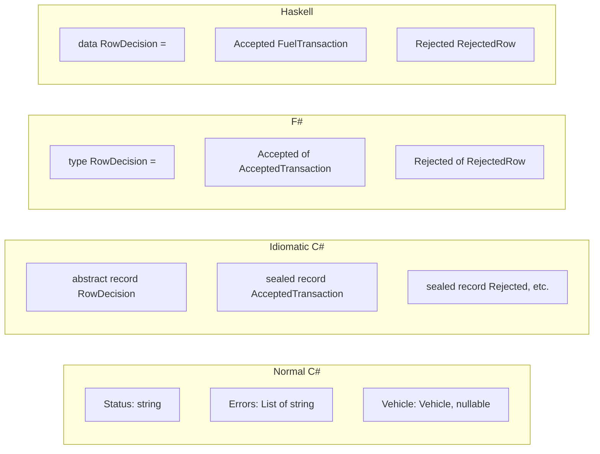
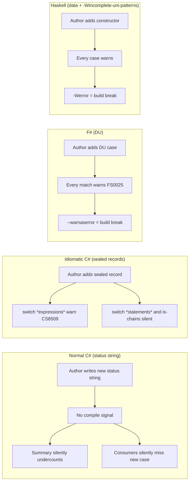
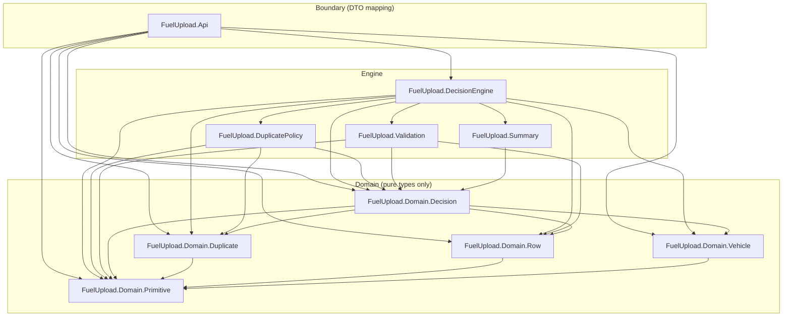
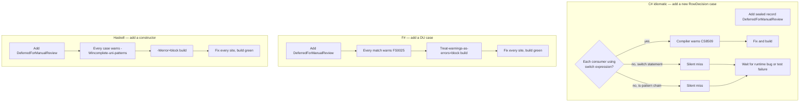

# Part 4 — Versus Haskell

Part 2 took the "normal C#" codebase and rebuilt it as **idiomatic C#**:
`record` sum types, `IReadOnlyList<T>` everywhere, no exception-driven
control flow. Part 3 jumped to **F#**, where the language itself is
designed around sum types and immutability.

This part is the one Ted asked for: a tour of the **Haskell** version, for
someone who doesn't know Haskell. Treat this as a primer + comparison, not
a reference. We'll walk through the actual source files in
`haskell-fuel-engine/`, stop and explain every Haskell-specific construct
the first time it appears, and then look at what the language is buying
you over both C# branches.

The goal is **exploration**. By the end you should be able to open any
`.hs` file in that project and at least sound out what it's saying.

---

## 1. Reading Haskell for the first time

Let's start by reading code, with explanations layered over the top. Every
snippet below is copy-pasted from the repo — no invented examples.

### 1.1 The `module` header — files name themselves

Open `src/FuelUpload/Domain/Decision.hs` and the first line is:

```haskell
module FuelUpload.Domain.Decision
  ( FuelTransaction (..)
  , ValidationError (..)
  , ValidationWarning (..)
  , QuarantineReason (..)
  , RejectionReason (..)
  , DuplicateSkipReason (..)
  , RejectedRow (..)
  , SkippedDuplicate (..)
  , RowDecision (..)
  , BatchOutcome (..)
  , BatchDecision (..)
  , BatchSummary (..)
  , RowContext (..)
  ) where
```

A few things going on:

- The **module name** — `FuelUpload.Domain.Decision` — must match the
  file path: `src/FuelUpload/Domain/Decision.hs`. The dot-separated name
  mirrors directory structure exactly. C# has `namespace X.Y.Z;` but the
  compiler doesn't *enforce* the file path. Haskell does.
- The parentheses after the module name are the **export list** —
  everything this module makes visible to importers. `FuelTransaction
  (..)` means "export the `FuelTransaction` type *and all its
  constructors and fields*." If you omit `(..)`, you export the type name
  only, which is useful for hiding the constructor (an internal
  invariant).
- The `where` keyword starts the body of the module.

In C#, this is roughly:

```csharp
namespace FuelUpload.Domain.Decision;
// then 'public' on each type to control export
```

The export list is the Haskell equivalent of marking things `public` /
`internal`, except it's centralized at the top of the file. Forgetting to
list something is how you keep it private.

Also notice this in the cabal file (`haskell-fuel-engine.cabal`):

```
ghc-options:
  -Wall
  -Wincomplete-record-updates
  -Wincomplete-uni-patterns
  -Wmissing-export-lists
  -Wpartial-fields
  ...
```

These are GHC (the Haskell compiler) warning flags. `-Wall` turns on the
"useful warnings" pack. `-Wincomplete-uni-patterns` complains when a
pattern match doesn't cover every constructor. This project asks for
*all* of those. Treat them as part of the design — they're how Haskell
catches what C# can't.

### 1.2 `data` declarations — algebraic data types

The headline feature. Here's `RowDecision` from the same file:

```haskell
data RowDecision
  = Accepted FuelTransaction
  | AcceptedWithWarnings FuelTransaction (NonEmpty ValidationWarning)
  | Quarantined FuelTransaction (NonEmpty QuarantineReason)
  | SkippedDuplicate SkippedDuplicate
  | Rejected RejectedRow
  | Fatal FatalError
  deriving stock (Eq, Show)
```

Read it like English:

> A `RowDecision` *is* one of: an `Accepted` carrying a `FuelTransaction`,
> *or* an `AcceptedWithWarnings` carrying a `FuelTransaction` and a
> non-empty list of `ValidationWarning`, *or* a `Quarantined` carrying a
> transaction and a non-empty list of reasons, *or* …

The `|` is "or." Each branch is called a **constructor**. A constructor
is two things at once:

1. A **value** you can build: `Accepted myTransaction` produces a
   `RowDecision`.
2. A **pattern** you can match on: `case decision of { Accepted t -> ... }`.

Compare to the three encodings of the same idea:

| Concept | C# normal | C# idiomatic | F# | Haskell |
|---|---|---|---|---|
| Tag | `Status: string` | `abstract record RowDecision` + sealed nested records | `type RowDecision = \| Accepted of ... \| ...` | `data RowDecision = Accepted ... \| ...` |
| Storage | `public string Status` | per-case record | DU case payload | constructor payload |
| Exhaustiveness | none | switch *expression* warns | match warns | `-Wincomplete-uni-patterns` warns |



The Haskell line count for the entire `RowDecision` definition, including
the equality/printing derivation, is **eight lines** (counting the
`deriving stock` line). The idiomatic C# equivalent is about 50 lines
because each case needs its own `sealed record` nested type.

### 1.3 Records with field accessors

Look at `data PreviousAttempt` in `Domain/Duplicate.hs`:

```haskell
data PreviousAttempt = PreviousAttempt
  { previousTransactionId :: TransactionId
  , previousCanonicalizationState :: CanonicalizationState
  , previousFinalizationState :: FinalizationState
  }
  deriving stock (Eq, Show)
```

The braces with `name :: Type` lines are **record syntax**. This is the
Haskell equivalent of a C# record:

```csharp
public record PreviousAttempt(
    TransactionId PreviousTransactionId,
    CanonicalizationState PreviousCanonicalizationState,
    FinalizationState PreviousFinalizationState);
```

But there's something subtle. In Haskell, every field name is
**automatically a function** of type `Record -> Field`. That is:

```haskell
previousTransactionId :: PreviousAttempt -> TransactionId
```

The name `previousTransactionId` is both the field's label *and* a
top-level function you can use anywhere. In `DuplicatePolicy.hs` you'll
see it called like a function, not like a property access:

```haskell
| previousFinalizationState previousAttempt == FailedRetryable =
```

Read that as: "if the result of calling `previousFinalizationState` on
`previousAttempt` equals `FailedRetryable`, then…"

In C# you'd write `previousAttempt.PreviousFinalizationState ==
FinalizationState.FailedRetryable`. Same idea, dot-flipped. The
function-first style means you can pass `previousFinalizationState`
itself around — say, as an argument to `map` — without any lambda
wrapping. Property access in C# can't do that (you need `x =>
x.PreviousFinalizationState`).

One gotcha: field-accessor names are global in their module. You **can't
have two records with a field named `name` in the same module** without
extensions. That's why this codebase prefixes fields like
`previousTransactionId`, `parsedRowNumber`, `transactionAmount`, etc. The
prefix is the workaround.

### 1.4 `newtype` — zero-cost wrappers

Spot this in `Primitive.hs`:

```haskell
newtype RowNumber = RowNumber Int
  deriving stock (Eq, Ord, Show)

newtype TransactionId = TransactionId String
  deriving stock (Eq, Ord, Show)
```

`newtype` is like `data` but **restricted to exactly one constructor with
exactly one field**. In return, the compiler erases the wrapper at
runtime — a `RowNumber` is represented as a bare `Int` in memory, no
boxing, no overhead. But to the type system, `RowNumber` and `Int` are
**not interchangeable**. You can't pass an `Int` where a `RowNumber` is
expected, and the compiler will refuse if you try.

This is the Haskell version of the idiomatic C# trick of wrapping
`int`/`string` primitives in domain types:

```csharp
public readonly record struct RowNumber(int Value);
public readonly record struct TransactionId(string Value);
```

… except it's zero-overhead by default, and the language gives you `Eq`
and `Ord` and `Show` (printing) for free via `deriving stock`.

### 1.5 `deriving stock (Eq, Show)` — getting equality for free

Every `data` or `newtype` declaration in this project ends with some form
of:

```haskell
  deriving stock (Eq, Show)
```

A **type class** in Haskell is roughly a C# interface — except instead of
the type implementing it directly, the compiler generates implementations
for you on request.

- `Eq` is the type class for "can be compared with `==`."
- `Show` is "can be printed as a string with `show`."
- `Ord` is "has a total ordering, so it can be sorted, used as Map key, etc."

`deriving stock` says: "compiler, please write the obvious
field-by-field equality / structural-printing instance for me." The
`stock` keyword (enabled via the `DerivingStrategies` extension in this
cabal file) is explicit about *which* deriving strategy to use, which is
good hygiene.

The C# parallel is what `record` types give you: structural equality and
a `ToString()` override, generated by the compiler. Haskell's version
predates C#'s by about 20 years and is more general (you can derive any
type class the compiler knows how to derive for that type).

### 1.6 Function types — the `::` and the arrows

Here's the central function from `DecisionEngine.hs`:

```haskell
classifyRow :: ValidationConfig -> UploadMode -> RowContext -> RowDecision
classifyRow config mode context =
  case (contextVehicleLookup context, contextDuplicateCheck context) of
    ...
```

Two lines:

1. **Type signature** (the `::` line). Reads: "`classifyRow` has type:
   given a `ValidationConfig`, then a `UploadMode`, then a `RowContext`,
   produces a `RowDecision`."
2. **Definition** (the next line). On the right side of `=` is the body.

`->` chains type the way a comma chains arguments. The C# equivalent:

```csharp
public static RowDecision ClassifyRow(
    ValidationConfig config,
    UploadMode mode,
    RowContext context)
```

But here's where Haskell does something C# can't natively: that signature
is *also* legal as `ValidationConfig -> (UploadMode -> (RowContext ->
RowDecision))`. Every multi-argument function is, under the hood, a
function that takes the first argument and returns a function that
expects the rest. This is **currying**, and it's why you can write
`fmap (classifyRow config mode) contexts` in `classifyBatch`:

```haskell
classifyBatch config mode contexts =
  let decisions = fmap (classifyRow config mode) contexts
      ...
```

`classifyRow config mode` is a perfectly valid value — it's a function
of type `RowContext -> RowDecision`, ready to be mapped over a list.
C# can do the same with explicit lambdas (`x => ClassifyRow(config,
mode, x)`) but the syntax has to spell out the lambda. F# is in between
(it has currying like Haskell, but you need to be explicit about it
sometimes).

### 1.7 `case ... of` — pattern matching

Look at the body of `classifyRow`:

```haskell
classifyRow config mode context =
  case (contextVehicleLookup context, contextDuplicateCheck context) of
    (VehicleLookupFatal fatalError, _) ->
      Fatal fatalError
    (_, DuplicateCheckFatal fatalError) ->
      Fatal fatalError
    _ ->
      classifyValidated
```

Read it as: "compute the pair `(vehicle lookup, duplicate check)`, and
match it against these shapes:

- If the first slot is `VehicleLookupFatal` (binding the inner error to
  `fatalError`) and the second slot is anything (`_` is wildcard), return
  `Fatal fatalError`.
- Otherwise, if the second slot is `DuplicateCheckFatal …`, return that.
- Otherwise, run `classifyValidated`."

This is C#'s `switch` expression with structural patterns, *except*:

1. It's **expression-position**: the whole `case … of …` *is* a value.
   You can return it directly, you can assign it, you can put it inside
   another expression. C# `switch` expressions can do this; C# `switch`
   statements can't.
2. The compiler **warns at compile time** if you've left a constructor
   uncovered (when `-Wincomplete-uni-patterns` is on, as it is here).
3. **No fall-through.** Each arm is a complete expression, ending at the
   next arm. C# `switch` statements need explicit `break`/`return`.

The deeper `classifyValidated` block shows the pattern stacked:

```haskell
classifyValidated =
  case validationErrors config row of
    firstError : remainingErrors ->
      reject (RowFailedValidation (firstError :| remainingErrors))
    [] ->
      case contextVehicleLookup context of
        VehicleMissing registration ->
          reject (VehicleWasNotFound registration)
        VehicleFound vehicle ->
          case contextDuplicateCheck context of
            DuplicateCheckSucceeded duplicateState ->
              case duplicateDecision mode duplicateState of
                UploadDuplicate ->
                  acceptedOrQuarantined vehicle
                SkipDuplicate reason ->
                  SkippedDuplicate SkippedDuplicateInfo
                    { skippedRow = row
                    , duplicateSkipReason = reason
                    }
                RejectDuplicate reason ->
                  reject (DuplicateCannotBeUploaded mode reason)
            DuplicateCheckFatal fatalError ->
              Fatal fatalError
        VehicleLookupFatal fatalError ->
          Fatal fatalError
```

A few details to notice:

- `firstError : remainingErrors` is **list pattern syntax**. The `:`
  operator (read "cons") builds a list from a head and a tail; the same
  syntax destructures one. `firstError : remainingErrors` matches a
  non-empty list, binding `firstError` to the head and `remainingErrors`
  to the rest.
- `[]` is the empty list pattern.
- This is how you split "are there any errors?" into two branches
  without a separate `if` check — the type system bakes the split into
  the pattern.

### 1.8 `NonEmpty` — the type-level guarantee that a list isn't empty

This is the one to make a big deal of.

In `Decision.hs`:

```haskell
data RowDecision
  = Accepted FuelTransaction
  | AcceptedWithWarnings FuelTransaction (NonEmpty ValidationWarning)
  | Quarantined FuelTransaction (NonEmpty QuarantineReason)
  ...
```

`NonEmpty ValidationWarning` is a list type from `Data.List.NonEmpty`
whose values are guaranteed by the type system to have **at least one
element**. There is no such thing as an empty `NonEmpty`. The compiler
will not let you construct one.

It's roughly defined like this in the standard library:

```haskell
data NonEmpty a = a :| [a]
```

That is: "a non-empty list of `a` is one `a` followed by a (possibly
empty) regular list of `a`." The `:|` operator builds them; pattern
matching on `firstReason :| rest` gives you the guaranteed head and the
(possibly empty) tail.

You can see exactly that pattern in `DecisionEngine.hs`:

```haskell
firstReason : remainingReasons ->
  Quarantined transaction (firstReason :| remainingReasons)
```

Read it like this: "we just matched the regular list `[QuarantineReason]`
as `firstReason : remainingReasons`, which means we *know* there was at
least one reason. We construct a `NonEmpty` by re-packaging that
guarantee using the `:|` constructor, and the compiler is now satisfied
that the `Quarantined` case is well-formed."

Now compare to idiomatic C#:

```csharp
public sealed record QuarantinedRow : RowDecision
{
    public QuarantinedRow(
        RowNumber rowNumber,
        FuelTransaction transaction,
        IReadOnlyList<QuarantineReason> reasons,
        ...)
    {
        if (reasons.Count == 0)
        {
            throw new ArgumentException(
                "Quarantined rows require at least one reason.",
                nameof(reasons));
        }
        ...
    }
}
```

That's a **runtime** check. The compiler doesn't know `reasons` is
non-empty; it just trusts the constructor to throw when it isn't. Any
caller can construct a `QuarantinedRow` with the wrong list and the bug
shows up at runtime in production.

The Haskell version literally **cannot represent** an empty quarantine.
The type system refuses. The check disappears.

### 1.9 `Maybe` — the explicit "might not be there"

You won't see explicit `Maybe` much in this codebase (the F#/Haskell-style
DUs absorb most of its job), but you'll see one form: `Maybe String`
fields in the response DTO (`Api.hs`):

```haskell
data FuelUploadDecisionDto = FuelUploadDecisionDto
  { decisionRowNumber :: Int
  , decisionOutcome :: String
  , decisionTransactionId :: Maybe String
  , decisionVehicleId :: Maybe String
  ...
```

`Maybe a` has exactly two constructors: `Nothing` and `Just a`. It's
Haskell's equivalent of C#'s `string?` (nullable reference) or F#'s
`Option<string>`. The key difference from C# nullable references is
that **you cannot accidentally treat a `Maybe String` as a `String`** —
the compiler will not let you call `length` on `Nothing`. You have to
pattern-match it open.

### 1.10 Guards — the `|` after a function arm

Now look at `DuplicatePolicy.hs`:

```haskell
duplicateDecision Retry (DuplicateOf previousAttempt)
  | previousFinalizationState previousAttempt == FailedRetryable =
      UploadDuplicate
  | otherwise =
      SkipDuplicate (skipReasonForPreviousAttempt previousAttempt)
```

This is the same function being defined with **guards**. A guard is a
boolean condition written after a `|`, and the first one that's `True`
wins. `otherwise` is just a name for `True` — it's the conventional "else"
arm.

Translated to F#-ish pseudocode:

```fsharp
match (mode, state) with
| Retry, DuplicateOf prev when prev.FinalizationState = FailedRetryable -> UploadDuplicate
| Retry, DuplicateOf prev -> SkipDuplicate (skipReasonFor prev)
```

Translated to C# (idiomatic) switch expression:

```csharp
return (mode, state) switch
{
    (UploadMode.Retry, DuplicateOf p) when p.FinalizationState == FailedRetryable
        => UploadDuplicate,
    (UploadMode.Retry, DuplicateOf p) => SkipDuplicate(SkipReasonFor(p)),
    ...
};
```

Guards are how you express "this case, *but only* if some condition
holds." They compose naturally with pattern matching.

### 1.11 `where` — local definitions inline

Look at this `classifyRow` snippet:

```haskell
classifyRow config mode context =
  case (...) of
    ...
  where
    row = contextRow context

    reject reason =
      Rejected RejectedRow
        { rejectedRow = row
        , rejectionReason = reason
        }

    classifyValidated = ...
```

`where` lets you define helpers *inside* a function, scoped only to that
function. The C# pattern is local functions:

```csharp
RowDecision ClassifyRow(...)
{
    RowDecision Reject(RejectionReason reason) =>
        new RowDecision.Rejected(row, reason);
    ...
}
```

The thing to keep in mind: in Haskell, the `where` block can come *after*
the main expression, even though logically it's defining things used
*before* it. The compiler reads the whole function before deciding what's
in scope.

### 1.12 Putting the primer in one table

Here's the cheat sheet you can keep open while you read the rest of the
files:

| Haskell | C# (idiomatic) | F# | Meaning |
|---|---|---|---|
| `module X.Y.Z where` | `namespace X.Y.Z;` | `namespace X.Y.Z` | namespace |
| `data T = A \| B Int` | sum-of-records or abstract record | `type T = A \| B of int` | sum type |
| `data T = T { x :: Int }` | `record T(int X);` | `type T = { X: int }` | record |
| `newtype T = T Int` | `record struct T(int Value)` | `type T = T of int` | zero-cost wrapper |
| `deriving stock (Eq, Show)` | implicit on `record` | implicit on records/DUs | structural equality + printing |
| `f :: A -> B -> C` | `C F(A, B)` | `val f : A -> B -> C` | function type |
| `case x of …` | `x switch { … }` (expression) | `match x with …` | pattern match |
| `\| guard = expr` | `case … when …:` | `\| pat when guard ->` | guarded clause |
| `Maybe a` | `T?` (nullable) | `Option<'T>` | optional value |
| `NonEmpty a` | *no equivalent without runtime check* | *no equivalent without runtime check* | type-level non-empty list |
| `where` block | local function | `let` inside function | local helpers |
| `let x = … in expr` | inline `var x = …` then expr | `let x = … in expr` | scoped binding |
| `f x y` | `f(x, y)` | `f x y` | function call |
| `x.f` | `x.F` | `x.F` | record field access (here `f x`!) |

That last row is the one that trips up newcomers: `previousFinalizationState previousAttempt` *is* the field access. There's no dot. The function-shaped accessor *is* the API.

---

## 2. Side-by-side: encoding `RowDecision`

The same idea — "a row decision is one of six things" — encoded three
ways. This is the centerpiece. Look at the line counts.

```mermaid
flowchart TB
  subgraph CS["C# idiomatic"]
    direction TB
    CS1[abstract record RowDecision]
    CS2[sealed record AcceptedTransaction]
    CS3[sealed record AcceptedTransactionWithWarnings]
    CS4[sealed record QuarantinedRow]
    CS5[sealed record SkippedDuplicate]
    CS6[sealed record RejectedRow]
    CS7[sealed record FatalProcessingError]
    CS1 --> CS2
    CS1 --> CS3
    CS1 --> CS4
    CS1 --> CS5
    CS1 --> CS6
    CS1 --> CS7
  end
  subgraph FS["F#"]
    direction TB
    FS1[type RowDecision =]
    FS2[Accepted of AcceptedTransaction]
    FS3[AcceptedWithWarnings of AT * Warning list]
    FS4[Quarantined of QuarantinedRow]
    FS5[SkippedDuplicate of SkippedDuplicate]
    FS6[Rejected of RejectedRow]
    FS7[Fatal of FatalProcessingError]
    FS1 --> FS2
    FS1 --> FS3
    FS1 --> FS4
    FS1 --> FS5
    FS1 --> FS6
    FS1 --> FS7
  end
  subgraph HS["Haskell"]
    direction TB
    HS1[data RowDecision =]
    HS2[Accepted FuelTransaction]
    HS3[AcceptedWithWarnings T NonEmpty Warning]
    HS4[Quarantined T NonEmpty Reason]
    HS5[SkippedDuplicate SkippedDuplicate]
    HS6[Rejected RejectedRow]
    HS7[Fatal FatalError]
    HS1 --> HS2
    HS1 --> HS3
    HS1 --> HS4
    HS1 --> HS5
    HS1 --> HS6
    HS1 --> HS7
  end
```



**C# idiomatic — ~50 lines.** Each case is its own `sealed record`
nested inside an abstract `record`. The `QuarantinedRow` case has an
explicit constructor with a runtime `if (reasons.Count == 0) throw`.

```csharp
public abstract record RowDecision
{
    private RowDecision() { }

    public sealed record AcceptedTransaction(FuelTransaction Transaction) : RowDecision;

    public sealed record AcceptedTransactionWithWarnings(
        FuelTransaction Transaction,
        IReadOnlyList<UploadWarning> Warnings) : RowDecision;

    public sealed record QuarantinedRow : RowDecision
    {
        public QuarantinedRow(
            RowNumber rowNumber,
            FuelTransaction transaction,
            IReadOnlyList<QuarantineReason> reasons,
            IReadOnlyList<UploadWarning> warnings)
        {
            if (reasons.Count == 0)
            {
                throw new ArgumentException("Quarantined rows require at least one reason.", nameof(reasons));
            }
            // assignments...
        }
        public RowNumber RowNumber { get; }
        public FuelTransaction Transaction { get; }
        public IReadOnlyList<QuarantineReason> Reasons { get; }
        public IReadOnlyList<UploadWarning> Warnings { get; }
    }

    public sealed record SkippedDuplicate(RowNumber RowNumber, DuplicateState Duplicate, DuplicateSkipCode Reason) : RowDecision;
    public sealed record RejectedRow(RowNumber RowNumber, RejectionReason Reason) : RowDecision;
    public sealed record FatalProcessingError(RowNumber RowNumber, FatalError Error) : RowDecision;
}
```

**F# — 9 lines.** Compact, named cases, the `Warning list` allows empty
lists (no `NonEmpty` distinction at the type level).

```fsharp
[<RequireQualifiedAccess>]
type RowDecision =
    | Accepted of AcceptedTransaction
    | AcceptedWithWarnings of AcceptedTransaction * Warning list
    | Quarantined of QuarantinedRow
    | SkippedDuplicate of SkippedDuplicate
    | Rejected of RejectedRow
    | Fatal of FatalProcessingError
```

**Haskell — 8 lines.** Same shape as F#, but the warnings and quarantine
reason lists are `NonEmpty`, which means the empty case literally cannot
exist:

```haskell
data RowDecision
  = Accepted FuelTransaction
  | AcceptedWithWarnings FuelTransaction (NonEmpty ValidationWarning)
  | Quarantined FuelTransaction (NonEmpty QuarantineReason)
  | SkippedDuplicate SkippedDuplicate
  | Rejected RejectedRow
  | Fatal FatalError
  deriving stock (Eq, Show)
```

The difference between F# and Haskell on this one definition isn't line
count — it's that Haskell pushes the "at least one warning" /
"at least one reason" invariant into the type. F# has access to a
`NonEmptyList` package too, but the codebase here doesn't use it; it
leaves the invariant implicit.

---

## 3. What Haskell protects against that C# and F# don't

Tying it back to the seven footguns from Part 1 (`docs/01-walkthrough.md`),
here's the scorecard:

| Footgun | Idiomatic C# | F# | Haskell |
|---|---|---|---|
| 1. NRE in logger | Nullable refs help (but opt-in) | Option type forces handling | `Maybe` forces handling + pure-by-default |
| 2. Case-sensitive `"Retry"` | Enum | DU | sum type |
| 3. Missing recovery branch | switch expression warns | `match` warns | `case` warns under `-Wincomplete-uni-patterns` |
| 4. Mutable response | `IReadOnlyList<T>` (opt-in) | immutable by default | immutable by default, no opt-out |
| 5. Status typos | `record` per case | DU per case | constructor per case |
| 6. Validator throws | accumulating returns | accumulating returns | accumulating returns |
| 7. Switch no default | switch *expression* warns | `match` warns | `case` warns |

All three modern encodings handle the core seven. Where Haskell pulls
ahead is in three places.

### 3.1 Pattern-match exhaustiveness is on by default and aggressive

This project's `haskell-fuel-engine.cabal` turns on every relevant
warning:

```
ghc-options:
  -Wall
  -Wincomplete-record-updates
  -Wincomplete-uni-patterns
  ...
```

`-Wincomplete-uni-patterns` is the killer. The moment you write a `case
mode of …` and miss `AggressiveRecovery`, the compiler emits something
like:

```
src/FuelUpload/DuplicatePolicy.hs:17:1: warning: [-Wincomplete-patterns]
    Pattern match(es) are non-exhaustive
    In an equation for 'duplicateDecision':
        Patterns of type 'UploadMode', 'DuplicateState' not matched:
            AggressiveRecovery (DuplicateOf _)
```

And because the project also passes `-Werror` in CI (a one-line change in
the cabal file flips warnings into hard errors), the build fails. This is
the **structural** answer to Footgun 3.

C# has the same idea for `switch` *expressions* — but only `switch
expressions`. The `switch` statement (Footgun 7) doesn't warn. The
"normal C#" branch uses statements; the idiomatic branch uses
expressions. Haskell doesn't have two flavors — `case` is one thing, and
it always warns when incomplete.

F# behaves the same way as Haskell here. The difference is that Haskell
turns the warning on **by default in modern project templates**, whereas
F# warnings can be silenced project-wide with `--nowarn`. Cultural, not
language-level — but the culture matters.

### 3.2 Purity / no hidden side effects

Look at the signature again:

```haskell
classifyRow :: ValidationConfig -> UploadMode -> RowContext -> RowDecision
```

That return type — `RowDecision` — is a **pure** value. There is no `IO`
anywhere in the signature. In Haskell, **a function whose type doesn't
mention `IO` cannot perform any I/O**. It cannot call `Console.WriteLine`
(`putStrLn`). It cannot read a file. It cannot mutate a shared variable.
It cannot make a network call.

If you tried to add a logging call inside `classifyRow`:

```haskell
classifyRow config mode context = do
  putStrLn "row..."   -- this is IO
  case ... of
    ...
```

The compiler would refuse with a type mismatch: `putStrLn` returns
`IO ()`, but the function's declared return type is `RowDecision`, not
`IO RowDecision`. To make it compile, you'd have to change the
signature to `ValidationConfig -> UploadMode -> RowContext -> IO
RowDecision`, which would then force **every caller** to also be in
`IO`, all the way up to `main`. Logging cannot hide.

This is the structural answer to Footgun 1 (the rogue logger). The
"normal C#" version had a `LogDecision` inside the loop that touched
`d.Vehicle.LicensePlate` when `d.Vehicle` was null. In Haskell, the
classifier *literally cannot* call a logger without rewriting its type
signature and dragging every caller into `IO` with it. The discipline is
imposed by the language, not by code review.

C# has `[Pure]` attributes and conventions but no enforcement. F# has
`IO`-style monads available, but doesn't impose them — most F# code
freely calls `printfn` from anywhere.

### 3.3 `NonEmpty` makes "list with ≥ 1 element" a type

Already covered above. The relevant comparison:

```csharp
// Idiomatic C# — runtime check
if (reasons.Count == 0)
{
    throw new ArgumentException(...);
}
```

```haskell
-- Haskell — type-level guarantee
Quarantined transaction (firstReason :| remainingReasons)
--                       ^^^^^^^^^^^^^^^^^^^^^^^^^^^^^^^
-- the type NonEmpty QuarantineReason makes empty impossible
```

C# can express "at least one" only by hiding it behind a constructor
that throws. Haskell expresses it in the type signature itself. Any
function that consumes a `NonEmpty QuarantineReason` can use `head` on
it without fear — `head` on `NonEmpty` is total (never throws); `head`
on a regular list is partial (throws on `[]`).

### 3.4 Immutability by default, full stop

Footgun 4 in the normal C# version was `public List<string> Errors = new
List<string>()` — a mutable field on a public record. Anyone downstream
could append to it.

Idiomatic C# fixes this by using `IReadOnlyList<T>` and immutable
records. But `IReadOnlyList<T>` is a *view*; if the underlying object is
a `List<T>`, a different reference holder can still mutate it. You have
to be disciplined.

F# is immutable by default; you have to opt into `mutable` with a
keyword, and the result still doesn't escape your control easily.

**Haskell has no `mutable` keyword.** There is no `var`. Records cannot
be mutated; there are only "create a new value that differs by these
fields" operations (record-update syntax). To get true in-place
mutability you need `IORef` or `STRef`, which are themselves wrapped in
`IO` or `ST` — they advertise the mutation in your type signature.

Footgun 4 *cannot be expressed* in Haskell.

### 3.5 Type inference removes ceremony

Almost none of the functions in `DecisionEngine.hs` need to repeat their
argument types in the body. Haskell infers them. The top-level signature
is the contract; the body is the work. C# can do *some* of this with
`var`, but generics, lambdas, and constructor calls often need explicit
types.

The result is that the Haskell files in this repo are usually *shorter*
than their C# equivalents and similar in length to F#. Per-line they
carry more information.

---

## 4. How extension works

Suppose Ted decides there's a seventh `RowDecision` case:
`DeferredForManualReview`. Here's what changes in each language.

### 4.1 In Haskell

Add one line to `Domain/Decision.hs`:

```haskell
data RowDecision
  = Accepted FuelTransaction
  | AcceptedWithWarnings FuelTransaction (NonEmpty ValidationWarning)
  | Quarantined FuelTransaction (NonEmpty QuarantineReason)
  | SkippedDuplicate SkippedDuplicate
  | Rejected RejectedRow
  | Fatal FatalError
  | DeferredForManualReview FuelTransaction String   -- NEW
  deriving stock (Eq, Show)
```

Now run `cabal build`. The compiler emits a warning at every `case
rowDecision of …` site that doesn't handle the new constructor. For
example, `Api.hs` has:

```haskell
toDecisionDto :: RowDecision -> FuelUploadDecisionDto
toDecisionDto decision =
  case decision of
    Accepted transaction -> ...
    AcceptedWithWarnings transaction warnings -> ...
    Quarantined transaction reasons -> ...
    SkippedDuplicate skipped -> ...
    Rejected rejected -> ...
    Fatal fatalError -> ...
```

That `case` would now produce:

```
warning: [-Wincomplete-patterns]
    Pattern match(es) are non-exhaustive
    In a case alternative:
        Patterns of type 'RowDecision' not matched:
            DeferredForManualReview _ _
```

With `-Werror` (the conventional production setting), this is a build
break. You **cannot ship** without addressing every consumer. The
compiler has located all of them for you.

The `BatchSummary.summarize` function would warn, the `Api.hs`
`toDecisionDto` would warn, every test would warn — every consumer of
`RowDecision` is flagged.

### 4.2 In F#

Almost identical to Haskell. Add a case to the DU:

```fsharp
type RowDecision =
    | Accepted of AcceptedTransaction
    | AcceptedWithWarnings of AcceptedTransaction * Warning list
    | Quarantined of QuarantinedRow
    | SkippedDuplicate of SkippedDuplicate
    | Rejected of RejectedRow
    | Fatal of FatalProcessingError
    | DeferredForManualReview of AcceptedTransaction * string  // NEW
```

`match decision with …` blocks warn (warning FS0025). Treated as an
error under `--warnaserror`, also a build break. Same shape, similar
strength.

### 4.3 In idiomatic C#

Add a new `sealed record`:

```csharp
public sealed record DeferredForManualReview(
    FuelTransaction Transaction,
    string ReviewNote) : RowDecision;
```

Now hunt for consumers. `switch` *expressions* that don't include
`DeferredForManualReview` will emit warning CS8509 (non-exhaustive
switch). `switch` *statements* — like the one in normal-C# Footgun 7 —
won't warn at all. You have to grep.

The compiler helps **only at switch expressions**. Other patterns of
consuming the type (e.g. `if (d is RowDecision.Accepted)` chains, or
visitor methods, or `Where(d => d is …)` filters) are invisible.

### 4.4 In normal C#

The `RowDecision` is one class with a `Status: string` field. There's no
"add a case" — you just start writing `"DeferredForManualReview"` as a
status string. Every consumer is on its own. The summary calculator
silently drops the new status because its `switch` has no default.



---

## 5. What can go wrong / what's hard in Haskell

The pitch above is real, but it's not free. Honest list:

### 5.1 Laziness

Haskell evaluates **lazily** by default. A value of type `Int` isn't
necessarily computed when you bind it; it's a **thunk** — a recipe to
compute the value, evaluated only when something forces it.

This is great for some things (you can write `take 10
(filter prime [1..])` over infinite lists and it terminates) and *bad*
for memory in others. The canonical surprise is the **space leak**:
a long-running computation accumulates a tower of unforced thunks that
hold references to old data, and your program's memory grows without
bound.

The classic case:

```haskell
sum = foldl (+) 0   -- BAD: builds a thunk for every addition
sum = foldl' (+) 0  -- GOOD: forces each accumulator step
```

For this fuel-upload codebase, batch sizes are small enough that
laziness doesn't bite. But on real workloads, you eventually need to
learn `seq`, `BangPatterns`, `foldl'`, and the strict variants of
`Data.Map`.

C# and F# evaluate strictly by default. You don't think about this.

### 5.2 Partial functions

Despite the type system, Haskell still has **partial functions** that
throw at runtime:

- `head []` — throws "Prelude.head: empty list"
- `tail []` — same
- `fromJust Nothing` — throws
- `Map.! "missing key"` — throws
- `read "not a number" :: Int` — throws

A lot of these are in the standard library for historical reasons. The
community knows; tools like `hlint` warn about them; the `safe` package
provides total alternatives (`headMay :: [a] -> Maybe a`); but **the
type system doesn't stop you from using the partial versions**. A junior
who writes `head xs` on a list that turns out to be empty in production
gets the same crash as the C# `arr[0]` on an empty array.

This is why `NonEmpty` is so useful: `head` on `NonEmpty` *is* total.
But you have to opt in.

### 5.3 `error "..."` — the escape hatch

Haskell has `error :: String -> a`. It throws an exception. Equivalent
to C# `throw new Exception(message)`. Real codebases occasionally use it
for "impossible" branches the type system can't see; it's a code smell,
because the type `a` claims any caller can rely on the return value, and
`error` lies about that.

You won't find `error` in this project (I checked) but you'll see it in
the wild. When you do, treat it the same way you'd treat
`throw new InvalidOperationException("can't happen")` in C# — a sign
the encoding could probably be tighter.

### 5.4 Onboarding cost

Honest assessment: Haskell asks more of the reader than C# or F#.

Things you don't strictly need for this codebase but will encounter the
moment you go outside it:

- **Type classes and instances.** `Eq`, `Ord`, `Show`, `Functor`,
  `Monad`. The first three look like interfaces; the others require
  more time.
- **Functor / Applicative / Monad.** The `<$>`, `<*>`, `>>=`, `do`
  notation in `Api.hs`'s `toDomainRequest` is monadic combinator code.
  It's how Haskell expresses "compose computations that might fail" or
  "compose computations that produce side effects." `do` notation
  papers over a lot of it, but if you read the underlying expression
  you'll see operators that take time to internalize.
- **GHC extensions.** Real Haskell projects pile on language extensions
  (`OverloadedStrings`, `RankNTypes`, `TypeFamilies`, `GADTs`,
  `MultiParamTypeClasses`, …). The cabal file in this project keeps the
  list tiny (`BlockArguments`, `DerivingStrategies`) on purpose. Larger
  projects can be a vocabulary check.
- **Monad transformers / MTL / ReaderT pattern.** How you compose
  effects in real applications. Real but not in this codebase.

The learning curve is steeper than F# and substantially steeper than
C#. The payoff is that the language gives back the most invariants per
line. Whether that's worth it depends on the team and the problem.

### 5.5 IO escape pressure

Once a function lives in `IO`, every caller in the chain is also `IO`
(or wraps the call with `unsafePerformIO`, which is the equivalent of
`#pragma warning disable`). This is the "viral" property of effects:
once they're in, they stay in.

For pure decision logic — like this codebase — that's fine; nothing is
in `IO`, and the engine is testable as a pure function. The moment you
want to add logging, telemetry, retries with backoff, database access,
HTTP calls, you cross into `IO`, and you either accept it or design
around it (the *ReaderT pattern*, *MTL stack*, *free monads*, *effect
systems* — each with its own learning cost).

C# is the opposite: every function is implicitly in "IO" (it can call
`Console.WriteLine`), so there's no pressure. The cost is that you
can't tell from a signature whether a function is pure.

### 5.6 Refactoring across module boundaries

Haskell's import lists and export lists are explicit and unforgiving.
Adding a new function to `DuplicatePolicy.hs` and using it from
`DecisionEngine.hs` requires:

1. Adding the function name to `DuplicatePolicy`'s export list.
2. Adding it to `DecisionEngine`'s import list.
3. If you're using a constructor of a type, importing the type with
   `(..)`, etc.

C# has `using` statements but they're loose — you can rename a method
and the compiler chases the references. In Haskell, moving a function
between modules is a multi-file edit, and the compiler will complain
about every place that's now wrong until you've cleaned them all up.
This is a feature (you literally can't have a stale import), but it
*feels* heavier.

---

## 6. Is it easier or harder to read?

Honest answer: per-line, Haskell often says the most of any of the four
languages in this experiment. The `RowDecision` definition is eight
lines and captures every invariant — exhaustiveness, immutability,
non-emptiness, structural equality. The same information in normal C#
takes paragraphs of documentation.

Per-concept, Haskell asks the most of the reader. You need to grok
algebraic data types, currying, pattern matching, type classes,
laziness, the `Maybe`/`Either`/`NonEmpty` family, and (eventually)
`IO` and `do` notation. None of these are exotic on their own. Stacked,
they're a wall.

The split is roughly:

- A junior who's never seen Haskell can probably read **half** of this
  codebase after one careful read of this document. The `data` decls,
  the function signatures, the `case` blocks — yes. The
  `<$>`/`<*>`/`do` block in `Api.hs` — not yet.
- An intermediate Haskell developer reads the whole codebase in under
  an hour and finds it boring, in the good way. There are no surprises.
- A C# senior who has used F# will hit ~70% comprehension within a day
  of poking around with the compiler.

The trade-off the language makes: it asks you for more *up front* and
gives you more *guarantees* in return. Not "easier" or "harder" in the
abstract; just different bets about where to spend cognitive budget.

---

## 7. How easy is it to extend?

Let's walk through a real extension: adding a new branch to the
duplicate policy. Say we introduce a new `UploadMode` called
`ManualOverride`, which uploads any duplicate regardless of state.

### 7.1 Step 1 — add the case to `UploadMode`

In `Domain/Primitive.hs`:

```haskell
data UploadMode
  = Normal
  | Retry
  | ConservativeRecovery
  | AggressiveRecovery
  | ManualOverride                  -- NEW
  deriving stock (Eq, Show)
```

### 7.2 Step 2 — build

Now run `cabal build`. The compiler emits:

```
src/FuelUpload/DuplicatePolicy.hs:17:1: warning: [-Wincomplete-patterns]
    Pattern match(es) are non-exhaustive
    In an equation for 'duplicateDecision':
        Patterns not matched:
            ManualOverride (DuplicateOf _)

src/FuelUpload/Api.hs:278:1: warning: [-Wincomplete-patterns]
    (in parseMode, the function has no branch for "manualoverride")
```

Two places to fix. The compiler told you exactly where.

### 7.3 Step 3 — add the branch in `DuplicatePolicy.hs`

Insert at the end of the existing branches:

```haskell
duplicateDecision ManualOverride (DuplicateOf _) =
  UploadDuplicate
```

That's it. The `case` in `DecisionEngine.hs` calls `duplicateDecision`
and reads the result; no change needed there because the result type
(`DuplicatePolicyDecision`) didn't change. The summary doesn't change.
The DTO mapping doesn't change (the outcome strings are based on
`RowDecision`, which is unaffected).

### 7.4 Step 4 — add the parser branch in `Api.hs`

```haskell
parseMode field value =
  case normalize value of
    "normal" -> Right Normal
    "retry" -> Right Retry
    "conservativerecovery" -> Right ConservativeRecovery
    "aggressiverecovery" -> Right AggressiveRecovery
    "manualoverride" -> Right ManualOverride    -- NEW
    _ -> ...
```

Build clean. Done.

### 7.5 Compare to F#

F# `match` warns the same way. You'd update the same two files
(`DecisionEngine.fs` for the engine, the boundary mapper for the
parser). Add the case to the DU, fix the two warnings, build green.
Functionally identical to Haskell on this kind of change.

### 7.6 Compare to idiomatic C#

In idiomatic C#, the duplicate policy lives in `Engine/DuplicatePolicy.cs`
as a `switch` *expression* over `(UploadMode, DuplicateState)`. Add the
new `UploadMode.ManualOverride` enum value, and the compiler warns
CS8524 on the switch (non-exhaustive enum). Fix that. The boundary
DTO mapping also has a switch over upload mode strings; that one warns
or it doesn't, depending on whether the mapper used a switch expression
or a switch statement. **The author has to make that choice up front
for every consumer.**

In other words: in C# the protection depends on the consumer choosing
the right syntactic shape. In Haskell, all consumers get the protection
because there's only one syntactic shape (`case`).

### 7.7 Compare to normal C#

In normal C#, you'd add a new string constant `"manualOverride"` to
`UploadModes`. Nothing else is forced. The duplicate policy in
`Services/DuplicatePolicy.cs` is a chain of `if (mode == ...)` checks; it
will silently fall through to `skipReason = "UnknownMode"` and *drop the
row*. You won't see the bug until someone uploads with the new mode
and asks where their data went.

This is Footgun 3, exactly. The reason Haskell catches it is the same
reason F# catches it: the type of `mode` *is* the closed set of cases,
and the compiler can enumerate them.

---

## 8. Haskell module hierarchy

The repo's layout:



Two observations:

1. **`FuelUpload.Api` is the only module that does anything stringy or
   external.** All the DTO parsing lives there. `Domain.*` and
   `DecisionEngine` are pure typed values. The "boundary" is the
   *module*, not a folder convention — moving any string parsing
   inward would be visible as an import in some `Domain` file, and
   would stand out.

2. **`Domain.Primitive` is the leaf.** Everything depends on it. The
   newtypes there are the wire-level value types (`RowNumber`,
   `MoneyAmount`, `TransactionId`) and the closed `UploadMode` /
   `FatalError` enums. Changing one of these forces a recompile of
   essentially the whole library, which is exactly what you want —
   primitives are foundational.

The file structure matches the module structure exactly (Section 1.1).
No "magic" registrations, no DI containers — just imports.

---

## 9. The exhaustiveness-story diagram

Putting the C#/F#/Haskell extension stories side by side:



The C# story has a fork: protection only when the consumer chose the
right syntactic shape. F# and Haskell collapse the fork — there's one
way to consume a sum type, and that way is checked.

---

## 10. Wrapping up

What this Haskell version buys, in one paragraph:

> Types you couldn't write in C# (`NonEmpty`, sum types with
> `-Wincomplete-uni-patterns` on), purity by default (no hidden
> `Console.WriteLine` in `classifyRow`, ever), and structural extension
> (add a case, compiler tells you all 11 places to update). The cost is
> a learning curve, laziness as a footgun, and a community of partial
> functions (`head`, `fromJust`) you have to learn to avoid.

For a problem like fuel-upload classification — pure, finite, total — it
is a near-ideal fit. Every invariant the C# tests have to assert at
runtime, the Haskell types assert at compile time. The same
`Bug3_AggressiveRecovery_MissesFailedAfterCanonicalWithoutKey` regression
test that exists in the C# project is, in Haskell, a compile error if
you make the analogous mistake.

For a problem that's mostly I/O orchestration, request/response
plumbing, and Things That Talk To The Database — the calculus changes.
You'd still benefit from the type system, but you'd pay more in `IO`
plumbing and effect organization.

---

## Forward link

Haskell is type-driven safety. **Rust is what happens when you want all
of that *plus* control over memory and concurrency.** Part 5 closes the
series.
