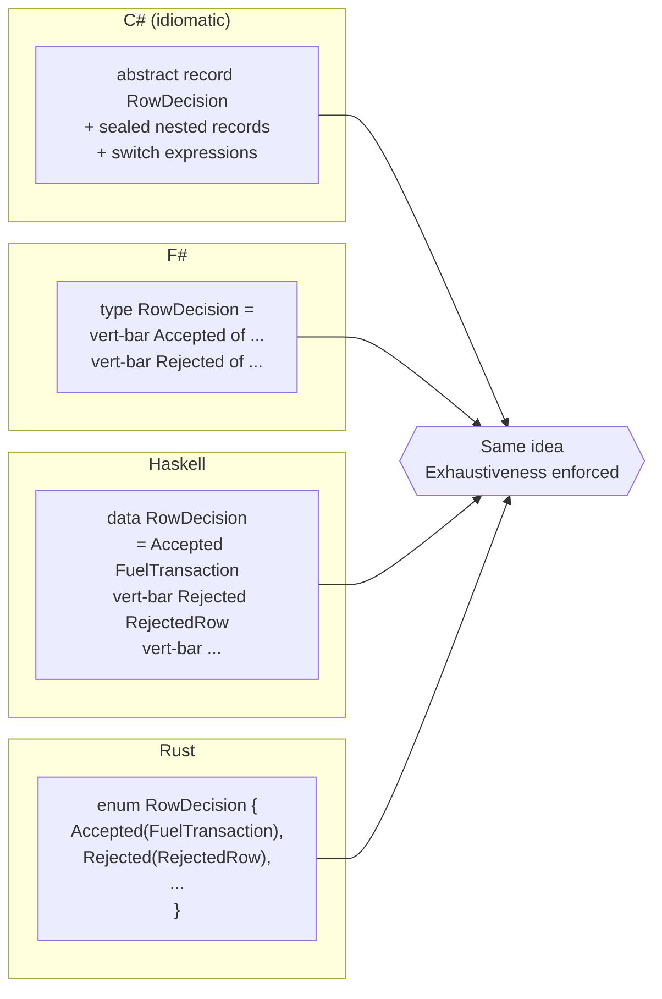
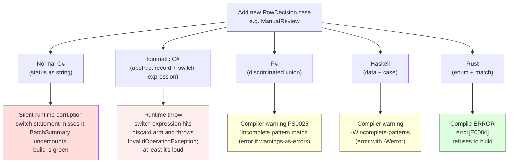

# Part 5 — Rust: ML with Stricter Performance Defaults

This is the closer. Four implementations in, you have a calibrated eye:
strings let typos compile, sum types squash typos at compile time, and
exhaustive `match` is the difference between "we lost a quarter of
transactions" and "the build refused to ship."

Rust is the fifth implementation, and the question Ted asked is the right
one: **what is it most like? what's easy and hard? is it safe? are bugs
obvious? any footguns?**

---

## 1. What is Rust most like?

On **this** domain — pure decision logic, no concurrency, no manual memory
tricks, no FFI — Rust looks **most like Haskell or F#**. Read the
fuel-engine Rust source and you'll see the same shapes you saw in those two:

- Sum types with associated data (`enum RowDecision { Accepted(...), Rejected(...), ... }`)
- Exhaustive pattern matching (`match x { ... }` — the compiler will fail
  the build if you forget a case)
- Immutability by default (`let` binds once; `let mut` is opt-in)
- No nulls — `Option<T>` everywhere, and the compiler forces you to handle
  `None`
- Algebraic product types as `struct` records, just like Haskell `data`
  and F# records

What Rust **adds** that those two don't have is **ownership and borrowing**.
On this codebase it peeks through in only a few places — `&[RowInput]`
versus `Vec<RowInput>`, the `.clone()` calls in `boundary.rs` and
`classifier.rs`, the `&` references threaded through `classify_row` — but
it's the thing that will dominate your experience the moment you grow this
into a real service with shared state, async I/O, or zero-copy parsing.

Said differently: **on this domain, Rust is ML with stricter performance
defaults.** If you liked Part 3 (F#) and Part 4 (Haskell), you will like
the *shape* of Rust here. The pain — and the payoff — show up in problems
this engine doesn't have yet.

---

## 2. Side-by-side: `RowDecision` in four encodings

Same idea, four spellings. The point of this diagram is that **C# records
+ inheritance, F# discriminated unions, Haskell `data`, and Rust `enum`
are the same construct** dressed in different syntax. They all give you
"a value that is exactly one of N alternatives, each carrying its own
payload, and the compiler can prove you handled every alternative."



### C# (idiomatic) — `RowDecision.cs`

```csharp
public abstract record RowDecision
{
    private RowDecision() { }

    public sealed record AcceptedTransaction(FuelTransaction Transaction) : RowDecision;
    public sealed record AcceptedTransactionWithWarnings(
        FuelTransaction Transaction,
        IReadOnlyList<UploadWarning> Warnings) : RowDecision;
    public sealed record QuarantinedRow : RowDecision { /* ... */ }
    public sealed record SkippedDuplicate(...)        : RowDecision;
    public sealed record RejectedRow(...)             : RowDecision;
    public sealed record FatalProcessingError(...)    : RowDecision;
}
```

### F# — `Decision.fs`

```fsharp
[<RequireQualifiedAccess>]
type RowDecision =
    | Accepted of AcceptedTransaction
    | AcceptedWithWarnings of AcceptedTransaction * Warning list
    | Quarantined of QuarantinedRow
    | SkippedDuplicate of SkippedDuplicate
    | Rejected of RejectedRow
    | Fatal of FatalProcessingError
```

### Haskell — `Decision.hs`

```haskell
data RowDecision
  = Accepted FuelTransaction
  | AcceptedWithWarnings FuelTransaction (NonEmpty ValidationWarning)
  | Quarantined FuelTransaction (NonEmpty QuarantineReason)
  | SkippedDuplicate SkippedDuplicate
  | Rejected RejectedRow
  | Fatal FatalError
  deriving stock (Eq, Show)
```

### Rust — `domain/decision.rs`

```rust
#[derive(Debug, Clone, PartialEq)]
pub enum RowDecision {
    Accepted(FuelTransaction),
    Warning {
        transaction: FuelTransaction,
        warnings: Vec<Warning>,
    },
    Quarantined {
        transaction: FuelTransaction,
        reasons: QuarantineReasons,
        warnings: Vec<Warning>,
    },
    SkippedDuplicate(SkippedDuplicate),
    Rejected(RejectedRow),
    Fatal(FatalError),
}
```

Four spellings of "make illegal states unrepresentable." Rust uses *struct
variants* (`Quarantined { ... }`) where it wants named fields, and *tuple
variants* (`Accepted(FuelTransaction)`) where positional is enough. F# and
Haskell are positional-only by default; idiomatic C# is verbose-only by
default. Pick your poison.

---

## 3. Is Rust safe? Are bugs obvious?

Short answer: **yes, and yes** — in ways the C# version can't approach and
that go slightly beyond what Haskell and F# give you (mostly in memory and
concurrency, neither of which this engine flexes).

### 3.1 Memory safety is guaranteed in safe Rust

No null pointer dereferences. No use-after-free. No double-free. No
buffer overruns. No data races. The compiler proves it before the code
runs. The only way to opt out is to write `unsafe { ... }` blocks, and the
fuel engine has zero of them — `grep -r 'unsafe' rust-fuel-engine/src/`
returns nothing.

**Footgun 1 from Part 1 cannot compile in Rust.** In normal C#:

```csharp
private void LogDecision(RowDecision d)
{
    Console.WriteLine(
        "row " + d.RowNumber +
        " plate=" + d.Vehicle.LicensePlate +   // NRE when Vehicle is null
        " status=" + d.Status);
}
```

The Rust equivalent would have `d.vehicle: Option<Vehicle>` — there's no
such thing as a "maybe a `Vehicle`" that's silently nullable. To read the
license plate you'd be forced to write:

```rust
match &d.vehicle {
    Some(v) => println!("row {} plate={} status={:?}", d.row_number.0, v.reference.0, d.status),
    None    => println!("row {} (no vehicle) status={:?}", d.row_number.0, d.status),
}
```

There's no "I forgot to check." The compiler will not let you reach the
inner value of an `Option` without telling it what to do when there isn't
one.

### 3.2 Exhaustive `match` — the compiler refuses to forget a case

This is the headline. Look at the real `duplicate_gate` in
`engine/duplicate_policy.rs`:

```rust
pub(crate) fn duplicate_gate(
    row: &ParsedFuelRow,
    duplicate_check: &DuplicateCheckResult,
    mode: UploadMode,
) -> DuplicateGate {
    match (mode, duplicate_check) {
        (_, DuplicateCheckResult::Unique) => DuplicateGate::Continue,
        (_, DuplicateCheckResult::Fatal(error)) => DuplicateGate::Fatal(error.clone()),
        (UploadMode::Normal, DuplicateCheckResult::Duplicate(state)) => {
            DuplicateGate::Skip(skipped_duplicate(row, state, mode))
        }
        (UploadMode::Retry, DuplicateCheckResult::Duplicate(DuplicateState::PreviousAttempt {
            retry: RetryEligibility::ExplicitlyRetryable, ..
        })) => DuplicateGate::Continue,
        (UploadMode::Retry, DuplicateCheckResult::Duplicate(_)) => {
            DuplicateGate::Skip(skipped_duplicate(row, /* ... */))
        }
        (UploadMode::ConservativeRecovery, /* ... */) => /* ... */,
        (UploadMode::AggressiveRecovery, DuplicateCheckResult::Duplicate(DuplicateState::PreviousAttempt {
            finalization: FinalizationState::FailedBeforeCanonicalFinalization, ..
        })) => DuplicateGate::Continue,
        (UploadMode::AggressiveRecovery, DuplicateCheckResult::Duplicate(DuplicateState::PreviousAttempt {
            finalization: FinalizationState::FailedAfterCanonicalFinalization,
            canonical_transaction: CanonicalTransactionKey::Missing, ..
        })) => DuplicateGate::Continue,
        (UploadMode::AggressiveRecovery, DuplicateCheckResult::Duplicate(_)) => {
            DuplicateGate::Skip(skipped_duplicate(row, /* ... */))
        }
    }
}
```

Notice: `UploadMode` is an `enum` with four variants, `DuplicateCheckResult`
is an `enum` with three variants. The compiler treats the pair `(mode,
duplicate_check)` as a Cartesian product of all those variants and **will
refuse to compile** unless every cell is covered (directly, via `_`
wildcards, or via guards). Footgun 3 — the missing aggressive-recovery
branch that ate a quarter of transactions in normal C# — *cannot ship*.
If a developer deletes the
`FailedAfterCanonicalFinalization`/`CanonicalTransactionKey::Missing` arm,
the compiler error is immediate and points at the exact missing case:

```
error[E0004]: non-exhaustive patterns:
  `(UploadMode::AggressiveRecovery, DuplicateCheckResult::Duplicate(
      DuplicateState::PreviousAttempt {
          finalization: FinalizationState::FailedAfterCanonicalFinalization,
          canonical_transaction: CanonicalTransactionKey::Missing, ..
      })
  )` not covered
```

Compare to the normal-C# version, where the same omission is **invisible
at the type level** because `previousOutcome` is a `string`. Same omission;
different fates.

### 3.3 No nulls

`Option<T>` is the only way to express "maybe absent" — and `Option` is
itself an `enum`:

```rust
pub enum Option<T> {
    None,
    Some(T),
}
```

Same exhaustiveness machinery. Same "compiler refuses to forget the
absent case." Look at the boundary layer:

```rust
require(
    row.vehicle_id.as_deref(),
    &format!("{prefix}.vehicle_id"),
    FuelUploadMappingErrorCode::MissingVehicleLookupPayload,
)?;
```

`row.vehicle_id` is `Option<String>`. There is no way to "just use it" —
you either pattern-match, call `.unwrap()` (panicking on `None`, see
footguns below), or thread it through `Result` with `?`. None of those
ways is silent.

### 3.4 Immutability by default

Every binding is immutable unless you spell `let mut`. Every field on a
struct is read-only unless the binding holding the struct is `mut`. There
is no equivalent of C#'s `public List<string> Errors = new ...;` — exposing
mutable state is opt-in and visible.

Footgun 4 from Part 1 — the publicly-mutable `RowDecision.Errors` — is
structurally impossible to ship by accident. If a caller wants to mutate
the `warnings: Vec<Warning>` field of a `RowDecision::Warning`, they need
the whole decision bound as `mut` and ownership transferred to them. The
borrow checker forces that decision into the diff.

### 3.5 Bugs are obvious in the diff

This is the line every Rust evangelist eventually says, and it's true.
Look at `classify_row` again:

```rust
let vehicle = match &input.vehicle_lookup {
    VehicleLookupResult::Found(vehicle) => vehicle,
    VehicleLookupResult::NotFound { requested } => {
        return RowDecision::Rejected(RejectedRow { /* ... */ });
    }
    VehicleLookupResult::Ambiguous { requested, matches } => {
        return RowDecision::Rejected(RejectedRow { /* ... */ });
    }
    VehicleLookupResult::Fatal(error) => return RowDecision::Fatal(error.clone()),
};
```

You can read that and *see* every outcome. There is no "and what if this
returns null" anxiety, because **nothing returns null**. Every fallible
call is either a `Result<T, E>` (handled with `?` or `match`) or an
`Option<T>` (handled with `match` or `?` if the function returns
`Option`). Every clone is explicit — search the file for `.clone()` and
you have an exhaustive list of every place a heap allocation happens.

The juniors on your team don't need to "remember" anything. They just
read the diff.

---

## 4. Any footguns in Rust?

Yes. Be honest about them. None of these apply heavily *to this engine*,
but they are the things that will bite a team in their first six months.

### 4.1 `.unwrap()` and `.expect()`

The escape hatches from `Option` and `Result`. They say "I know this is
`Some` / `Ok`, panic if I'm wrong." They are the equivalent of Haskell
`fromJust` or `head []`. They exist for two legitimate reasons (tests and
prototypes) and one illegitimate one (a junior who doesn't know how to
handle the case yet and ships anyway).

The fuel engine uses them legitimately, after manual validation:

```rust
mode: mode.expect("checked errors"),
config: ValidationConfig {
    cost_rule: cost_rule.expect("checked errors"),
    odometer_rule: odometer_rule.expect("checked errors"),
    /* ... */
}
```

Read the surrounding context: the code already collected errors and
returned `Err(errors)` if any of those three `Result`s was `Err`. The
`.expect` here is "I have already proven this is `Ok`." The string
inside `.expect()` is a runtime message that prints if the proof was
wrong. Code review of this pattern is non-trivial — the static type
system can't see your proof.

**Rule of thumb on a team:** lint `.unwrap()` in production code paths
(clippy has the lint), accept `.expect("...")` only when the message
makes the invariant explicit, and require a comment when you're sure.

### 4.2 Lifetimes

The famous one. Lifetimes are the compiler's way of tracking how long a
borrowed reference lives — `&T` is "I'm reading something I don't own."

The fuel engine has lifetimes everywhere, but **elided** — the compiler
infers them. Look at `classify_row`:

```rust
pub fn classify_row(input: &RowInput, mode: UploadMode, config: &ValidationConfig) -> RowDecision {
```

Two references in (`&RowInput`, `&ValidationConfig`), and a fully-owned
`RowDecision` out. The compiler infers `'a` lifetimes on those two refs
and notes the return value contains nothing borrowed from them. No
syntax burden on the reader.

The day this gets harder is when a function returns a *reference* into
its input — say, `fn pick_warning<'a>(decision: &'a RowDecision) -> &'a
Warning`. Now you're writing lifetime annotations. The first six months,
the compile errors are notoriously hard to read; veterans will tell you
the pattern is "stop fighting it, return owned data, use `Arc` if you
need shared ownership" — but the pain is real for a junior.

### 4.3 Async

Not on display here (the engine is synchronous). But: `async fn` returns
a `Future` that **does nothing until awaited**. Cancellation has subtle
correctness traps (await points are cancellation points; partially-applied
side effects are common). `Send + Sync` trait bounds bleed everywhere
once you cross a thread boundary, and the compile errors get baroque.

Flag it because most teams reach for async early and Rust async is one
of the steeper learning curves in the industry. Tokio is a second
language layered on top of Rust; budget for it.

### 4.4 `Rc<RefCell<T>>` and interior mutability

When you genuinely need shared mutable state — say, a counter shared
between two parts of a graph — the borrow checker forbids the obvious
"two mutable references" approach. The escape hatches are explicit:

- `Rc<T>` for single-threaded shared ownership
- `Arc<T>` for multi-threaded shared ownership
- `RefCell<T>` for runtime-checked interior mutability (single-threaded)
- `Mutex<T>` for runtime-checked interior mutability (multi-threaded)

These are the right tools. The footgun is over-use: a junior fights the
borrow checker for an hour, slaps `Rc<RefCell<T>>` everywhere, and
silently moves their bugs from compile time to runtime panic time
("already borrowed: BorrowMutError"). The fuel engine sidesteps this
entirely by being functional — every function returns owned data, no
shared state.

### 4.5 `.clone()` for convenience

The boundary layer is the place to look. Quote from `boundary.rs`:

```rust
.chain(mapped_rows.iter().flat_map(|result| match result {
    Ok(_) => Vec::new(),
    Err(errors) => errors.clone(),       // <-- explicit clone
}))
```

And in `classifier.rs`:

```rust
VehicleLookupResult::Fatal(error) => return RowDecision::Fatal(error.clone()),
```

These `.clone()`s exist because the borrow checker won't let us move
value `X` out of a reference we don't own. The fix is "make a copy."
That's almost free for the small strings in this codebase, but **it is
not free in general** — `.clone()` on a `Vec<Vec<Bytes>>` is real work,
and the cost is invisible at the call site. Footgun: writing `.clone()`
becomes a habit and you stop noticing it until profiling tells you 30%
of your CPU went to cloning.

### 4.6 Macros

`vec![]`, `println!()`, `matches!()`, `format!()`, `#[derive(Debug, Clone,
PartialEq)]` — all macros. They are extremely useful. Each one is a
mini-language with its own rules, and when something goes wrong inside a
macro the compiler error often points at the macro expansion site rather
than your source. Debugging "why did `derive(Debug)` fail?" the first
time is a rite of passage.

### 4.7 `Cargo.toml` vs `Cargo.lock`

A small ops footgun for newcomers: the conventional wisdom is
"applications commit `Cargo.lock`, libraries don't." The fuel engine's
`Cargo.toml` (it's a library crate) keeps deps empty, so no decision to
make here — but the moment you add `serde` or `tokio` you'll need to
decide. The official Cargo docs cover it; the worth-noting bit is that
juniors often guess wrong, and a missing `Cargo.lock` on the deploy
target is the same shape of bug as "works on my machine."

---

## 5. What's easy / what's hard?

### Easy on this codebase

- **Enums + exhaustive match feel exactly like F# and Haskell.** If you
  read Parts 3 and 4 you already know how to read `classifier.rs` and
  `duplicate_policy.rs`.
- **No lifetimes to write.** The engine elides them all.
- **No async.** Synchronous batch processing maps cleanly to plain
  functions.
- **No unsafe.** The whole codebase is safe Rust end-to-end.
- **Tooling.** `cargo test`, `cargo clippy`, `cargo fmt`, `cargo doc`
  are all one-liners and they all just work.

> On this engine, Rust is "ML with stricter performance defaults." If
> you understood the F# implementation, you can read the Rust one in an
> afternoon.

### Harder when scope grows

- **Borrow checker fights** appear the moment you want to share data
  between two collections or pass a reference into a closure that
  outlives its scope. The fix is usually "own more, borrow less, clone
  if cheap" — but it's a learning curve.
- **Async + concurrency** is a whole second skill. The reward is
  fearless concurrency (no data races, ever) and no GC pauses, but the
  up-front cost is real.
- **Generics with trait bounds** read like Haskell typeclass code, with
  the added Rust-specific complications of lifetimes and `Send + Sync`.
- **Compile times.** Touch a popular crate like `serde` and wait. The
  fuel engine is small; in industry you'll build `sccache` and
  `cargo-watch` habits early.

---

## 6. Does Rust protect against the seven footguns?

The full table.

| # | Footgun                              | Rust outcome              | Why                                                                 |
| - | ------------------------------------ | ------------------------- | ------------------------------------------------------------------- |
| 1 | NRE in logger                        | **Caught at compile**     | `Option<T>` makes "maybe absent" explicit; you can't deref `None`.  |
| 2 | case-sensitive mode string           | **Caught at compile**     | `UploadMode` is an `enum`; "retry" only enters via boundary parsing.|
| 3 | missing recovery branch              | **Caught at compile**     | Exhaustive `match` on `(mode, duplicate_check)`. The lethal one.    |
| 4 | mutable response                     | **Caught at compile**     | All bindings immutable unless `mut`; no public mutable fields.      |
| 5 | status typos                         | **Caught at compile**     | `RowDecision` is an `enum`; typos can't construct an unknown case.  |
| 6 | exception-driven validator           | **Caught with caveat**    | Idiomatic Rust returns `Vec<ValidationError>`; the engine already does. |
| 7 | switch w/o default                   | **Caught at compile**     | `match` is exhaustive by default; missing arms refuse to compile.   |

All seven. Six structurally, one by convention. The "caveat" on #6 is
that Rust *allows* you to write a panicking validator (`panic!("bad
row")`) the way C# allows you to write a throwing one — but the cultural
default is `Result<T, E>` and `Vec<E>`, and `clippy` flags `panic!()` in
non-test code by default.

---

## 7. Where does Rust *win* over Haskell / F#?

Honestly: on this domain, mostly **tied**. The wins are off-stage.

- **Predictable performance.** No GC pauses, no JIT warmup, no surprise
  thunk explosions (a Haskell sharp edge). Same algorithm runs in
  bounded memory.
- **Zero-cost abstractions.** `enum`, generics, iterators all compile
  down to the same code you'd write by hand in C. The F#/Haskell story
  is "fast enough for most things"; Rust's is "as fast as C."
- **No runtime.** Deployable to embedded targets, WASM, kernels,
  microcontrollers. Haskell and F# both need a runtime (GHC RTS / CLR).
- **FFI to native code.** `extern "C"` and `#[no_mangle]` are
  first-class. Calling into libsndfile from F# is doable but painful;
  from Rust it's idiomatic.
- **Fearless concurrency.** `Send + Sync` plus the borrow checker mean
  data races are caught at compile time. Haskell has STM (lovely) but
  Rust's compile-time race-freedom is unique.

None of these apply to the fuel engine. The fuel engine is a pure
function from a DTO to a DTO. Don't pretend otherwise.

---

## 8. Where does Rust *lose* on this domain?

Be specific.

### 8.1 Explicit `.clone()` at the boundary

The Haskell and F# versions of `boundary.rs` would shrug and let
garbage collection handle the duplicated `Err(errors)` vectors. The
Rust version has to either move the data or clone it. The fuel engine
clones it (cheap here). Over time, on a team without discipline, this
becomes performance debt.

### 8.2 More verbose enum-variant access

In Haskell you can pattern-match in a `case` *or* in function
equations *or* in `let` *or* in a guard:

```haskell
classify (Found v) = useVehicle v
classify _         = reject
```

In Rust the same line is longer:

```rust
let vehicle = match &input.vehicle_lookup {
    VehicleLookupResult::Found(v) => v,
    _ => return RowDecision::Rejected(/* ... */),
};
```

Two lines vs five. Worth it, but not zero cost.

### 8.3 No automatic currying / no pipe operator (yet)

F# pipelines:

```fsharp
rows
|> List.map classifyRow
|> List.filter isAccepted
```

Rust iterator chains do the same job, but with more punctuation:

```rust
rows.iter()
    .map(|row| classify_row(row, mode, config))
    .filter(|d| matches!(d, RowDecision::Accepted(_)))
    .collect::<Vec<_>>()
```

The `|row|` closure header, the `matches!()` macro, the turbofish
`::<Vec<_>>` — all are small papercuts that pile up. None individually
fatal.

### 8.4 Construction-site verbosity

Compare the Haskell:

```haskell
Quarantined transaction reasons
```

To the Rust:

```rust
RowDecision::Quarantined {
    transaction,
    reasons,
    warnings,
}
```

Same idea, more characters. Trade-off: the Rust version names its
fields and is harder to misread two years from now.

---

## 9. Exhaustiveness across five languages — what happens when you add a 7th `RowDecision`?

You've been working in the fuel engine for six months and the business
asks for a new outcome: `ManualReview` — "this row needs a human to look
at it." You add a new case to `RowDecision` and ship. What does each
language do?



Five languages, five different outcomes for the *exact same change*.
That's the curve.

- **Normal C#:** the silent one. `switch (d.Status)` has no `default`
  arm; the new status string never gets counted. Totals quietly stop
  adding up.
- **Idiomatic C#:** loud at runtime. `switch expression` falls through
  to a discard `_ =>` arm that throws. Better than silent — you find
  out the same day, not the same quarter — but still runtime, still
  after deploy.
- **F#:** the compiler warns you. With `<TreatWarningsAsErrors>true`
  (idiomatic in production F# projects) it's a build error.
- **Haskell:** the compiler warns you. With `-Werror` (idiomatic in
  production Haskell projects) it's a build error.
- **Rust:** **no warning, an error.** No flag to enable. The build
  refuses to produce a binary until you handle the new case.

The C# crowd will note that the gap between "warning" and "error" is
configuration. True. The gap between "silent" and "warning" is *not*
configuration — it's the type system.

---

## 10. The blub paradox, in two sentences

Look at the curve.

- **Normal C#:** illegal states are *common*. Bugs are *invisible*.
- **Idiomatic C# / F# / Haskell / Rust:** illegal states are
  *unrepresentable*. Bugs are *the kind you see in code review*.

> Each language up the ladder makes a class of error
> **unrepresentable** rather than **unlikely**. The skill juniors are
> reaching for isn't "knowing the syntax of Rust" — it's **noticing
> the kinds of errors their current language allows them to make,
> and choosing tools that don't allow them**.

You came here to compare five fuel-upload implementations. You're
leaving with a better tool for reading code in any language: the
ability to look at a function signature and ask "what does this *let*
me get wrong?" When the answer is "nothing the compiler couldn't catch
for me," you're holding a sharper instrument than the one most teams
ship with.

That's the whole series.
